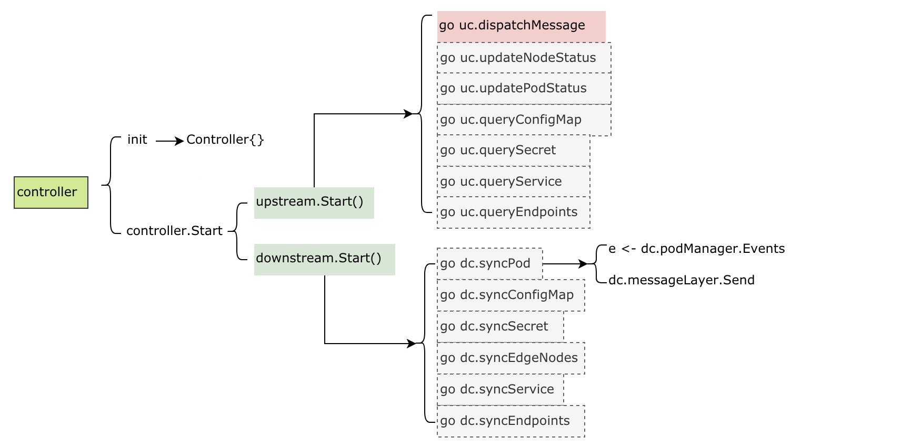

可能由于各自的定位不同，K3S更像是一个kubernetes厂商的一个发行版，在边缘计算方面其实是没有摄入细节的。相比起来，KubeEdge目标更明确，除了在kubernetes的方面做了各种异步通信通道，保障offline后的业务连续性之外；还定义了一系列的设备抽象，用来管理边缘设备。而且，其v1.8版本正朝着边缘端服务网格，以及函数式计算等方向发展。总体感觉是基本功能可用，但是更深入的功能有待开发，比如函数式计算这块貌似只有界面，但是使用手册和功能都缺失等。

这里记录一下学习kubeedge v1.8分支代码的一些理解，便于后续快速查看。其实华为在该项目中文档还算写的比较完备的，官方文档可以参考[这里](https://docs.kubeedge.io/en/docs/)。

## 架构


整体架构图比较明了，在不考虑edgesite的情况下，其架构分为了云端和边缘端。其实可以理解为kubernetes的管理侧和kubelet节点侧（对应edge端）。很多年前rancher就采用这种架构，通过隧道网络通过一个机头来统一纳管位于多个云服务提供商上的计算节点。但是请注意，这里的场景是边缘计算，意味着edge端的网络环境难以保障。

## 云边通信

于是就衍生出了cloud端的cloud Hub与edge端的Edge Hub。这两个模块之间通过websocket或者quic通信，相当于建立了一条底层通信隧道，供k8s和其他应用通信。当然，使用什么协议通信不是重点，重点是如何保障当着之间的链路都无法保障的时候，业务不受到影响，这就是MetaManager的要解决的问题了。

1. CloudHub
前面提到cloud端的cloudHub就是一个隧道的server端，用于大量的edge端基于websocket或者quic协议连接上来；没错，这货才是正儿八经的二传手，每天就负责拉皮条。

2. EdgeHub
位于edge端运行，是隧道的client端，负责将接收到的信息转发到各edge端的模块处理；同时将来自个edge端模块的消息通过隧道发送到cloud端。

### 边缘端

1. MetaManager
MetaManager模块后端对应一个本地的数据库（sqlLite），所有其他模块需要与cloud端通信的内容都会被保存到本地DB种一份，当需要查询数据时，如果本地DB中存在该数据，就会从本地获取，这样就避免了与cloud端之间频繁的网络交互；同时，在网络中断的情况下，本地的缓存的数据也能够保障其稳定运行（比如你的智能汽车进入到没有无线信号的隧道中），在通信恢复之后，重新同步数据。

2. Edged
之前提到过kubernetes的kubelet，它相当于k8s的核心。这块其实简单做了一些裁剪，去掉一些用不上的功能，然后就成为Edged模块，该模块就是保障cloud端下发的pod以及其对应的各种配置、存储（后续会支持函数式计算）能够在edge端稳定运行，并在异常之后提供自动检测、故障恢复等能力。当然，由于k8s本身运行时的发展，该模块对应支持各种CRI应该也比较容易。

3. **EventBus/ServiceBus/Mappper**
前面讲到的模块都与k8s直接或间接相关，接下来说下与设备（或者说真正IOT业务）相关的设备管理侧。外部设备的接入当前支持MQTT和Rest-API，这里分别对应EventBus和ServiceBus。EventBus就是一个MQTT broker的客户端，主要功能是将edge端各模块通信的message与设备mapper上报到MQTT的event做转换的组件；而ServiceBus就是对应当外部是Rest-API接入时的转换组件。说道这里，就有必要提一下MQTT broker，其实搞互联网的基本都用过类似于rabbitmq、activeMQ之类的消息中间件，其实他们就支持MQTT协议（可以理解为AMQP的精简版）。IOT的各种设备可能直接支持MQTT，但有的只支持蓝牙或者其他近场通信的协议。没关系，Mappper可以实现将各种协议转换为对MQTT的订阅与发布，从而实现与edge端的通信。当然，ServiceBus对应就适用于支持http协议的服务了。

4. DeviceTwin
edge端最后就剩下一个DeviceTwin模块了，要理解这个名词，就得提一下数字孪生这个概念。这里来科幻一下，假设人类要实现乾坤大挪移，但是有点难度的是，这下是要把你移到火星上。怎么办？这里有一个解决方案：在地球上通过扫描你的所有生物信息，生成拥有你完整生物特征的数据包之后，然后在地球上就把你毁灭了。再将描述你完整信息的数据包通过电波光速发送到火星上，让火星的设备再使用接收到的生物特征造出一个你。回个头来，我们要说的数字孪生就是那个用来传输到火星的用于描述你所有生物特征的数据包；当然，这里对应就是接入设备信息。所以，DeviceTwin就是将这些信息保存到本地DB中，并处理基于cloud端的操作来修改device的某些属性（也就是操作设备）；同时，将设备基于eventBus上报的状态信息同步到本地DB和cloud端的中间人。

### 云端

1. Controller
然后再说controller，其实准确的说controller是包括了用于edge端与API-Server同步信息的edgeController与用于DeviceTwin与API-Server同步device CRD信息的deviceController组成。这两个模块相对也比较简单，后面具体讲解。

## 各模块实现

### 边缘端

1. 入口与beehive
beehive模块在整个kubeedge中扮演了非常重要的作用，它实现了一套Module管理的接口，程序中各个模块的启动、运行、模块间的通信等都是由其统一封装管理。下图是kubeedge的edge端代码的main启动流程，这里涉及到的modules就是由beehive提供。


可以看到，在初始化的时候，分别加载了各个edge端modules的init函数，用来注册其modules到heehive框架中。然后在core.Run中遍历启动（StartModules）。

另外，值得提及的是，用于模块间通信，发送message到group/module的功能，在beehive中，其实是通过channel来通信的。这也是golang推荐的goroutine间通信的方式。

1. EdgeHub


重点是启动了两个go routine，用来实现往两个方向的消息接收和分发。这里go ehc.routeToEdge对应从隧道端点接收cloud端发往edge端的消息，然后调用ehc.dispatch解析出消息的目标module并基于heehive模块module间消息的通信机制来转发出去。

同理，go ehc.routeToCloud实现将edge端消息基于隧道转发到cloud端的cloudHub模块处理。当然，该模块中实现了对同步消息的response等到超时处理的逻辑，当在未超时期间收到response消息，会转发到消息发送端模块。比较暴力的是，一旦发送消息到cloud失败，该goroutine会退出，通知所有模块，当前与cloud端是未连接状态，然后重新发起连接。

metaManager在与cloud的连接断开期间，会使用本地DB中的数据，不会发起往cloud端的查询。

1. Edged


这块基本是调用kubelet的代码，实现较多的是启动流程。另外，将之前kubelet的client作为fake的假接口，转而将数据都通过metaClient来存储数据到metaManager，从而代理之前直接访问api-server的操作。

这里差异化的一块代码在e.syncPod的实现，通过读取metaManager和EdgeController的pod任务列表，来执行对本地pod的操作。同时，这些pod关联的configmap和secret也会随着处理pod的过程而一并处理。对pod的操作也是基于一个操作类别的queue，比如e.podAddWorkerRun就启动了一个用于消费添加pod的queue的goroutine。外部的封装基本就这样，内部完全通过引用kubelet原生的包来处理。

1. MetaManager


从代码架构看起来，该模块比较简单，首先在外层按照一定周期给自己发送消息，触发定时同步pod状态到cloud端。另外，在mainLoop中启动一个独立的goroutine接收外部消息，并执行处理逻辑。

处理逻辑基于消息类型分类，分别包括：

- cloud端发起的增、删、查、改
- edge端模块发起的查询请求（前面提到，当状态为disconnect的时候不发起remote查询）
- cloud端返回的查询响应的结果
- edgeHub发来的用于更新与cloudHub见连接状态的消息,自己给自己发送的，定期同步edge端pod状态到cloud端的消息
- 函数式计算相关的消息
- 重点来说增删查改，拿添加举例。当接收到要添加某个资源时，会将资源解析出来，组织成为key、type、value的三元组，以一种类似于模拟NoSQL的方式保存到本地的SqlLite数据库中。这样保存的目的也是为了方便快速检索和增删。保存完之后，需要对应发送response消息到请求消息的源模块。

1. EventBus与ServiceBus


EventBus
eventBus用于对接MQTT Broker与beehive，MQTT broker有几种启动模式，从代码实现的角度分为：

使用内嵌MQTT broker
使用外部MQTT broker
在内嵌MQTT broker模式下，eventBus启动了golang实现的broker包gomqtt用来作为外部MQTT设备的接入，具体用法请参考其github项目首页。两种模式下eventBus都做了一些共性的操作，具体包括：

向broker订阅关注的topic，如下：

```json
SubTopics = []string{
	"$hw/events/upload/#",
	"$hw/events/device/+/state/update",
	"$hw/events/device/+/twin/+",
	"$hw/events/node/+/membership/get",
	"SYS/dis/upload_records",
}
```

当接收到对应的event时，触发回调函数onSubscribe

回调函数中，对event做了简单的分类，分别发送到不同的目的地（DeviceTwin或EventHub）
所有`$hw/events/device/+/twin/+`和`$hw/events/node/+/membership/gettopic`的event发送到DeviceTwin，其他的event直接发送到EventHub再同步到Cloud端。

当然，该部分也包括了创建客户端，往MQTT broker发布events的接口，这里就不展开了。

6. ServiceBus
ServiceBus启动一个goroutine来接受来自beehive的消息，然后基于消息中带的参数，通过调用http client将消息通过REST-API发送到本地127.0.0.1上的目标APP。这相当于一个客户端，而APP是一个http Rest-API server，所有的操作和设备状态都需要客户端调用接口来下发和获取。

7. DeviceTwin


DeviceTwin包含一下几个部分的功能：

数据存储方面，将设备数据存储到本地存储sqlLite，包括三张表：device、deviceAttr和deviceTwin。
处理其他模块发送到twin module的消息，然后调用 dtc.distributeMsg来处理消息。在消息处理逻辑里面，消息被分为了四个类别，并分别发送到这四个类别的action执行处理（每一个类别又包含多个action）：

- membership
- device
- communication
- twin

由于这个部分和设备更紧密相关，为何要分着几个类别，都是如何抽象，这块的理解方面还不够透彻，暂时只关注其主业务逻辑，官方文档对这块有比较详细的描述。

### 云端


这里重点关注在init中加载了cloudHub、controller（也就是edgeController）和devicecontroller三个部分。然后和edge端一样，都是beehive的套路，调用StartModules来启动所有的模块。

1. CloudHub


handler.WebSocketHandler.ServeEvent在websocket server上接收新边缘node的连接，然后为新node分配channel queue。再进一步将消息交给负责内容读写的逻辑处理。

channelq.NewChannelEventQueue为每一个边缘node维护了一个对应的channel queue（这里默认有10个消息的缓存），然后调用go q.dispatchMessage 来接收由controller发送到clouHub的消息，基于消息内容解析其目的node，然后将消息发送到node对应的channel排队处理。

clouHub的核心逻辑包括这两部分，读和写：

前面讲到，需要发送到边缘node的消息会发送到了node对应的channel队列上，这里通过handler.WebSocketHandler.EventWriteLoop在channel中读取到，并负责基于隧道发送处理（这里也很多判断，比如如果找不到对应的node节点，或者该node节点为offline状态等都会终止发送）。
另一方面，handler.WebSocketHandler.EventReadLoop函数从隧道上读取来自于edge端的消息，然后将消息发送到controller模块处理（如果是keepalive的心跳消息直接忽略）。
如果cloudHub往node发送消息失败，就会触发EventHandler的CancelNode操作；如果结合edgeHub端的行为的话，我们知道edgeHub会重新发起到cloud端的新连接，然后重新走一遍同步流程。

2. Controller（EdgeController）



controller的核心逻辑是upstream和downstream。

upstream
接收由beehive发送到controller的消息，然后基于消息资源类型，通过go uc.dispatchMessage转发到不同的的goroutine处理。这里包括nodeStatus、podStatus、queryConfigMap、querySecret、queryService、queryEndpoints等；各种类别的操作都是调用k8s的client代码来将节点状态写到API-Server。

downstream
通过调用k8s client代码来监听各资源的变化情况，比如对于pod是通过 dc.podManager.Events来读取消息，然后调用dc.messageLayer.Send将消息发送到edge端处理。这里也同upstream，包括pod、configmap、secret、nodes、services和endpoints这些资源。

3. DeviceController


deviceController同edgeController，只是其关心的资源不再是k8s的workload的子资源，而是为device定义的CRD，包括：device和deviceModel。
