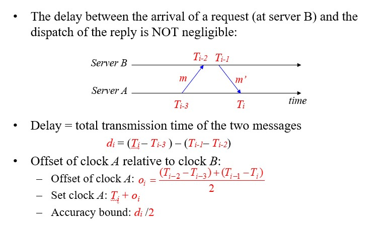
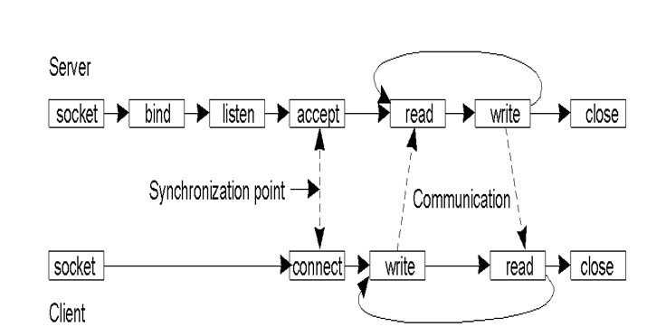
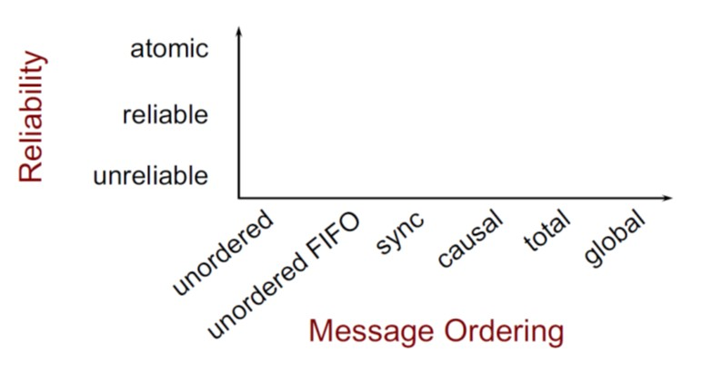
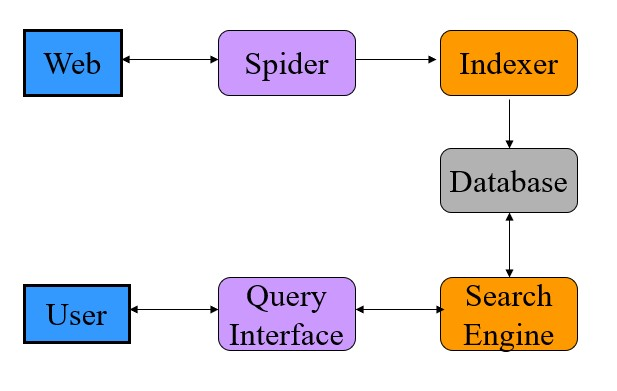
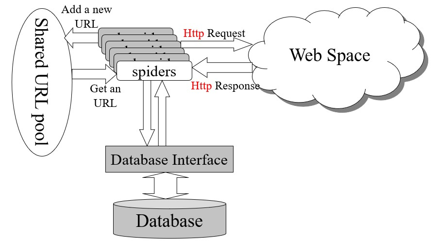
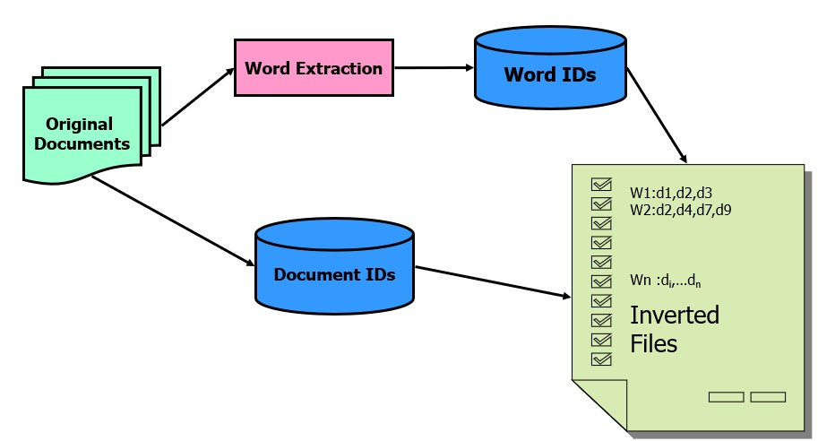

## 一、分布式系统介绍

### 1.1 分布式系统

分布式系统定义为其中联网计算机上的组件仅通过传递消息来通信和协调其动作的系统。

1. 特点：

- 并发：多进程、多线程之间并发，共享资源
- 无全局时钟：进程间通过消息传递协作
- 单节点失败问题：某些进程失败不会被其他进程知晓

### 1.2. 分布式系统挑战

1. 异质性：

- 中间件：提供程序抽象以掩盖底层(网络、硬件、操作系统、编程语言)不同的软件
- 移动代码：可以从一台计算机传输到另一台计算机并在目标计算机上运行的程序代码。 示例：Java Applet。Java虚拟机（JVM）提供了一种使代码在各种主机上可执行的方法。

2. 开放性：

- 单个计算机系统的开放性：哪些接口可以extended or implemented
- 分布式系统开放性：可以添加新资源共享服务并使其可供各种客户端程序使用的程度。

3. 安全性：

- 机密性：防止泄露给未经授权个体
- 完整性：防止更改、破坏，方法之一，校验和
- 可用性：防止干扰访问资源的手段。

4. 易扩展性：

- 物理资源开销
- 性能下降
- 防止软件执行中的超时
- 避免性能瓶颈：设计算法避免

5. 失败处理问题:

- 失败的检测：只有一部分的失败可以被检测到
- 掩盖失败：部分被检测的失败，可以被掩盖或减轻损失
- 容忍失败：Internet大部分服务容忍失败
- 从失败处恢复：从软件层面设计，当服务器崩溃后，永久性数据可被恢复或回滚
- 冗余组件：可通过冗余组件容忍失败。

6. 并发性：

多线程并发使用同一资源，考虑性能表现

7. 透明性：

- 访问透明性：本地资源和远程资源可以通过相同操作访问
- 地点透明性：无需知晓物理地址、网路地址即可访问资源
- 并发透明性：多个进程并发操作共享资源互不干扰
- 复制透明性：使用户可以使用多个资源实例来提高可靠性和性能，而无需用户或应用程序程序员了解副本。
- 故障透明性：隐藏故障，即使硬件或软件组件出现故障，用户和应用程序也可以完成其任务。
- 移动透明性：允许在系统内移动资源和客户端，而不会影响用户或程序的操作。
- 性能透明性：允许重新配置系统以随负载变化而提高性能。
- 伸缩透明性：允许系统和应用程序按比例扩展，而无需更改系统结构或应用程序算法。

8. 服务质量

- 可靠性
- 安全性
- 性能
- 易扩展性

## 二、系统模型

### 2.1 物理模型

物理模型是分布式系统底层硬件元素的表示，它从所用计算机和网络技术的特定细节中抽象出来。

三代分布式系统：

1. 早期的分布式系统

- 由于使用局域网技术而在1970年代末和1980年代初出现。
- 系统通常由局域网连接的10到100个节点组成，Internet连接性有限且支持的服务（例如，共享的本地打印机，文件服务器）。

2. 互联网规模的分布式系统
   - 由于Internet的增长而出现在1990年代。
   - 基础架构已成为全球性的。

3. 当代分布式系统
   - 移动计算的出现导致节点与位置无关
   - 需要增加功能，例如服务发现和对自发互操作的支持
   - 云计算和普适计算的出现

### 2.2 体系结构模型

分布式系统的体系结构模型简化并抽象了分布式系统各个组件的功能，并且

- 跨计算机网络组织组件。
- 它们之间的相互关系，即彼此交流。

1. 通信实体

在分布式系统中，进行通信的实体通常是进程。

例外情况：

- 在原始环境（例如传感器网络）中，操作系统不提供任何抽象，因此节点进行通信。
- 在大多数环境中，进程由线程补充，因此线程更多地是通信的端点。

2. 通信示例

- 进程间通讯：
  - 对分布式系统中进程之间的通信的低级支持，包括消息解析原语。
  - 直接访问Internet协议提供的API（套接字编程）并支持多播通信。
- 远程调用
  - 涵盖了基于通信实体之间的双向交换的一系列技术。
  - 导致调用远程操作，过程或方法
    - 请求-应答协议：更多的模式施加在基础消息解析服务上，以支持客户端-服务器计算
    - 远程过程调用：可以像在本地地址空间中一样调用远程计算机上的过程中的过程
    - 远程方法调用：调用对象可以调用远程对象中的方法
- 间接沟通
  - 群组通信
    - 将消息传递给一组的管理者
    - 系统中由组标识符表示的组的抽象
    - 收件人选择接收发送到组的消息
    - 广播（发送给所有人的消息）
    - 组播（消息发送到特定组）
  - 发布-订阅系统
    - 大量的生产者（发布者）将感兴趣的信息项（事件）分发给同样大量的消费者（订阅者）
  - 消息队列
    - 消息队列提供点对点服务，消息产生者进程可以将消息发送到指定的队列，而消费者进程可以从队列中接收消息或得到通知。

3. 服务器结构

- 客户端服务器架构
  - 客户端-服务器提供了一种直接，相对简单的方法来共享数据和其他资源
  - 但是它伸缩性很差
  - 通过将服务放置在单个地址中隐含的服务提供和管理的集中式扩展不能很好地超出承载该服务的计算机的容量及其连接的带宽
  - 为了在更多数量的计算机和网络链路之间共享计算和通信负载，需要更加广泛地分配共享资源。
- P2P
  - 由在不同计算机上运行的大量对等进程组成。
  - 所有进程都具有客户端和服务器角色。
  - 它们之间的通信模式完全取决于应用程序需求。
  - 用于访问对象的存储，处理和通信负载分布在计算机和网络链接之间。
  - 每个对象都复制到几台计算机中，以进一步分散负载，并在断开各个计算机的连接时提供弹性。
  - 与客户端-服务器体系结构相比，放置和检索单个计算机的需求更加复杂。

4. 体系结构组件

将服务垂直组织成服务层。分布式服务可以由一个或多个服务器进程提供，彼此交互并与客户端进程进行交互，以维护服务资源在系统范围内的一致视图。

例子
网络时间服务是通过在Internet上的主机上运行的服务器进程基于网络时间协议（NTP）在Internet上实现的，这些服务器进程将向任何请求它的客户端提供当前时间。

5. 垂直分布

客户端-服务器体系结构的扩展。将传统服务器功能分布在多个服务器上。

### 2.3 基础模型

同步分布式系统和异步分布式系统的特征（交互模型）

## 三、物理时间

1. 最简单的同步技术

进行RPC以从服务器获取时间，将本地时钟设置为服务器时间，不计算网络或处理延迟。

2. Cristian 算法

补偿网络延迟（假设对称），客户端在$T_0$发送请求，服务器回复当前时钟值$T_{server}$，客户在$T_1$收到响应，即$RTT = T_1-T_0$，客户端将时钟设置为：$T_{client} = T_{server}+\frac{T_1-T_0}{2}$
精度，± RTT/2，如果考虑传输过程错误的时延，则精度为$\pm \left(\frac{T_1-T_0}{2} - T_{\min}\right)$，$T_{\min}$为消息最短传输时间

问题：
- 服务器可能会失败
- 受到恶意干扰

3. Berkeley 算法

目的：尽可能使一组计算机的时钟同步（也称为内部同步）

假设没有机器具有准确的时间源（即，没有区分客户端和服务器）
从参与的计算机中获取平均值，将所有时钟同步到平均值

一台机器被选为（或指定）为主机； 其他人是slave：
主机定期轮询所有slave，询问他们的时间，通过计算网络延迟，可以使用Cristian的算法从其他计算机获取更准确的时钟值，收集结果后，计算平均值，包括主机的时间。向每个从站发送需要调整其时钟的偏移量，通过发送“偏移”而不是“时间戳”来避免网络延迟问题。

算法中有一些规定可以忽略时滞过大的时钟的读数，计算容错平均值。如果主机发生故障，任何从机都可以接管主机

4. NTP协议

端口123，UDP

- 即使出现消息延迟，也可以使Internet上的客户端准确地同步到UTC
  - 使用统计技术来过滤数据并提高结果质量
- 提供可靠的服务
  - 避免长时间的连接中断
  - 冗余路径
  - 冗余服务器
- 使客户端能够频繁同步
  - 通过使用偏移量来调整时钟（对于对称模式）
- 提供抗干扰保护
  - 验证数据源

组播（用于快速LAN，精度低）
  服务器定期将其时间多播到其子网中的客户端

远程过程调用（中等精度）
  服务器以其实际时间戳响应客户端请求
  就像克里斯蒂安的算法一样

对称模式（高精度）
  用于在时间服务器之间进行同步（对等）

使用UDP不可靠地传递所有消息

计算方法：对称模式下：



时延计算方法$d_i = \left(T_i - T_{i-3}\right) - \left(T_{i-1} - T_{i-2}\right)$。
时钟A设置时间为$T_{i} + o_i = T_{i-1}+ \left. d_i / \right. 2$

提升精度方法：
- 单一来源的数据过滤
  - 保留多个最新对<oi，di>
  - 过滤器色散：选择与最小dj对应的oj

- 对等选择：与较低层服务器同步
  - 较低的层数，较低的同步散布

- 服务器的层是动态变化的，具体取决于与其同步的服务器

## 四、逻辑时钟

### 4.1 事件发生关系

1. happened-before

- 如果a和b发生在同一进程中，a在b之前，则$a\rightarrow b$
- 如果a和b发生在不同的过程中，a是“发送”，b是相应的“接收”，则$a\rightarrow b$
- 传递的：如果$a\rightarrow b$和$b\rightarrow c$，则$a\rightarrow c$

2. concurrent

其他类型为concurrent

### 4.2 逻辑时钟

逻辑时钟是单调递增的软件计数器，它不必与物理时钟有关，必须通过加而不是减来校正时钟

为事件分配逻辑时间值的规则
如果$a\rightarrow b$，则$clock\left(a\right) < clock\left(b\right)$

1. Lamport 算法

每个进程$P_i$具有逻辑时钟$L_i$。 时钟同步算法：

- $L_i$初始化为0；
- $L_i$更新：
  - LC1：$P_i$中发生的每一个新事件，$L_i$都会增加1
  - LC2：$P_i$发送消息m时，它将$t = L_i$附加到m
  - LC3：当$P_j$收到（m，t）时，它会设置$L_j：= \max \left\{L_j, t \right\}$，然后将LC1应用于事件receive（m）的$L_j$递增

2. 时钟向量算法

每个进程Pi保持一个时钟Vi，该时钟Vi是N个整数的向量

- 初始化：对于$1\le i\le N$和$1 \le k\le N$，$V_i \left[k \right]:= 0$
- 更新$V_i$：
  - VC1：$P_i$中有新事件时，它将设置$V_i \left[i\right]:= V_i \left[i\right] +1$
  - VC2：$P_i$发出消息m时，它将$t = V_i$附加到m
  - VC3：当$P_j$收到$\left(m, t\right)$时，对于$1\le k\le N$，它设置$V_j \left[k\right]:= \max \left\{V_j \left[k\right], t \left[k\right]\right\}$，然后将VC1应用于事件的递增$V_j \left[j\right]$ 接收$\left(m, t\right)$

注意：$V_i \left[j\right]$是一个时间戳，指示$P_i$知道到目前为止$P_j$中发生的所有事件。

根据向量时钟区分 happened-before 和 concurrent
定义

- $V = V’$：当$i = 1, \cdots, N$时，$V \left[i\right] = V’\left[i\right]$
- $V\le V’$：当$i = 1, \cdots, N$时，$V \left[i\right]\le V’\left[i\right]$
- $V < V’$：如果$V\le V’$，并且$V\ne V’$
- $V\left(e\right)$：事件e的时间戳向量

对于任何两个事件a和b，

- $a\rightarrow b$如果$V\left(a\right) < V\left(b\right), a\ne b$
- $a || b$如果既不满足$V\left(a\right) \le V\left(b\right)$也不满足$V\left(a\right) \ge V\left(b\right)$

3. 因果顺序组播算法

每个组成员保留一个长度为n（n个组成员）的时间戳向量，所有分量都初始化为0。
当Pi多播消息m时，它将递增其时间向量Vi的第i个分量，并将Vi附加到m。
当带有$V_j$的$P_j$从$P_i$接收$\left(m, V_i\right)$时：

- 如果（对于所有k，$V_j\left[k\right] \ge V_i \left[k\right]，k\ne i$），则
  - $V_j [i]：= V_i [i]$; // $V_i [i]总是大于V_j [i]$
  - $V_j [j]：＝ V_j [j] +1$

4. 全序组播

对于m1 || m2，所有接收者都必须以相同的顺序接收m1和m2（即m2之前的所有m1或m1之前的所有m2）。

## 五、互斥算法 & 选举算法

### 5.1 互斥算法

#### 5.1.1 集中式算法

模拟单处理器系统，一个进程当选为协调员。

步骤：

1. 索取资源
2. 等待回应
3. 获得许可
4. 访问资源
5. 释放资源

如果另一个进程要求资源：

- 协调员不会回复直到被请求资源被释放
- 维护队列
服务请求按FIFO顺序

好处

- 公平：所有请求均按顺序处理
- 易于实施，理解，验证
- 流程不需要了解小组成员，只需了解协调员

问题

- 流程无法区分被协调者阻塞还是失败–单点故障
- 集中式服务器可能成为瓶颈

#### 5.1.2 令牌环算法

假定已知的一组过程，可以对组进行某些排序（唯一的进程ID），在软件中构建逻辑环，进程与其邻居进行通信。

初始化

- 进程0为资源R创建令牌
令牌在环上循环

- 从Pi到P（i + 1）mod N
进程获取令牌时
- 检查是否需要持有令牌
- 如果不是，请向邻居发送令牌
- 是，请访问资源
- 持有令牌直到完成

一次只有一个进程具有令牌

- 保证互斥
顺序明确（但不一定先到先得）
- 饥饿不会发生
- 有时不如先到先得的算法有效

问题

- 令牌丢失（例如，进程终止），它将不得不重新生成。检测丢失可能是一个问题（令牌丢失还是有人正在使用？）
- 流程损失：如果您无法与邻居交谈怎么办？

#### 5.1.3 Ricart & Agrawala 算法

使用可靠的多播和逻辑时钟的分布式算法，进程要获得资源所有权：

- 撰写包含以下内容的消息：
  - 标识符（机器ID，进程ID）
  - 资源名称
  - 时间戳（按总顺序排列的Lamport）
- 向组中的所有进程发送请求
- 等到所有人都允许
- 输入关键部分/使用资源

进程收到请求时：

- 如果接收者不感兴趣：
  - 发送确定给发件人
- 如果接收器在临界锁中
  - 不回复; 将请求添加到队列
- 如果接收方也刚发送了一个请求：
  - 比较时间戳：已接收和已发送的消息，选择最早的
  - 如果接收方是失败者，请发送OK
  - 如果接收方是获胜者，请不要回复，排队
- 完成关键部分后
  - 向所有排队的请求发送确定

问题：
N点故障
大量的通讯流量
证明可以使用完全分布式的算法

#### 5.1.4 分布式互斥算法

每个进程维护请求队列，包含互斥请求，要求关键部分

- 进程Pi将请求（i，Ti）发送到所有节点
- 将请求放置在自己的队列中
- 当进程Pj收到一个请求，它返回带有时间戳的ack

输入关键部分（访问资源）：

- Pi从其他进程接收到的消息（确认或释放），且时间戳大于Ti
- Pi的请求在其队列中具有最早的时间戳

与Ricart-Agrawala的区别：

- 每个人都做出回应（acks）…总是-没有阻碍
- 进程根据其请求是否是其队列中的最早者来决定是否进行

释放关键部分

- 从自己的队列中删除请求
- 发送带有时间戳的发布消息

进程收到释放消息时

- 从队列中删除对该进程的请求
- 这可能会导致其自己的条目在队列中具有最早的时间戳记，从而使其能够访问关键部分

### 5.2 选举算法

1. 需要一个过程来担任协调员

2. 进程没有区别特征

3. 每个进程都有一个唯一的ID来标识自己

#### 5.2.1 霸道选举算法

•选择ID最大的进程作为协调者
•当进程P检测到协调器失效时：

- 将选举消息发送到具有更高ID的所有进程。
  - 如果没有人回应，则P获胜并接管。
  - 如果有任何响应，则表示P的工作已完成。

- 可选：让所有具有较低ID的节点都知道正在进行选举。

如果进程收到选举消息

- 发回确定信息
- 举行选举（除非已经举行选举）

- 进程通过向所有进程发送一条消息告诉他们是新的协调者来宣布胜利
- 如果死进程恢复，则举行选举以找到协调器。

#### 5.2.2 环选举算法

流程安排

- 如果有任何进程检测到协调器故障
  - 构造带有进程ID的选举消息并发送到下一个进程
  - 如果后继者失败，跳过
  - 重复直到找到正在运行的进程
- 收到选举信息
  - 进程转发消息，将其进程ID添加到主体
- 最终，消息返回给发起者
  - 进程在列表中看到其ID
  - 分发（或多播）协调器消息，通知协调器。通常选举编号最小的进程

#### 5.2.3 Chang & Roberts Ring 算法

优化环

- 消息始终包含一个进程ID
- 避免多次巡回选举
- 如果某一进程发送消息，则将其状态标记为参与者

收到选举消息后：

- 如果PID（消息）> PID（进程）
  - 转发消息–较高的ID总是会胜过较低的ID
- 如果PID（消息）< PID（进程）
  - 用PID（进程）替换消息中的PID
  - 转发新消息–我们的ID号更高； 用它
- 如果PID（消息）< PID（进程）AND 进程是参与者
  - 丢弃邮件-我们已经在分发ID
- 如果PID（消息）== PID（过程）
  - 该过程现在是领导者-消息已传播：宣布获胜者

## 六、socket套接字通信

### 6.1 面向连接的协议 Connection-oriented Protocols

1. 建立联系
2. 谈判协议
3. 交换数据
4. 终止连接

### 6.2 无需连接的协议 connectionless protocols

- 没有通话设置
- 发送/接收数据（每个数据包都已寻址）
- 无终止

### 6.3 socket

目标：

- 进程之间的通信不应该取决于它们是否在同一台计算机上
- 将所有数据交换（访问）统一为文件访问
  - 应用程序可以选择特定的通信方式
- 虚拟电路，数据报，基于消息的有序交付
  - 支持不同的协议和命名约定（不仅适用于TCP / IP或UDP / IP）



PCB协议控制模块，PCB的每个条目包含：

- 本地地址
- 本地端口
- 目的地址
- 目的端口

### 6.4 RPC 远程过程调用

在其他机器上调用程序的机制，机器A上的进程可以调用机器B上的过程。A被暂停，B继续执行。当B返回时，控制权移交给A。

目标：进行远程过程调用，看起来与对程序员的本地调用相同。

RPC编译器会自动生成存根过程，以向用户发出RPC，就好像它是本地调用一样。存根过程做什么：

- 编码解码参数和返回值
- 处理不同机器之间的不同数据格式
- 检测和处理客户端/服务器进程和网络的故障

RPC工作流程：

对于服务接口中的每个方法，访问服务的客户端包含了一个存根过程( stub procedure)。该存根过程的行为对客户端来说就像一个本地过程，但不执行调用。存根过程把过程标识符和参数编码成一个请求消息。该请求消息通过它的通信模块发送给服务器。当应答消息返回时，它将对结果进行解码。对于服务接口中的每个方法，服务器端包含分发器程序、服务器存根过程和服务过程。该分发器程序根据请求消息中的过程标识符选择一个服务器存根过程。该服务器存根过程对请求消息中的参数解码，然后调用相应的服务过程,并把返回值编码成应答消息服务过程是服务接口中过程的具体实现。客户和服务器的存根过程及分发器程序可以通过接口编译器从服务的接口定义中自动生成。

1. 客户端调用存根过程，将参数压栈。Client calls stub (push parameters onto stack)
2. 客户端的存根过程将过程标识符和参数编码成一个请求消息，并调用操作系统**中断**，请求发送消息。Clnt_stub marshals parameters to message & makes an OS call (client blocked)
3. 客户端通过网络，将消息发送给服务器。Network message sent to server
4. 服务器分发器程序将请求消息传递给服务器存根过程。Deliver message to server stub & unblock server
5. 服务器存根过程对请求消息中的参数解码，然后调用相应的服务过程。Svr-stub unmarshals parameters & calls service routine (local call)
6. 服务过程将返回结果传递给服务器存根过程。Return to the stub from service routine
7. 服务器存根过程封装消息并调用操作系统请求发送消息。Svr_stub marshals return-value & requests OS to send out message
8. 数据在网络上传输。Transfer message over network
9. 客户端存根过程接收消息，**恢复进程**。Deliver message to client (unblock client)
10. 客户端存根过程将返回值返回客户端程序。Clnt_stub unmarshals return-value & returns to client program…

## 七、网际路由

### 7.1 CIDR

无类别域间路由协议

CIDR：将网络地址（A，B或C类）细分为任意长度，以有效利用IP地址空间（此细分对整个Internet都是可见的）。

用于给用户分配IP地址以及在互联网上有效地路由IP数据包的对IP地址进行归类的方法。在Internet上创建附加地址的方法，这些地址提供给服务提供商（ISP），再由ISP分配给客户。CIDR将路由集中起来，使一个IP地址代表主要骨干提供商服务的几千个IP地址，从而减轻Internet路由器的负担。

CIDR路由表中的每个条目都包含一个基地址和一个子网掩码（与子网中的路由相同）。
对于路由IP数据包，其目标IP地址为布尔值与子网掩码进行“与”运算，以查看其是否与条目的基本地址相匹配（如果找到多个匹配项，则使用最长的匹配项）。
数据包通过匹配条目的传出链接发送出去。
并非所有路由器都执行CIDR。 （如果所有路由器都采用CIDR，则地址的网络部分可以是任意长度！）

### 7.2 NAT

为了缓解IP地址的短缺，NAT技术仅使用少量的外部IP地址与外部进行通信，并从外部隐藏本地IP地址（因此这些本地IP地址可以在其他地方重用）：
所有到外部的Internet通信都必须经过NAT路由器，其中内部IP地址（源IP地址）被外部IP地址代替。
IP数据包中的源端口号字段由指向NAT路由器的转换表中条目的索引代替。 此项包含内部IP地址和原始源端口号。
当外部IP数据包到达NAT路由器时，将提取其目标端口号并将其用作转换表的索引，在此转换表中将提取原始IP地址和端口号并将其放回到数据包中。

数据包通过NAT穿越时转换地址。
使用端口号标识内部IP用户。
这是解决问题的肮脏方法，仅适用于TCP / UDP通信。

### 7.3 DHCP

专用IP地址的分配由动态主机配置协议完成，动态协议是在路由器上运行的服务：
短期租用IP地址（尤其是对于移动用户），主机可能会定期刷新地址

DHCP服务器可以服务于多个LAN（子网）。
每个LAN上都需要一个DHCP中继代理，以使该LAN上的主机能够通过广播消息到达DHCP服务器。
启动设备（主机）时，它将广播DHCP发现数据包（以请求/发现IP地址）。
DHCP发现数据包被同一LAN上的DHCP代理截获并转发到DHCP服务器。

### 7.4 ARP

地址解析协议，将已知的IP地址转换为MAC地址。

ARP提供了从IP地址到物理地址的映射。 假设A知道B的IP地址，并且想知道B的物理地址：

- 广播ARP查询报文，包含B的IP地址
- 局域网上的所有计算机都接收ARP查询
- B收到ARP数据包，并用其（B）的物理层地址回复A
- 缓存（保存）IP到物理地址对，直到信息变旧（超时）
  - 软状态：除非刷新，否则信息超时（消失）
ARP Shell命令：arp

### 7.5 OSPF

开放的最短路径优先协议

一个AS通常被划分为带编号的区域（一个子网或一组连续的子网）。
每个AS都有一个主干，称为区域0。每个区域中至少有一个路由器连接到主干路由器。
一些骨干路由器（称为AS边界路由器）连接到其他AS，以进行AS间路由。

OSPF将AS中的路由器抽象为连接的图，并为每个边缘分配权重（距离，延迟等）。
每个路由器定期向其相邻路由器泛洪Link-State-Update消息，因此每个路由器都知道该区域内的拓扑。

区域内路由：每个路由器使用链接状态数据库，并运行到目标路由器的最短路径。

区域间路由：源路由器$\rightarrow$骨干网$\rightarrow$目标区域$\rightarrow$目标路由器
跨AS路由，源路由器$\rightarrow$骨干网$\rightarrow$AS边界路由器$\rightarrow$目的地AS边界路由器（通过BGP）$\rightarrow$dest-router

### 7.6 BGP

边界网关协议
跨AS的流量通过BGP（边界网关协议）路由：
外部网关协议更关注路由策略，例如没有通过某些AS的传输流量，没有为某些AS的中继等。

BGP是一种距离向量协议。 路由表中的每个条目均包含：dest，下一跳到目的地，距离（跳数）。 它总是选择到目的地的距离最短的下一跳邻居来转发数据包，称为下一跳路由。
每个BGP路由器都与其邻居交换路由信息（到所有目的地的距离和下一跳）。 从邻居收集信息后，BGP路由器可以更新（建立）自己的路由表。

## 八、命名服务

### 8.1 DNS 域名系统

在许多名称服务器的层次结构中实现的分布式数据库
DNS服务：
主机名解析
邮件主机位置（例如，找到hwdu@hitsz.edu.cn的邮件服务器）
反向分辨率
知名服务（例如telnet，FTP，HTTP等）
名称的添加/删除是由权威管理员手动编辑名称数据库来完成的。

DNS：存储资源记录（RR）的分布式数据库

1. Type=A. name is hostname, value is IP address
2. Type=CNAME. name is an alias name for some “real name”, value is the “real name”
3. Type=NS. name is domain (e.g. foo.com), value is IP address of authoritative name server for this domain. 值是该域的权威名称服务器的IP地址
4. Type=MX. value is hostname of mailserver associated with name

例：

1. 在域中添加新主机：在NS DB中添加记录
    jupiter IN A 144.214.120.2
2. 创建子域“ ds”：在NS DB中添加一条记录（以及主机名“ ds-sun0”的条目）
    IN NS ds-sun0.ds.cs.cityu.edu.hk
3. 为子域“ ds”设置邮件服务器：添加一条记录
    ds.cs.cityu.edu.hk IN MX 1 mars.cs.cityu.edu.hk
the “ds” sub-domain uses the same mail server as “cs.cityu” domain
4. 更改域的www服务器：添加一条记录
    www.cs.cityu.edu.hk IN CNAME mars.cs.cityu.edu.hk
    OR
    www IN A 144.214.120.97

## 九、群组通信

### 9.1 通信类型

1. 一对一
   1. 单播
        点对点
   2. anycast
        1对最近的独立节点
2. 一对多
   1. 组播
      1. 1对多
      2. 群组通信
   2. 广播
        一对全部

### 9.2 解决问题

1. 群组开放 or 封闭：封闭仅可群成员发送消息
2. 独立节点 or 分层级的
   - 独立节点：每个节点都可和整个群组通信
   - 分层级：需要设置代理者：将消息传递给子组的代理者
3. 群组成员关系，群组创建
   - 分布式 or 中心化
4. 离开群组、加入群组：必须是同步的
5. 容错性

考虑失败因素：

1. 崩溃失败
   - 进程停止通信
2. 遗漏失败（通常是由于网络）
3. 发送遗漏：进程无法发送消息
4. 接收遗漏：进程无法接收消息
5. 拜占庭式的失败：一些消息有误
6. 分区失败
   - 网络可能会被分割，将组划分为两个或更多个无法访问的子组

### 9.3 组播

1. 软件实现的组播

通过组协调器进行多个单播

- 协调员认识小组成员
- 协调员遍历小组成员
- 可能支持协调员的层次结构

### 9.4 组播可靠性

1. 原子性

发送到局域网内的消息会到达所有局域网的成员
如果无法到达任何成员，则没有成员将对其进行处理

问题

- 网络不可靠
- 每条消息都应得到确认
- 确认可能会丢失
- 邮件发件人可能死亡

解决：

1. 重试 尽管有网络故障和系统停机时间
   - 发件人和收件人保持持久的日志
   - 每封邮件都有一个唯一的ID，因此我们可以丢弃重复的邮件
   - 发件人
     - 发送消息给所有小组成员
     - 记录发送消息
     - 等待每个小组成员的确认
     - 记录确认
     - 如果等待确认超时，请重新发送给组成员
   - 接收者
     - 将收到的非重复消息记录到持久日志中
     - 发送确认消息

假如无效的发送者或接收者将被重新启动，则在中断的地方重新启动

2. 重新定义组
   - 如果某些成员未能收到该消息：
   - 从组中删除失败的成员
   - 然后允许现有成员处理消息
   - 但是仍然需要考虑发送者的死亡
   - 尚存的小组成员可能需要接任以确保当前所有小组成员都收到消息
   - 这是虚拟同步中使用的方法


2. 可靠组播：

- 所有非故障组成员都将收到此消息
  - 假设发件人和收件人将仍然活着
  - 网络可能有故障
    - 尝试重新发送未送达的邮件...但最终放弃了
  - 如果某些小组成员没有收到消息也可以
- 确认消息
  - 向每个小组成员发送消息
  - 等待每个小组成员的确认
  - 转发给非响应成员
  - 受到反馈内爆的影响

### 9.5 优化确认消息ACK

1. 最简单的方法是在发送下一条消息之前等待ACK
   - 但这会导致往返延迟
2. 最佳化
   1. 流水线发送ACK
      - 发送多个消息–异步接收ACK
      - 设置超时–重新发送缺少ACK的消息
   2. 累积确认
      - 等待一会儿再发送ACK
      - 如果收到其他邮件，则对所有邮件发送一个ACK
   3. 稍待确认
      - 发送ACK和返回消息
   4. 消极确认
      - 在每条消息上使用序列号
      - 接收者请求重发错过的消息
      - 效率更高，但需要发件人无限期地缓冲消息

TCP执行其中的前三个，但是现在我们必须为每个收件人执行此操作

### 9.6 消息顺序

1. 基于全局时间的顺序

所有消息均按发送的确切顺序传递，假设两个事件永远不会在同一时间发生！

难以（不可能）实现，不可行

2. 全序组播

所有接收器的订购顺序一致，所有消息均以相同的顺序发送给所有组成员，它们在交付队列中按相同顺序排序。

执行：

- 附加唯一的完全排序的消息ID
- 接收器仅在接收到所有具有较小ID的消息时才向应用程序传递消息

3. 偏序

消息按Lamport或Vector时间戳排序。如果消息m’因果关系取决于消息m，则所有进程都必须在m’之前传递m。

实现方法：


Pa接收来自Pb的消息,每个进程都保留一个优先级向量
（类似于向量时间戳记）
向量在多播发送和接收事件上更新。每个条目=因果关系事件之前来自相应组成员的最新消息数

1. 同步顺序 Sync ordering

消息可以按任何顺序到达
特殊消息类型
同步原语
在接受任何其他（同步后）消息之前，请确保已传递所有待处理的消息

5. 单源FIFO（SSF）排序 Single Source FIFO (SSF) ordering

来自同一来源的消息将按照其发送顺序进行传递。
消息m必须在消息m’之前传递 当且仅当 m是从同一主机在m'之前发送的

6. 无序组播

消息可以以不同的顺序传递给不同的成员。无需保证按序到达。

7. 各种组播顺序关系



### 9.7 IP组播

组播协议：

1. IGMP：Internet组管理协议
   - 专为路由器与直接连接的网络上的主机进行通信而设计

2. PIM：协议独立多播独立合并协议
   - 组播路由协议，用于在路由器之间传递数据包
   - 拓扑发现由其他协议处理
   - 两种形式：
     1. 密集模式（PIM-DM）密集模式
     2. 稀疏模式（PIM-SM）稀疏模式

PIM-DM

将多播数据包中继到所有连接的路由器，使用生成树和反向路径转发（RPF）避免循环。如果链接上没有感兴趣的接收者，则反馈并切断。

路由器发送修剪消息，路由器定期发送消息以刷新修剪状态。泛洪是由发送者的路由器发起的。

反向路径转发（RPF）：避免路由循环（逆向路径转发）

数据包仅在通过发送者最短路径的链接接收到的情况下才进行复制和转发，通过检查路由器到源地址的转发表找到最短路径。

Flooding: Dense Mode Multicast 洪泛：密集形式多播

优势：

- 简单的
- 如果大多数位置都需要该数据包，则很好

坏处：

- 浪费在网络上，浪费在路由器上的多余状态和数据包重复

## 十、一致性和复制

### 10.1 以数据为中心的一致性模型

1. 严格一致性

对数据项x的任何读取都将返回一个值，该值对应于对x的最新写入的结果。如果两个操作在相同的时间间隔内发生冲突，则表示它们在同一数据上进行操作，并且其中之一是写操作。

严格的一致性是理想的模型，但是不可能在分布式系统中实现，因为它基于绝对的全局时钟。

2. 线性一致性

基本的想法是让一个系统看起来好像只有一个数据副本，而且所有的操作都是原子性的(线性一致寄存器的行为就好像只有单个数据副本一样，且每个操作似乎都是在某个时间点以原子性的方式生效的)。

一旦新的值被写入或读取，所有后续的读都会看到写入的值，直到它被再次覆盖。

3. 顺序一致性

- 一个线程中的所有操作必须按照程序的顺序来执行。
- （不管程序是否同步）所有线程都只能看到一个单一的操作执行顺序。在顺序一致性内存模型中，每个操作都必须原子执行且立刻对所有线程可见。

在概念上，顺序一致性模型有一个单一的全局内存，这个内存通过一个左右摆动的开关可以连接到任意一个线程。同时，每一个线程必须按程序的顺序来执行内存读/写操作。

4. 因果一致性

当在读取之后进行写入时，这两个事件可能是因果相关的。没有因果关系的操作被称为并发。

必要条件：可能因果相关的写入必须以相同顺序在所有进程中看到。 在不同的机器上，并发写入的顺序可能不同。

5. 先入先出一致性

放宽一致性要求，我们消除了因果关系

必要条件：由单个进程完成的写入将按发布的顺序被所有其他进程看到，但是来自不同进程的写入可能会被不同进程以不同的顺序看到。

由不同进程生成的所有写入均被视为并发。易于实现。

单个进程对数据操作顺序化，不同进程之间的值看不到。

6. 弱一致性

我们可以在所看到的相同过程中释放写入的要求，以便在各处引入同步变量。
同步操作将同步数据存储的所有本地副本。
弱一致性的属性：

- 对与数据存储关联的同步变量的访问顺序一致
- 直到在所有地方完成所有先前的写操作后，才允许对同步变量执行任何操作
- 在对同步变量进行所有先前的操作之前，不允许对数据项执行读或写操作。

它强制对一组操作进行一致性，而不是对单个写入和读取进行一致性
它限制了保持一致性的时间，而不是一致性的形式。

7. 释放一致性

获取操作以告知正在输入关键区域，当要退出关键区域时释放操作。

规则：

- 在对共享数据执行读或写操作之前，该进程完成的所有先前获取必须已成功完成。
- 在允许执行发布之前，必须完成该进程的所有先前读取和写入操作
- 对同步变量的访问是FIFO一致的（不需要顺序一致）。

需要明确的获取和发布调用

8. 入口一致性

每个数据项均有访问锁和释放锁，只要进入锁，就读取最新值。

条件：

- 直到针对该过程执行了对受保护共享数据的所有更新之前，不允许对该过程执行同步变量的获取访问。
- 在相对于该进程允许以独占模式访问某个进程的同步变量之前，没有其他进程可以保存该同步变量，即使在非独占模式下也是如此。
- 在执行了对同步变量的排他模式访问之后，直到对该变量的所有者执行了该同步变量的任何其他进程的下一个非排他模式访问，才可以执行该同步变量。

总结

| 一致性 | 描述 |
|:-----:|:-----|
|严格一致性| 所有共享访问权限的绝对时间排序 |
| 线性一致性 | 所有进程必须以相同顺序查看所有共享访问。此外，还根据（非唯一的）全局时间戳对访问进行排序 |
| 顺序一致性 | 所有进程以相同顺序查看所有共享访问，访问不按照时间顺序进行 |
| 因果一致性 | 所有进程以相同的顺序查看因果相关的共享访问 |
| FIFO一致性 | 所有进程按使用顺序相互查看写操作。来自不同进程的写入可能并不总是按该顺序显示 |
| 弱一致性 | 只有完成同步后，共享数据才能保持一致 |
| 释放一致性 | 退出关键区域时，共享数据将保持一致 |
| 入口一致性 | 输入关键区域时，与关键区域有关的共享数据将保持一致。 |

### 10.2 以客户端为中心的一致性模型

客户端通常使用本地副本访问分布式数据存储。更新最终会传播到其他副本。

单调读

- 如果某个进程读取了数据项x的值，则该进程对x进行的任何后续读取操作都将始终返回相同的值或更新的值

单调写

- 在通过同一进程对某个数据项x进行任何连续的写操作之前，已完成对x进行的写操作。

读的是自己写的结果

- 进程对数据项x的写操作的结果将始终被同一进程对x的连续读取操作看到

写之后才读

- 保证在相同的进程对x的先前读取操作之后，进程对数据项x的写操作将在相同或更新的x值上进行

### 10.3 一致性协议

1. 主动协议
   任何一个数据项x都有一个主服务器作为协调者，协调对x的写操作。需满足顺序一致性。
2. 复制写协议
   任何写操作都可以在多个服务器上操作。每个副本都有一个执行更新操作的关联过程。通过导致更新的写操作来传播更新。升级需要维护操作顺序（Lamport时间戳或协调器）；
   复制调用的问题：同一对象的多次调用会产生错误。
   **客户端在访问数据之前请求并获得多台服务器的许可**
   $N_R+N_W \ge , N_W \ge \left . N / 2\right .$
   投票算法的三个示例：
   - 正确选择读写集
   - 可能导致写-写冲突的选择（$N_W = \left . N / 2\right .$）
   - 正确的选择，称为ROWA（读一次，全部写）
3. 高速缓存相关协议
   可以根据不同的参数分析缓存
   - 相干检测策略（何时）
     - 在访问缓存数据之前进行一致性验证
     - 无验证：假定数据一致
     - 使用缓存数据后进行验证

   - 一致性执行策略（方法）
     - 没有缓存的共享数据（仅在服务器上）
     - 服务器将无效消息发送到所有缓存
     - 服务器传播更新

   - 直写式缓存
     - 客户端修改缓存的数据并将更新转发到服务器

## 十一、Unix 文件系统

1. 每个文件都有一个索引节点：

文件属性和数据索引：

- 文件属性：
  - 所有者，访问权限，访问时间，文件大小
  - 共12字节
- 资料索引：
  - 13个索引：10个直接索引，1个间接索引，1个二级间接索引，1个三级间接索引
  - 13 * 4 = 52字节
- 索引节点的大小= 64字节。
一个索引节点由其索引节点＃引用

2. 目录文件

是由将名称映射到索引节点编号的条目组成的普通文件，例如目录文件   /etc
在BSD4.3之后，文件名的长度可变（最多255个字节）。每个条目都有条目长度，名称和索引节点号。

3. 目录结构和名称解析

目录结构是树形结构，从根（或相对）目录中逐个部分递归地将路径名解析为索引节点编号。

e.g: /home/lec/jia/unix-fs.doc
a）从“/”的inode ＃3开始加载 “/” 的inode
b）读取目录文件“ /”的内容：
  1368 bin/ 1478 lib/ 233756 rpool/ 2484 boot/ 1486 mnt/
  1489 sbin/ 1369 dev/ 154559 net/ 1494 system/ 2818 devices/
   6 export/ 2429 platform/ 5 var/ 27376 home/ …………………
c）映射 “home” $\rightarrow$ inode ＃27376 $\rightarrow$ load inode 27376
d）读取目录文件 “/home”：
     94171 bsft08/ 93753 course/ 231 lec/ 94363 ms10/
     55531 bsft09/ 94125 cslab/ 94239 misc/ 91159 ms11/ ......
e）映射 “lec” $\rightarrow$ 索引节点 231 $\rightarrow$ 加载索引节点231
f）重复上述步骤，直到映射 “unix-fs.doc” $\rightarrow$ inode＃

**共访问8次**，斜线个数+节点个数

4. 超级块

每个文件系统都有一个超级块，其中包含：

- 文件系统的大小
- 系统中的空闲块数
- 缓存的空闲块号数组
- 下一个空闲块号的索引
- 指向i节点区域开始的指针
- 系统中空闲的i节点数
- 缓存的空闲i节点编号列表
- 下一个空闲索引节点编号的索引

**系统启动时，必须将根文件系统的超级块（通常是一个磁盘块）加载到内存中。**

5. 名称解析


6. 从硬盘中读取到缓存中步骤

读取文件数据的步骤：
read（fp，n，buf）
fp$\rightarrow$指向文件表中条目的指针，获取偏移量
$\rightarrow$指向inode表中条目的指针
$\rightarrow$获取数据的 block #
$\rightarrow$将 block # 转换为head, cylinker, sector
$\rightarrow$要求磁盘控制器读入数据并将n个字节复制到buf中

7. 挂载

```bash
mount(dev_name, dir_name, options);
umount(dev_name)

e.g., mount(“/dev/dsk1”, “/usr”, 0)
```

8. 链接文件

```bash
link(sour_fname, dest_fname)
e.g. link(“usr/src/uts/sys”, “/usr/include/sys”)
```

文件系统首先找到源文件的索引节点号。
然后，它搜索dest_fname的父目录。
它在dest文件的父目录中添加一个条目），并填写dest_fname和inode＃对。
注意：链接不能跨文件系统。

## 十二、分布式文件系统

1. 分布式文件系统目标
   - 位置透明：不包含文件物理位置信息的统一文件名空间。
   - 并发透明性：一个用户的文件操作不会受到其他用户的干扰。
   - 故障透明性：当系统的一部分出现故障时，系统的其余部分仍然可以提供文件服务。
   - 异构性：可以在不同的操作系统和通信协议之间进行互操作。
   - 可伸缩性：随着系统规模的扩大，系统性能不会降低。

2. DFS 组成
   - 平面文件服务：提供一组简单的常规操作，以访问文件的属性和数据，并由UFID索引。
   - 目录服务：将文本名称映射到UFID。
   - 客户端模块：允许在单个应用程序编程界面下访问文件和目录服务。

状态保持由客户端负责；服务器的目录服务保存文件的树形存储结构，服务器端的索引与文件分离，是无状态的

3. DFS与本地文件系统区别
   - 文件服务和目录服务的分离：
     - 文件服务变得更加通用，目录服务的设计可以更加灵活。
     - 它从文件服务器上卸载目录服务。
   - DFS中的无状态服务器：
     - 文件服务器的工作非常简单，将大部分工作留给了客户端模块。
     - 服务器可以有效地从故障中恢复，而无需恢复客户端的状态。
     - 客户端模块模拟传统的FS接口。
   - 可重复的操作
     - 文件操作是幂等的，允许使用至少一次的RPC语义。
     - 创建操作是例外的（但对用户没有副作用）。

4. 文件表示

每个文件都使用索引块（类似于UNIX中的i节点）来指向数据块（或索引块的另一层）。
通过使用UFID可以找到索引块。 UFID可以组织为B树结构以进行有效搜索。
从UFID到对应索引块的映射存储在磁盘中，并且映射可能太大而无法一次存储在内存中。
服务器的位置（文件组ID）嵌入在UFID中。 在进行RPC进行文件访问之前，客户端需要知道服务器的位置。 可以通过以下对任何服务器的RPC来完成此操作：
端口ID = GetServerPort（FileGroupID）

5. 文件删除

由于目录服务器与文件服务器的分离，某些目录链接已被删除的文件可能会保留在磁盘中，并且永远不会被访问。
在大多数系统中，该问题都被忽略或避免。
  一种“终生”方法旨在解决该问题：
目录服务器会定期轮循所有文件，即为在目录服务器上注册的所有文件设置生命周期。
文件服务器以一定的时钟速率减少所有文件的生存时间，对文件的每次访问都会更新其生存期。
寿命为0的文件将被删除（无法访问）。

6. 客户端挂载服务

```bash
mount [ -F nfs] [generic_options] [-o specific_options]  [-O] resource mount_point
mountall [-F FSType] [-l | -r]  [file_system_table]
```

挂载过程在路径名位置mount_point处将命名目录附加到文件系统层次结构。
/ etc / vfstab：每个文件系统的默认参数列表。
每个条目均包含以空格分隔的字段：
要安装的设备，要fsck的设备，安装点，FS类型，fsck pass，在引导时安装，安装选项。
那些在mount-at-boot字段为“ yes”的文件系统会在安装时由mountall自动安装
/ etc / mnttab：当前已挂载的文件系统的记录。
每个条目均包含由TAB分隔的字段：
特殊，mount_point，fstype，选项，时间

## 十三、事务处理系统

### 13.1 原子事务

原子事务：一系列数据访问操作，在以下意义上是原子的：

- all or nothing
- 可序列化

RM-ODP中事务的ACID属性：
原子性 atomicity
一致性 consistency
隔离性 isolation
耐用性 durability

### 13.2 事务原子性解决方法

1. 故障恢复（保证 nothing or all）

- 意图列表
- 影子版本

2. 并发控制（保证可序列化）

- 两阶段锁
- 时间戳顺序
- 乐观并发控制

### 13.3 故障恢复方法

事务的执行分为两个阶段：

- 暂时阶段，执行事务主体
- 确认阶段，使暂定值永久不变

使事务故障可恢复：

- 将暂定的数据值保留在磁盘上，以免发生故障
- 从失败重新启动时恢复数据项（恢复操作应该是幂等的）
- 使提交阶段可重复

#### 13.3.1 意图列表

使用意向列表进行的事务操作：

- Twrite将数据写入意图列表。
- Tread从意图列表中读取数据（如果存在）。
- CloseTrans在意图列表中对数据库文件（或恢复文件）执行操作。

恢复管理器：服务器从故障中重新启动时调用的程序（服务器的一部分）。
恢复文件：恢复管理器用来将数据库恢复到一致性状态的文件。对于一个事务，文件的每个条目都包含以下信息：

- Tid
- 事务状态
- 意图列表

#### 13.3.2 影子版本

当事务修改文件或数据项时，它会创建文件的影子（暂定）版本。
随后的Twrite / Tread 在影子版本上执行。
在closeTrans处，它检测与其他并发事务的版本是否冲突（通过并发控制完成）。
如果没有冲突，则将影子版本与已经提交的其他并发版本合并；否则将舍弃此更改。

在事务的第一个Twrite时创建文件索引块的副本。
每个Twrite操作都会创建影子页面。 修改页的索引条目指向影子页。
事务提交时，原始文件索引块被新文件索引块替换（这是幂等操作）。

### 13.4 并发控制

#### 13.4.1 事务的可序列化

冲突的操作：两项操作访问相同的数据项，其中一项被写入。
冲突的事务：两个事务中有冲突的操作。

事务T1和T2的可序列化性：
T1$\rightarrow$T2，如果任意两个冲突的操作 $op_{1i}\in T_1, op_{2j} \in T_2$ ：$op_{1i} \rightarrow op_{2i}$。

事务的可序列化性：
一组事务T1 T2，...，Tm的执行等同于按顺序执行它们，即$T_{i1}\rightarrow T_{i2}\rightarrow , \cdots, T_{im}$

注意：一般而言，可序列化性是数据库一致性的最低要求。

#### 13.4.2 两阶段锁

第一阶段：获取锁。
第二阶段：释放锁。
当事务开始释放锁时，它不能再申请锁。

锁管理器：服务器程序的模块。它维护服务器数据项的锁表。
锁表中的每个条目都具有：

- 事务编号
- 数据项ID
- 锁类型
- 条件变量（等待等待解锁的客户端的队列）

锁管理器提供两种操作：
lock（trans，dataItem，lockType）
unlock（trans），向条件变量发出信号
lock和unlock操作必须是原子的

两相锁定中可能会发生死锁

死锁的预防和处理：
在事务开始时锁定事务访问的所有数据项。
设置等待锁定的超时时间。

锁定的优点：
没有中止并重新启动。
易于理解和实施。

缺点：
悲观。
效率低下（锁定成本和客户端等待锁定的成本）。
死锁。

#### 13.4.3 时间戳

时间戳顺序的可序列化性：事务按其开始时间（openTrans）的顺序进行序列化。

重要时间戳记：
每个事务在开放时都会分配一个唯一的时间戳T（也用作TID）。
每个数据项都有一个写入时间戳（wt）和一个读取时间戳（rt）。

读取/写入操作：将事务的时间戳记T与数据的rt和wt进行比较，以确定操作是否可以继续进行。
读取规则：
仅当数据项是由较早的事务最后写入时，事务T才能读取该数据项。
如果接受对T的读取，则T成为数据的暂定rt（如果T> rt）。
写入规则：
仅当数据由较早的事务最后一次读写时，事务T才能写入数据。
当接受T的写入时，将使用时间戳T创建数据的暂定版本；
提交阶段：
当T提交时，其暂定版本的数据和暂定rt成为永久性；
如果T中止，则删除T创建的所有临时数据和rts。

暂定值（包括数据对象的暂定rt）的提交必须等待较早事务的暂定值的提交。
事务仅等待较早的事务，从而避免了死锁。

注意：所有事务都按照它们开始时的时间顺序进行序列化（openTrans）。

好处：
没有死锁。
坏处：
额外空间的存储时间戳。
可能中止并重新启动。
长时间的事务可能会阻止其他事务。

#### 13.4.4 多版本时间戳排序

服务器将旧的提交版本（版本历史记录）以及临时版本保留在数据版本列表中。
读到太迟的内容不必拒绝。 它返回版本最大的wt小于事务的数据。 读取仍然需要等待暂定版本提交/中止。
写入操作之间没有冲突，bcs每个事务都在其自己的数据版本上进行写入。 但是，如果以后的事务读取了数据，则写入将被拒绝。
如果提交不从较早版本中读取数据，则无需等待较早的事务（bcs多个版本可以共存）。

### 13.5 乐观并发控制

基础：两次交易发生冲突的可能性很小。事务可以进行，就好像根本没有冲突一样。

事务具有三个阶段：暂定，校验阶段和提交阶段。

暂定阶段：读取和写入将立即返回（写入是暂定版本）。记录事务的读集（RS）和写集（WS）。
校验阶段：检测与其他并发事务的冲突并确定提交/中止的结果。
提交阶段：提交事务产生的暂定值。
**注意：事务按其关闭时间的顺序进行序列化。**

验证Ti时，系统会检查与Ti并发的每个Tj（即Ti开始在Tj的开始和结束之间）。

1. 顺序验证（在试验阶段重叠）：
  $ WS(T_j) \cap RS(T_i)=\varnothing $

2. 并发验证（验证/提交阶段中的重叠）：
  $ WS(T_j) \cap (RS(T_i)\cup WS(T_i))=\varnothing $
（如果$ WS(T_j) \cup WS(T_i)\ne \varnothing $，Tj可能会由于并发提交而覆盖Ti的数据）

无论哪种情况，Tj和Ti都等于Tj$\rightarrow$Ti。

当Ti进入验证时，记录时间finish_t，复制validation_set，然后将Ti添加到validation_set中。

在临时阶段，commit_t在Ti的start_t和finish_t之间的事务在尝试阶段是并发的，而在验证阶段是与Ti进行的串行的。

validate_set中的事务在验证阶段与Ti并发。

如果Ti通过验证，它将进入写入阶段。
记录Ti的commit_t并将Ti从validation_set中删除。

分析乐观并发控制

- 可序列化
  - 事务按照关闭时的时间顺序进行序列化。
- 饥饿问题
  - （长）事务可能会一次又一次中止。
- 优势
  - 乐观（高并发）。
  - 没有死锁。
  - 事务不会被其他进程阻止。
- 坏处：
  - 复杂化。
  - 饥饿问题。
  - 存在中止并重新启动现象。

### 13.6 总结并发控制方法

两阶段锁定：

- 访问之前锁定数据项。
- 获取锁保证顺序序列化。
- 没有中止并重新启动。

时间戳顺序：

- 访问之前，请检查数据项的时间戳。
- 按照开始时间的顺序进行序列化。
- 在执行期间中止。

乐观的方法：

- 在结束时进行验证。
- 按照关闭时间的顺序进行序列化。
- 验证时不符合则舍弃。

## 十四、网络搜索技术

1. 网络搜索结构



1. Spiders

自动检索网页

- 以URL开头，检索网页
- 在网页上查找所有URL，然后递归检索尚未搜索的URL
算法问题

- 效率和质量：如何快速收集尽可能多的有用网页？
- 如何选择下一个网址？
- 如何避免子网过载？

3. 索引

选择术语（关键字）为文档建立索引，需要网页作者通过Meta标签（在html文件中的Title标签旁边）进行合作，以指明要索引的特定术语

算法问题：

- 如何选择术语/短语来为文档建立索引，以便可以准确，有效地返回用户查询
- 如何索引以不同类型编码的文档（多媒体数据检索）

1. 数据库

结构化数据（请参阅Google Bigtable）
Bigtable：用于结构化数据的分布式存储系统，CACM，2008年6月
并行搜索和分布式存储

算法问题：

- 数据分区和分布式存储：在数以千计的服务器中存储PB级数据
- 实时数据检索和更新（短延迟）
- 容错（数据冗余）

5. 搜索引擎

6. 互联网信息检索的难点

多元化的用户（从外行到计算机书呆子）。
可以开发一个适应用户的不断发展的系统吗？

语言表达的歧义：
由于互联网上数据的多样性，这是一个重要的问题
如何收集和应用用户配置文件技术来解决该问题？
虚假信息：网上诱骗，垃圾邮件，误导性广告

7. Spider架构



1. Digraph

节点：网页（其地址为URL）
有向边：从一个网页到另一网页的超链接
节点内容：对应网页的内容
有向图的动态性质：
对于某些节点，有一些我们尚不知道的外向边缘。
尚未处理的节点（不知道其内容）
新的边缘（超链接）可能已添加到某些节点
对于所有节点，都有一些我们尚不知道的传入边缘。

没有超级链接的中央控制，每个搜索引擎只能映射整个网站空间的一小部分
超级链接由各个网页作者动态添加和删除
没有网页知道其传入的超链接
某些搜索引擎未记录某些网页

9. Digraph反向链接

Web上的超链接是向前指向的。 网页不知道指向它们的超链接。
网页作者可以自由链接到网络空间中的其他文档，而无需其作者的同意
反向链接信息很重要
在科学文献中，SCI（科学引文索引）是判断一篇学术论文学术价值的重要指标。
找到所有反向链接并不容易

10. 反向链接实现：FAN

网页的FAN具有指向该网页的链接。
用户在访问和查看页面内容后，将向该网页添加链接。

网页拥有的 fans 越多，受欢迎程度就越高。
例如，SCI（科学引文索引）是一种评价研究论文重要性的众所周知的方法。
但是，一些非常流行的网页众所周知，因此人们无需将其放在自己的网页中，例如google.com，yahoo.com等。
关于反向链接流行的另一个有争议的论点：
与许多不重要的网页所指向的网页相比，某些重要网页所指向的网页？

11. Page Ranking

网页排名的两个因素：

- 指向它的网页的等级，越高越好
- 网页中指向它的传出链接的数量，越少越好

A页的页面等级PR（A）的计算方法如下：

- 假设页面A具有指向它的页面T1 ... Tn（即反向链接）。
- d是介于0和1之间的因子（通常设置为0.85）。
- C（T）是页面T的传出链接数。

$$
PR\left(A\right) = \left(1-d\right) + d\times \left(\frac{PR\left(T_1\right)}{C_{\left(T_1\right)}} + \cdots \frac{PR\left(T_n\right)}{C_{\left(T_n\right)}}\right)
$$

PR（A）的定义是循环的，即，页面的等级取决于其他页面的等级。 但是，可以通过简单的迭代算法来计算页面排名。
网页排名可以通过使用Web有向图来有效地计算。在中等大小的工作站上，可以在几个小时内计算出2600万页的页面排名。
页面排名可帮助搜索引擎根据其受欢迎程度或重要性对搜索结果进行排名（此处不考虑搜索结果的相关性）。

12. 倒排文件



创建倒排文件方法：

- 将文件名（文档）映射到文件ID
- 删除对搜索没有意义的停用词（“ in”，“ the”，“ in”，……）。
- 进行小写（可选），删除数字（可选），插入单数和复数形式的名词，动词的不同时态，同一单词的形容词和副词以进行搜索。
- 生成倒排文件
  - 建立从单词到文档ID的反向文件映射。可以插入有关单词在文档中出现的次数或单词的出现位置的信息，以进行更准确的搜索。
  - 对关键字进行排序以进行快速搜索。

搜索倒排文件方法：

- 二元搜寻
  - 小规模使用
- 创建同义词库并结合以下技术：
  - 散列
  - B+树
  - 指向索引文件中地址的指针


