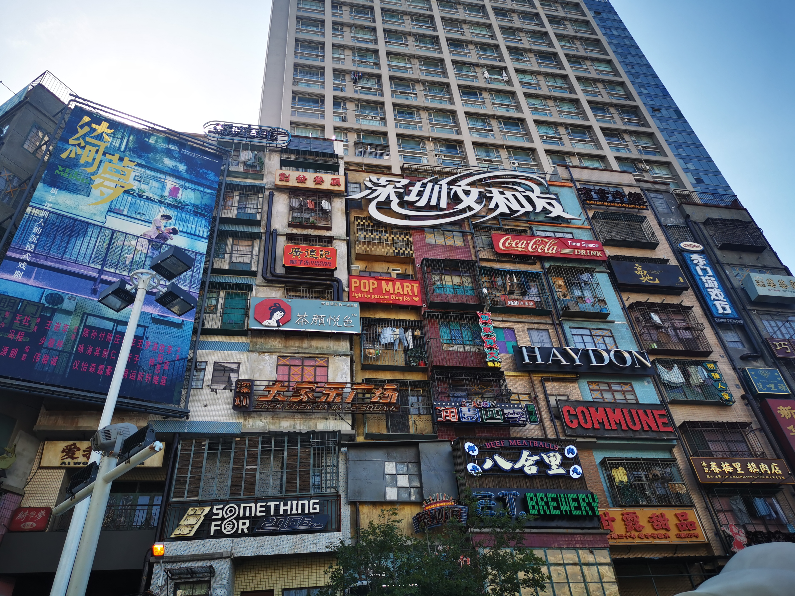
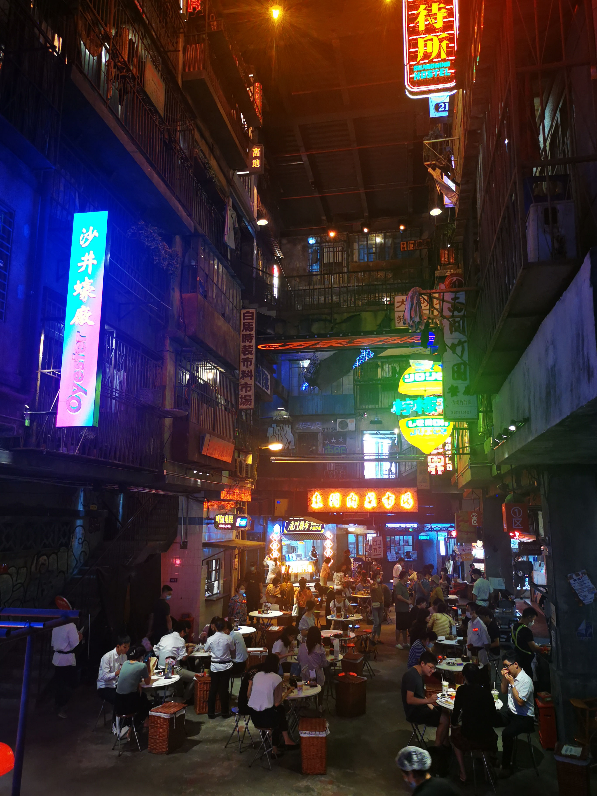
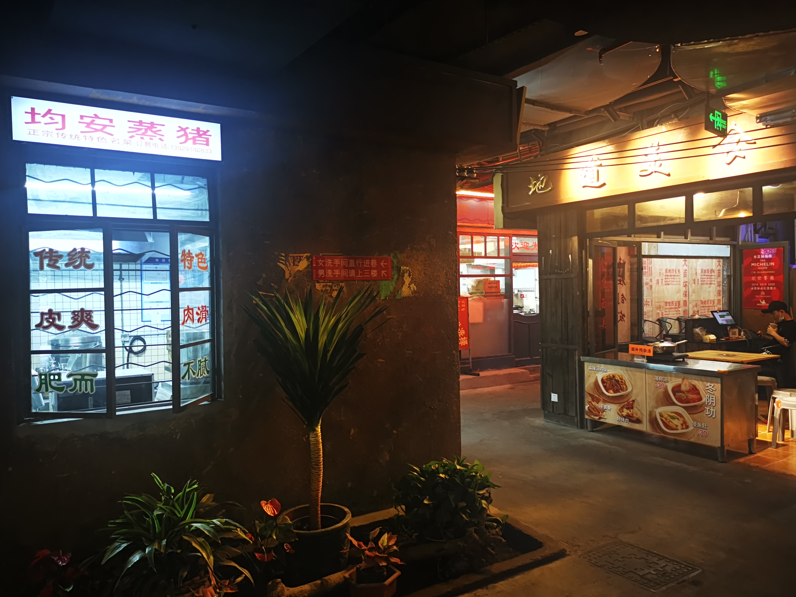
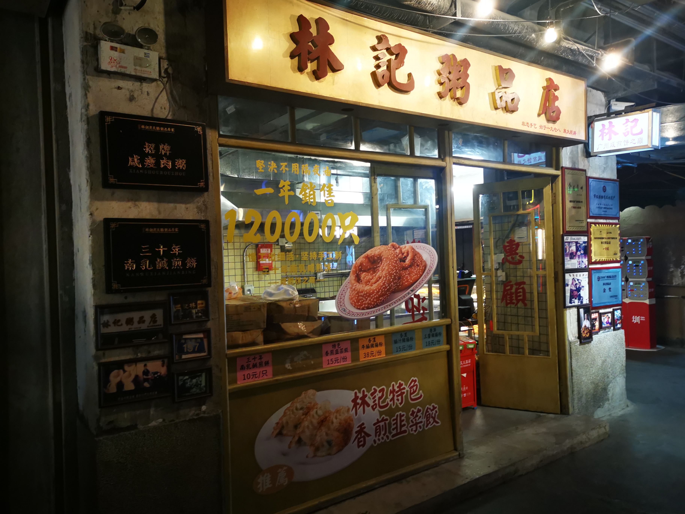
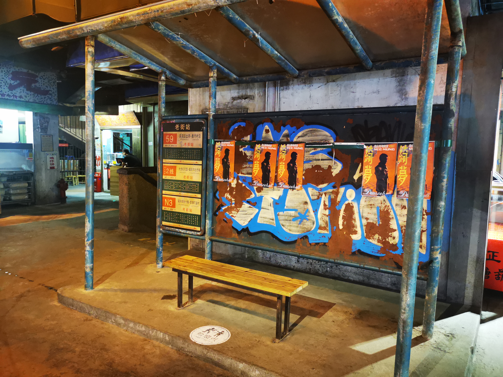
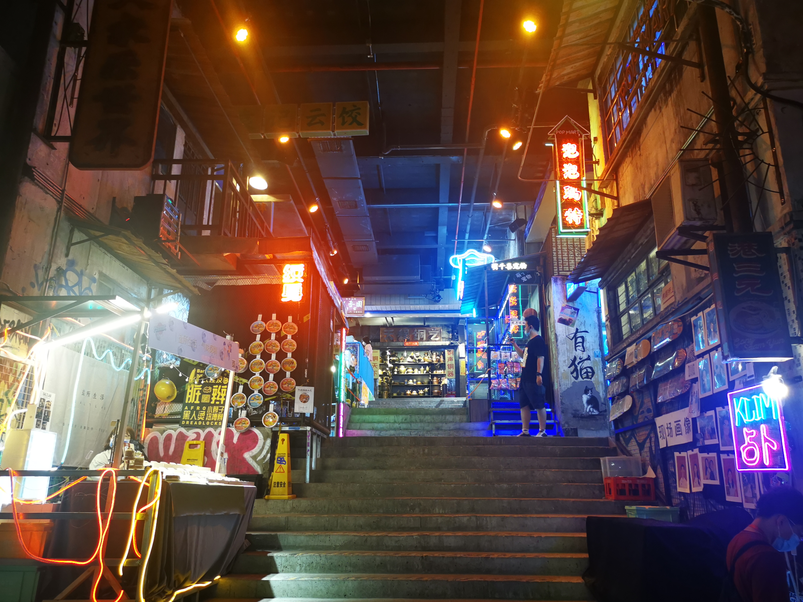
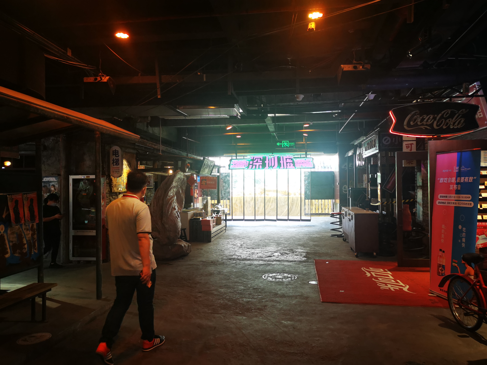

## 前言

虽然本篇的写作日期是2021-06-03，本来是打算在6月2日去深圳文和友玩了之后写的游记，但是紧跟着广东省的疫情出现，我不得不提前了回家的计划，紧接着的是办理各种离校手续，在6.9这天甚至出现了导员与学校领导关于是否让我们回哈尔滨的不同消息，闹了半天才真正解决。在此要十分感谢深圳校区辅导员辛老师的努力，在大学的三年时间里，第一次感受到了来自辅导员的关心与关怀，她是真正能把学生放在心上的辅导员老师，真的很尊敬她。

这篇游记还是按照原计划写一写在深圳文和友的所见所闻吧，然后深圳的三个半月的生活体验写在下一篇纪行里面吧。

现在是6月10日，我在机场附近的宾馆写下以上的文字，因为要赶明天早上7点半的飞机，所以今天也会睡的比较早吧。

## 文和友

文和友是一个长沙的综合商场的品牌，不过装修上很有特点，仿的是80 90年代的老长沙的风格，里面除了很多长沙地方特色的小吃，更多的是那个年代的一些独有的门店。 不过据老长沙人（DDJ）所说，长沙人基本上很少去文和友，导致文和友更像是一个外地人来长沙的打卡景点。四月文和友在深圳开了一家新店，茶颜悦色也入驻了，据说当天排号达到了5w多人，幽兰拿铁被炒到了300一杯，不过在我去的当天，由于前几日广州刚出现疫情，人不是很多，茶颜悦色排队也不到10人，基本上是去了就能点单，拍照也没有很多人，整体更像上个世纪的感觉了，总之是不错的体验。

从大学城地铁站到老街站，需要转两次，花了快一个小时才到了门口，在地铁上我预约的座位，一直显示前方有98桌等待，我还以为要等到晚上，结果到了才发现，根本没有人，直接就进去了。

进去是一个短短的走廊，一家花店和几家忘了是什么的店铺了，好像有一家豆浆店。

进去后的一楼就是筒子楼的天井，中间是类似大排档的摊位，上方楼的墙壁上挂着大大小小的招牌，站在楼梯上看，颇有弄堂的内味了。

一楼实在是太热了，我直接就去了二楼，二楼就凉快了很多，上楼梯之后就是一条曲曲折折的巷子，两侧是各式各样的老式店铺，主要是各种小吃和饮品。

万年不主动和饮品的老直男也决定点一杯尝尝，选了店铺的招牌芝士芒芒，应该不会踩雷吧，店里面除了我之外并无顾客，真正的门可罗雀。和老板攀谈起来，老板说由于广州的疫情，最近一阵子根本没有人，文和友刚开业的时候排队可以到很远，很强的对比。我也不知这里的芝士芒芒是否正宗，下层是芒果肉捣成的泥混合着茶和沙冰，最上面一层芝士做顶。下层喝起来绵糯的口感，确实很好，芒果味也很浓。不过我忘了把芝士和下面的沙冰搅拌，导致喝到最后的时候，一口芝士差点没齁死我。不过总体来说还是很不错的，为什么这里没有照片呢，因为老直男从来都不会记得让手机先吃，不过后面的茶颜悦色就涨经验了。

穿过昏暗的巷子，眼前是一个开阔的小平台，有上世纪的老旧车站，有通向三楼的小楼梯，两侧是前些年在中央大街也能看见的棉花糖和街边画像，还有一家小小的可以撸猫的地方，好像还有一家纹身美甲店，这个确实是世纪初年轻人趋之若鹜的时尚潮流。

后侧是一个通向外侧的落地窗，深圳墟，至今也没太懂这个名字的含义。旁边是可口可乐的纪念馆，由于之前在中央大街也看过类似的店铺，里面的内容也大同小异，这里的展品更少一些，仅仅是一些国外的可乐，本以为能找到记忆中十年前的玻璃瓶可乐，结果这里没有，算是一点小失望吧。

二楼主要还是一些小吃和饮品，刚喝完已被芝士芒芒，想留点肚子给茶颜，二楼我就没太光顾了，上了三楼之后才发现，三楼才是整个文和友的精髓，有上世纪的杂货店、舞厅、一家卖话梅的店、广州的杏仁饼店，还有重头戏茶颜悦色。

百货店里面算是完全的唤醒了儿时记忆，屋内香薰的味道是0几年比较火的那种，或橙色或紫色的细口瓶里面装着的香水，混合着陈年木头的味道，颇有穿越的感觉，百货店有着上世纪经典的地摊特色，地上放着箱子，箱子里杂乱的放着扇子、痒痒挠、各种木制玩具等小物件。里面的货架有老式的收音机、八音盒、水晶球，在二十几年前拥有一个这个，那可一定是孩子们中的孩子王。

当然了，也少不了我小学时门口超市的小吃，各种辣条、烟糖、猴王丹（还有人叫这个老鼠屎来着），小时候一块钱五毛钱就能买来一天的快乐，现在想想，那时的快乐还真的简单。

百货店里也少不了当时很火的“姓氏纪念品”，当年比较火的是什么姓氏的扇子、带有姓氏的笔记本，当年要是有一个这种东西，那可值得班上同学羡慕好久。这里的是姓氏戒尺，我以为不是很长，结果抽出来一看，比小臂还要长一些，带走确实比较麻烦，就不买了。

有一个货架是各种小人书，据我妈说，他们那个年代小人书很受欢迎，是那时为数不多的课外读物了。忙着挑选来着，也忘了拍照了。。。

出了百货店可以看到一个舞厅，可能是因为疫情防控吧，这天舞厅并没有开业，要不然我绝对进去跳两曲，当一次夜店小王子，啊不，浪里小白龙。舞厅外面的海报也很有味道。怎么感觉黑白的头像很像林子祥，80年代他好像确实是比较有名的香港影星，不过我还是比较喜欢他的歌，强烈推荐《敢爱敢做》。

转过一个转角就是文和友的重头戏了，茶颜悦色。茶颜悦色需要扫码购买，每个手机号每天只能预定一次，一次只能够买两杯，而且取消排队后无法重新排队，所以排队就一定要坚持下去。听杰哥和在长沙上过学同学的建议，第一杯我还是买了推荐系数最高的幽兰拿铁，加了一份奶油，等的时间不是很久，到手的时候我真的没有想到，奶油居然这么高，我只能先用细吸管一点点的撇掉奶油吃掉，不过u1s1，奶油混着坚果碎真的很好吃。剩下的奶油不是很多的时候，把奶油和下面的茶混一混，吸一口，瞬间感觉头脑清醒了很多，红茶加鲜奶的组合让茶的清爽变得很浓郁，不像喜茶的那般淡；但又不是那种茶味过于浓烈让人不想继续品尝的劝退，总而言之就是口味的层次感很鲜明，搭配上层的奶油，味道很丰富，16块钱的价位附近，我还从没喝过这么好喝的奶茶。

深圳的文和友一共有两家茶颜悦色，一家在三楼，这里的店铺较大，还有茶叶的周边；另一家在地下一层，不过只有奶茶的门店，也比较小。我准备走一走消化一会再去楼下和第二杯声声乌龙。

我喜欢在复古的走廊慢慢走着，好似穿越了时空，回到了上个世纪，那时生活好像还过的很慢，下午放学后，在夕阳金黄的余晖中与同学在巷子中追逐，等到最后一点晚霞消散在天边，在昏黄的路灯下，一级一级地爬着筒子楼的铁质楼梯回到家中，点起煤油灯开始写作业，等到夜幕上星光点点，再冲个凉水澡，收起在窗台外挂的衣服，如果不小心碰倒了床边的花盆，落到地上可能惊动了经过的小猫，在一切都收拾好后进入梦乡。我喜欢这样简单的生活，朴素但纯真。

转过一个转角，看到了一个柱子上挂满了各式各样的红绿灯。

我也喜欢文和友对很多小细节的复刻，虽说在昏暗的环境下显得很杂乱，我仍然在其中体会到了那个年代专有的独特味道，某一隅单一的色调颇有赛博朋克的味道，街边的涂鸦仿佛也在诉说着年轻人对于个性追求的觉醒，杂乱的电线、锈迹斑斑的铁管、布满灰尘的电表箱、层层覆盖的小广告贴纸，好像一切都很混乱，但又感觉充满了人间烟火味，在这种街角，我感受到了很多温暖的感觉；相反，走在整洁的现代街道上，我却没有这种感觉。

不知不觉在上世纪的街巷里走了很久，想去地下一层看看。走下水泥质感的台阶，来到了地下一层。地下一层整体是一个较大的小广场，里面也是一家百货店，外面是灵敏的按键，摇动着很难操作的摇杆，在一次次成功KO对手后感受胜利的喜悦。说道街机，我想起了杰哥的游戏房，有机会一定去长沙看看，打卡杰哥的游戏房，重新回味一下短暂的童年。

旁边是一个科学怪人的小房子，屋外是各种奇奇怪怪的小东西。小时候，每个街区一定会有一个万能的科学怪人，平时大家不懂他在敲打什么，不过哪家的灯坏了，电视机不亮了，找他一定可以解决，他的屋子里一定有着各式各样的零件，可能有会动的机器人，尽管他的大多数发明被大家视作废铜烂铁，但是这并不妨碍他的热情。这是那个知识的光辉第一次照进小黑巷子的年代，总会有人克服艰难险阻，面对种种非议依然坚持自己的梦想，我由衷的敬佩他们。

老旧的黑白电视机，厚重的大脑袋主机，不怎么好用的天线，断断续续播放着新闻的旧收音机，配上墙上手写体的“时间就是金钱，效率就是生命”，好像真的回到了二十年前。

这次喝的是茶颜悦色的声声乌龙，味道不如幽兰拿铁那样富有冲击力，不过茶香依然浓郁，配有淡淡的桃子的香味（我也不知道我是怎么喝出来这个味道的），依然是一款不错的奶茶。下次我会考虑尝一尝其他产品，应该会有不同于幽兰拿铁和声声乌龙的感觉。

最后在二楼吃了一碗竹升面，《舌尖上的中国》第一季记录过这道广州的菜，不过深圳文和友的这家店的味道很一般，装盘也是塑料碗，感觉真的很不值，也没有拍照，下次一定要去广州的竹园尝尝正宗的竹升面。

总的来说，我喜欢文和友带给我的年代感，在仿佛穿越的时光中，与历史相遇，旧式的景物、亦或是简单的气味，都会让思绪飘回那个特殊的年代，简单质朴的生活却充满了人间烟火味。我好像看到了洒满街角的金黄色的余晖，将巷子中追逐的孩童的身影拉长，二层楼厨房飘出来的香气让睡在矮墙上的小猫也不自觉的抬头寻找，穿着工服的人骑着自行车下班了，自行车的支撑脚在地上刮出的哒哒声，孩童的打闹声，树上的蝉鸣，构成了一代人最美好的回忆吧。

