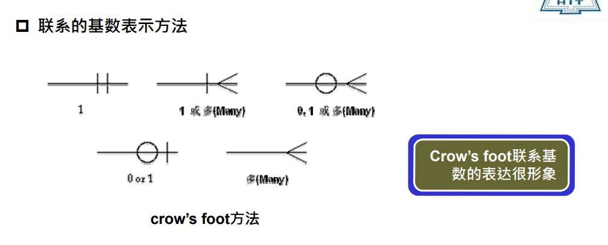

## 前言

深圳校区的《数据库系统》课程笔记。本部的数据库一直饱受诟病的是太依赖mooc了，不是说mooc不好，计算机本来就是一门发展极快的学科，mooc一录用好几年的情况实在不适合用在计算机学科上，我们希望能学到最新的知识，或者能与当前的技术做结合，第一节课之后，觉得深圳这边讲课的拓展比本部好很多。希望在这边能学到在本部学不到的知识。

## 一、数据库系统基本概念

1. Table的常用语：

- 列/字段/属性/数据项
- 行/元组/记录
- 表标题（格式）
- 表内容（值）

2. Table中描述了一批相互有关联关系的数据$\rightarrow$关系。第二章中给以严格定义：关系模型与关系运算

3. 数据库：相互之间有关联关系的Table的集合

4. 数据库系统(工作环境)
数据库(DB): Database
数据库管理系统(DBMS): Database Management System
数据库应用(DBAP): DataBase Application  
数据库管理员(DBA): DataBase Administrator  
计算机基本系统
**数据库管理系统不包括数据库管理员，数据库系统包括数据库管理员。**

5. 数据库管理系统(系统软件):从用户角度看DBMS的功能

- 数据库定义: 定义数据库中Table的名称、标题(内含的属性名称及对该属性的值的要求)等。

  - DBMS提供一套数据定义语言(DDL:Data Definition Language)给用户；
  - 用户使用DDL描述其所要建立表的格式；
  - DBMS依照用户的定义，创建数据库及其中的Table。

- 数据库操纵: 向数据库的Table中增加/删除/更新数据及对数据进行查询、  检索、统计等。
  - DBMS提供一套数据操纵语言(DML:Data Manipulation Language)给用户；
  - 用户使用DML描述其所要进行的增、删、改、查等操作；
  - DBMS依照用户的操作描述，实际执行这些操作。

- 数据库控制: 控制数据库中数据的使用---哪些用户可以使用,哪些不可以
DBMS提供一套数据控制语言(DCL:Data Control Language)给用户
  - 用户使用DCL描述其对数据库所要实施的控制
  - DBMS依照用户的描述，实际进行控制

- 数据库维护: 转储/恢复/重组/性能监测/分析…
  - DBMS提供一系列程序(实用程序/例行程序) 给用户
  - 在这些程序中提供了对数据库维护的各种功能
  - 用户使用这些程序进行各种数据库维护操作
  - 数据库维护的实用程序，一般都是由数据库管理员(DBA)来使用和掌握的

6. 数据库语言

使用者通过数据库语言利用DBMS操作数据库

- 数据定义语言(DDL:Data Definition Language)
  - DBMS提供给用户,以便用户定义数据格式
- 数据操纵语言(DML:Data Manipulation Language)
  - DBMS提供给用户,以便用户对数据进行操作
- 数据控制语言(DCL:Data Control Language)
  - DBMS提供给用户,以便用户对数据进行控制

数据库各种操作的执行
----DBMS按用户要求进行定义、操纵、控制和维护

数据库语言与高级语言:
一条数据库语言语句相当于高级语言的一个或多个循环程序

Select 列名
From 表名  
Where 条件

### 数据库系统的目标

1. 传统操作系统支持的文件处理系统弊端：

- 数据的冗余和不一致
- 数据访问困难
- 数据孤立
- 完整性问题：一致性约束很难满足，新的约束很难通过程序表现
- 原子性问题
- 并发性访问异常
- 安全性问题

2. 数据视图

   1. 数据抽象
     - 物理层：最低层次的抽象，描述数据存储方式
     - 逻辑层：描述数据库中存储什么数据以及数据间的关系
     - 视图层：最高层抽象，只描述数据库的某个部分
   2. 实例和模式
     - 实例：特定时刻存储在数据库中的信息的集合
     - 数据库模式：数据库的总体设计

   3. 数据模型

&emsp;&emsp;数据模型是数据库的基础，数据模型可以划分为四类：

  1. 关系模型：使用表的集合表示数据和数据之间的关系。*关系模型是基于记录的模型的一种*。**每个表包含某种特定类型的记录，每个记录类型定义了固定数目的字段或属性**
  2. 实体——联系模型（E-R模型）：基于对现实世界的认识：现实世界是由一组称为实体的基本对象以及这些对象间的联系构成。
  3. 基于对象的数据模型：对象关系数据模型结合了面向对象的数据模型和关系数据模型的特征。
  4. 半结构化数据模型：允许相同类型的数据项含有不同的属性集的数据定义。

### 数据库语言

#### 数据操纵语言

&emsp;&emsp;数据操纵语言：DML，即增删查改语言。
&emsp;&emsp;一般有两种基本的数据操纵语言：

- 过程化DML，要求用户指定什么数据以及如何获取这些数据
- 声明式DML，只要求用户指定需要什么数据，而不指明如何获取这些数据。

#### 数据定义语言

&emsp;&emsp;数据定义语言：DDL，使用一系列定义说明数据库模式。
&emsp;&emsp;存储在数据库中的值必须满足某些一致性约束。数据库系统实现可以以最小代价测试的完整性约束。

- 域约束
- 参照完整性
- 断言
- 授权

#### 关系数据库

关系数据库基于关系模型，包括DDL和DML。

1. 表

每个表有多个列，每个列有唯一的名字。

2. 数据操纵语言

SQL查询语言是非过程化的。以几个表作为输入（可能是一个），然后以一个表作为输出。

标准语句，select  from   where

3. 数据库定义语言

定义一个*department*表，

```SQL
create table department
  (depart_name  char(20),
  building      char(15),
  budget        numeric(12,2));
```

### 数据库设计

略

## 二、关系数据库

### 关系数据库的结构

关系数据库由**表**的集合构成，表的一行代表了一组值之间的联系。在数学术语中，*元组*是一组值的序列。在n个值之间的一种联系可以在数学上用关于这些值的一个n元组来表示，换言之，n元组就是有n个值的元组，对应表中的一行。

在关系模型的术语中，**关系**代表列，**元组**指代行，**属性**指代的是表中的列。对于关系的每一个属性，都有一个允许取值的集合，称为域。要求对所有关系r而言，r的所有属性的域都是原子的。如果域中元素被看做是不可再分的单元，则域是原子的。

### 码

一种能区分给定关系中的不同元组的方法。即，一个元组的属性值必须是能够唯一区分元组的。也即，一个关系中没有两个元组在所有属性上的取值都相同。

1. 超码：

超码是一个或多个属性的集合，这些属性的组合可以使我们在一个关系中唯一地标识一个元组。

形式化表示，设R表示关系r模式中的属性集合。如果说R的一个子集K是r的一个超码，则限制了关系r中任意两个不同元组不会再K的所有属性上取值完全相同，即如果$t_1$和$t_2$在r中且$t_1 \ne t_2$，则$t_1.K\ne t_2.K$.

如果K是超码，则K的任意超集也是超码。我们把任意真子集都不能称为超码的最小超码称为**候选码**。

2. 主码：

被数据库设计者选中、主要用来在一个关系中区分不同元组的候选码。主码应该选择那些值从不或者极少变化的属性。

3. 外码：

一个关系模式（如$r_1$）可能在它的属性中包括另一个关系模式（如$r_2$）的主码。这个属性在$r_1$上称作参照$r_2$的**外码**。关系$r_1$也称为外码依赖的**参照关系**，$r_2$叫做外码的**被参照关系**。

### 模式图

一个含有主码和外码依赖的数据库模式可以用**模式图**表示。

## 三、关系模型与关系运算

### 关系与关系模型

#### 关系

关系即表Table。

笛卡尔积：

一组域$D_1,D_2,\cdots,D_n$的笛卡尔积为：
$$
D_1\times D_2\times \cdots D_n = \left\{ \left(d_1,d_2,\cdots,d_n\right) | d_i\in D_i,i = 1,2,\cdots,n \right\}
$$

笛卡尔积的每个元素$\left(d_1,d_2,\cdots,d_n\right)$称为一个n-元组。元组$\left(d_1,d_2,\cdots,d_n\right)$的每一个值$d_i$叫做一个分量。

由于笛卡尔积中的所有元组并不都是有意义的，将笛卡尔积中有某一方面意义的那些元组称为一个关系。需要重新为每个列起一个名字，即该列的属性名，不同列名的列值可以来自相同的域。

关系可以用$R\left(A_1:D_1,A_2:D_2,\cdots A_n:D_n\right)$表示，可简记为$R\left(A_1,A_2,\cdots,A_n\right)$，这种描述又称为关系模式或表标题。

R为关系名字，$A_i$为属性，$D_i$是属性所对应的域，n为关系的度，关系中元组的数目称为关系的基数。

关系模式$R\left(A_1:D_1,A_2:D_2,\cdots,A_n:D_n\right)$中属性向域的映射在DBMS中常表示为属性的类型、长度等。

eg：

```SQL
Student(Snum char(8), Sname char(10), 
Ssex char(2), Sage integer, Dnum char(2), Sclass char(6))
```

➢列位置互换性：区分哪一列是靠列名
➢行位置互换性：区分哪一行是靠某一或某几列的值(关键字/键字/码字)
➢关系是以内容(名字或值)来区分的，而不是属性在关系的位置来区分
➢如下面两个关系是完全相同的关系

➢理论上：任意两个元组不能完全相同。(集合的要求：集合内不能有相同的
两个元素)；真实Table可能有完全相同的两行!
➢元组相同是指两个元组的每个分量都相同

**属性不可再分性称为关系第一范式。**

#### 关系模型

1. 关系模型

- DB数据的基本结构：Relation/Table
- DB数据的基本操作有：$\cup$(并, UNION)、 −(差, DIFFERENCE) 、
$\times$(广义积, PRODUCT)、 $\sigma$(选择, SELECTION)、 $\prod$(投影, PROJECTION)、 $\cap$(交, INTERSECTION) 、$\Join$(连接, JOIN)、 $\div$(除, DIVISION)运算
- DB数据的结构与操作受三个完整性的约束：实体完整性、参照完整
性和用户自定义的完整性

2. 关系模型中的完整性

➢ Relation/Table已在前面介绍过
➢ DB数据的基本操作对象是Relation/Table ，操作的结果仍然是Relation
/Table；
➢ 关系操作是集合操作，操作的对象及结果都是集合，是一次一集合(Set-at-a-time)的方式。而非关系型的数据操作方式是一次一记录(Record-at-a-time).

- 实体完整性
  - 关系的主码中的属性值不能为空值；
  - 空值：不知道或无意义的值；
  - 意义：关系中的元组对应到现实世界相互之间可区分的一个个个体，这些个体是通过主码来唯一标识的；若主码为空，则出现不可标识的个体，这是不容许的。

- 参照完整性
  - 如果关系R1的外码Fk与关系R2的主码Pk相对应，则R1中的每一个元组的Fk值或者等于R2 中某个元组的Pk 值，或者为空值
  - 意义：如果关系R1的某个元组t1参照了关系R2的某个元组t2，则t2必须存在
  - 例如关系Student在D#上的取值有两种可能:
    - 空值，表示该学生尚未分到任何系中
    - 若非空值，则必须是Dept关系中某个元组的D#值，表示该学生不可能分到一个不存在的系中

- 用户自定义完整性
  - 用户针对具体的应用环境定义的完整性约束条件

DBMS对关系完整性的支持

- 实体完整性和参照完整性由DBMS系统自动支持
- DBMS系统通常提供了如下机制：
  - 它使用户可以自行定义有关的完整性约束条件
  - 当有更新操作时，自动检验更新操作的正确性，即是否符合用户自定义的完整性

### 关系代数与关系运算

#### 关系代数

1. 并相容性

- 参与运算的两个关系及其相关属性之间有一定的对应性
- 定义：关系R与关系S存在相容性，当且仅当：
  1.  关系R和关系S 的属性数目必须相同；
  2.  对于任意i，关系R的第i个属性的域必须和关系S的第i个属性的域相同
    假设：R(A1, A2, … , An) , S(B1, B2, … ,Bm)。R和S满足并相容性：n = m 并且 Domain(Ai) = Domain(Bi)

关系代数定义了一组在关系上的运算，对应于作用在数字上的普通运算，如加减法乘法。关系代数通常以一个或两个关系作为输入，返回一个关系作为输出。

2. 集合操作

   1. 并
    假设关系R和关系S是并相容的，则关系R与关系S的并运算结果也是一个关系，记作：$R\cup S$, 它由或者出现在关系R中，或者出现在S中的元组构成。
      数学描述： $R\cup S =\left\{ t | t\in R \lor t\in S \right\}$ ，其中t是元组
      并运算是将两个关系的元组合并成一个关系，在合并时去掉重复的元组。
      $R\cup S$ 与 $S\cup R$运算的结果是同一个关系。

   2. 差
    假设关系R 和关系S是并相容的，则关系R 与关系S 的差运算结果也是一个关系，记作：R − S, 它由出现在关系R中但不出现在关系S中的元组构成。
      数学描述： $R − S =\left\{ t | t\in R \land t \ni S \right\}$ ，其中t是元组.
      $R − S$ 与 $S − R$ 是不同的.

   3. 交
    假设关系R和关系S是并相容的，则关系R与关系S的交运算结果也是一个关系，记作：$R\cap S$, 它由同时出现在关系R和关系S中的元组构成。
      数学描述： $R\cap S =\left\{ t | t\in R \land t\in S \right\}$ ，其中t是元组
      $R\cap S$ 和 $S\cap R$ 运算的结果是同一个关系
      交运算可以通过差运算来实现：$R\cap S = R − (R − S) = S − (S − R)$
  
   4. 广义笛卡尔积
    定义：关系$R (<a1, a2, …, an >)$ 与关系$S(<b1, b2, …, bm >)$ 的广义笛卡尔积(简称广义积) 运算结果也是一个关系，记作： $R \times S$, 它由关系R中的元组与关系S的元组进行所有可能的拼接(或串接)构成。
      数学描述： $R \times S =\left\{ <a1, a2, …, an, b1, b2, …, bm> |<a1, a2, …, an> \in R \land <b1, b2, …, bm> \in S \right\}$
      $R \times S = S \times R$ ： $R \times S$为R中的每一个元组都和S中的所有元组进行串接。$S \times R$为S中的每一个元组都和R中的所有元组进行串接。结果是相同的。
      两个关系R和S，它们的属性个数分别为n和m(R是n度关系，S是m度关系), 则笛卡尔积 $R \times S$的属性个数为n + m, 即元组的前n个分量是R中元组的分量，后m个分量是S中元组的分量（$R \times S$是n+m度关系）.
      两个关系R和S，它们的元组个数分别为x和y(关系R的基数x, S的基数y),则笛卡尔积$R \times S$的元组个数为$x \times y$ （$R \times S$的基数是$x \times y$）

3. 纯关系操作

   1. 选择
    给定一个关系R, 同时给定一个选择的条件condition(简记con), 选择运算结果也是一个关系，记作$\sigma_{con}\left(R\right)$ , 它从关系R中选择出满足给定条件condition的元组构成。

|符号|示例|含义|
|:----|:----|:----|
|$\sigma$选择|$\sigma_{salsry>=85000}\left(instructor\right)$|返回输入关系中满足谓词的行|
|$\prod$投影|$\prod_{ID,salary}\left(instructor\right)$|对输入关系的所有行输出指定的属性。从输出中去除重复元组|
|$\Join$自然连接|$instructor \Join department$|从两个输入关系中输出这样的元组对：它们在具有相同名字的所有属性上取值相同|
|$\times$笛卡尔积|$instructor \times department$|从两个输入关系中输出所有的元组对（无论它们在共同属性上的取值是否相同）|
|$\cup$并|$\prod_{name}\left(instructor\right)\cup \prod_{name}\left(student\right)$|输出两个输入关系中元组的并|

### 关系查询语言

查询语言：用户来从数据库中请求获取信息的语言。

1. 过程化语言：用户指导系统对数据库执行一系列操作以计算出所需结果。
2. 非过程化语言：用户只需要描述信息，而不用给出获取该信息的具体过程。

## 四、数据库完整性和安全控制

## 五、数据库建模的思想与方法

### 5.1 why?

数据模型：表达计算机世界的模型。
概念模型：表达信息世界的模型，信息世界是对现实世界的理解和抽象。

### 5.2 E-R模型 Chen方法

实体：矩形框
属性：椭圆
- 多值属性：双线椭圆
- 导出属性：虚线椭圆

关键字/码：下划线
连接属性和实体：直线
联系：菱形框
连接实体与联系：直线
连接联系和属性：直线
复合关键字：标有相同数字
多组关键字：标有不同数字

1：1联系：箭头直线，由联系指向实体
1：m联系：指向1端为箭头直线，指向多端为无箭头直线
m：n联系：无箭头直线
完全参与联系：双直线
部分参与联系：单直线

### 5.3 E-R模型 Crow's foot 方法

实体：矩形框，实体名称写在横线上
属性：实体框横线下
关键字：属性下加下划线

联系：菱形框，也可省略菱形框直接用联系名代替



## 六、数据库设计

### 6.1 数学建模工程方法

1. 实体：
   1. 独立标识符实体：独立实体——强实体
   2. 从属标识符实体：丛书实体——弱实体——没有足够属性构成主键
2. 属性/关键字：
   1. 主码：主属性
   2. 次关键字：候选码
   3. 外来关键字：外来属性
3. 联系：实体之间的关系
   1. 连接联系：
    分为标定联系和非标定联系

标定联系：子实体的实例都是由其与父实体的联系而确定的，父实体的主关键字是子实体主关键字的一部分。

非标定联系：子实体的实例能够被唯一标识而无需依赖于其实体的联系。父实体的主关键字不是子实体的主关键字。

分类联系：一个实体实例是由一个一般实体实例及多个分类实体实例构成的

- 一个一般实体是若干具体实体(分类实体)的类
- 分类实体与一般实体具有相同的主关键字
- 不同分类实体除具有一般实体特征外，各自还可能具有不同的属性特征

具体化：
实体的实例集中，某些实例子集具有区别于该实例集内其它实例的特性，可以根据这些差异特性对该实例集进行分组/分类，这一分组/分类的过程称作具体化。
子类 == 特例 == 更小的实例集合 == 更多的属性

泛化(Generalization)
若干个实体根据共有的性质，可以合成一个较高层的实体。泛化是一个高层 实体与若干个低层实体之间的包含关系。
泛化与具体化是个互逆的过程
具体化强调同一实体不同实例之间的差异属性，泛化强调不同实体之间的相似属性

### 6.2 数据库设计方法

设计过程：需求分析->概念数据库设计->逻辑数据库设计->物理数据库设计

#### 6.2.1 逻辑数据库设计

用指定DBMS要求给出概念数据库的逻辑模式描述。

1. ER图向关系模式转换

基本转换规则：实体-属性-关键字转换

实体->关系
属性->关系的属性
关键字->关系的关键字

复合属性转换：将每个分量属性作为符合属性所在实体的属性，或者将符合属性本身作为所在实体的属性

多值属性转换：将多值属性与所在实体的关键字一起组成新关系。

学生（姓名，学号，所选课程）->学生（学号，姓名），选课（学号，所选课程）


## 可能考题预测

### 并发操作可能会产生哪几类数据不一致？用什么方法能避免各种不一致的情况？

并发操作带来的数据不一致性包括三类：丢失修改、不可重复读和读“脏’夕数据。
（l）丢失修改（lostupdate）两个事务T1和T2读入同一数据并修改，T2提交的结果破坏了（覆盖了）T1提交的结果，导致T1的修改被丢失。
（2）不可重复读（Non一RepeatableRead）不可重复读是指事务T1读取数据后，T2执行更新操作，使T1无法再现前一次读取结果。
（3）读“脏”数据（DirtyRead）读“脏”数据是指事务T1修改某一数据，并将其写回磁盘，事务几读取同一数据后，T1由于某种原因被撤销，这时T1已修改过的数据恢复原值，T2读到的数据就与数据库中的数据不一致，则T2读到的数据就为“脏”数据，即不正确的数据。

避免不一致性的方法和技术就是并发控制。最常用的技术是封锁技术。也可以用其他技术，例如在分布式数据库系统中可以采用时间戳方法来进行并发控制。

### 什么是E-R图？构成E-R图的基本要素是什么？

E-R图为实体-联系图，提供了表示实体型、属性和联系的方法，用来描述现实世界的概念模型。

　　构成E-R图的基本要素是实体型、属性和联系，其表示方法为：

　　· 实体型：用矩形表示，矩形框内写明实体名；

　　· 属性：用椭圆形表示，并用无向边将其与相应的实体连接起来；

　　· 联系：用菱形表示，菱形框内写明联系名，并用无向边分别与有关实体连接起来，同时在无向边旁标上联系的类型（1 : 1，1 : n或m : n）。

### 数据库恢复的基本技术有哪些

转储和登录日志文件是数据库恢复的基本技术。
当系统运行过程中发生故障时，利用转储的数据库后备副本和日志文件就可以将数据库恢复到故障前的某个一致性状态。

### 外模式模式内模式的区别与联系

1、外模式
外模式又称子模式，对应于用户级。它是某个或某几个用户所看到的数据库的数据视图，是与某一应用有关的数据的逻辑表示。外模式是从模式导出的一个子集，包含模式中允许特定用户使用的那部分数据。用户可以通过外模式描述语言来描述、定义对应于用户的数据记录(外模式)，也可以利用数据操纵语言(DML)对这些数据记录进行。外模式反映了数据库的用户观。
2、内模式
内模式又称存储模式，对应于物理级，它是数据库中全体数据的内部表示或底层描述，是数据库最低一级的逻辑描述，它描述了数据在存储介质上的存储方式翱物理结构，对应着实际存储在外存储介质上的数据库。内模式由内模式描述语言来描述、定义，它是数据库的存储观。
3、模式
模式又称概念模式或逻辑模式，对应于概念级。它是由数据库设计者综合所有用户的数据，按照统一的观点构造的全局逻辑结构，是对数据库中全部数据的逻辑结构和特征的总体描述，是所有用户的公共数据视图(全局视图)。它是由数据库管理系统提供的数据模式描述语言(DDL)来描述、定义的，体现、反映了数据库系统的整体观。

