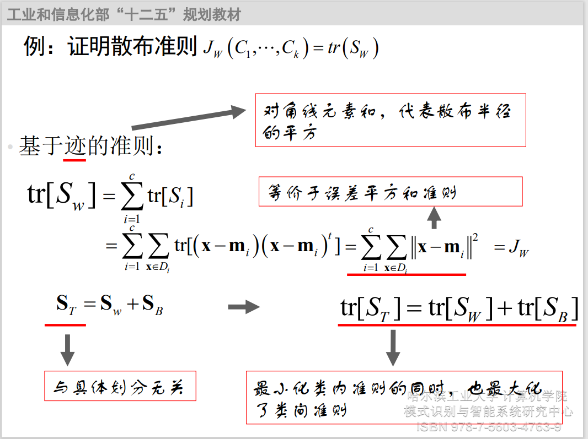
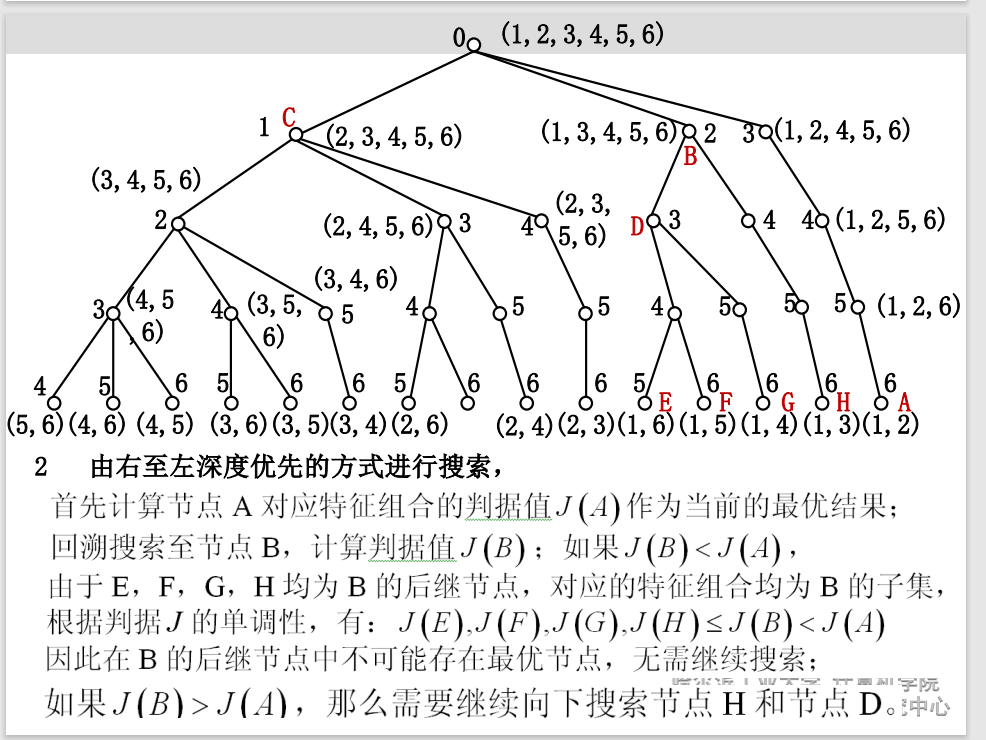

# 模式识别

## 第一章 绪论

### 分类与聚类

1. 有监督学习：分类

  已知：训练样本，每个样本的所属类别。

​  目的：利用训练样本的学习分类器，对未知类别样本分类。
2. 无监督学习：聚类
​  已知：训练样本
  未知：不知道样本的所属类别，甚至类别数量也未知。
  目的：利用无监督样本集，发现规律，对当前样本集合中样本进行分类。

​**只有一部分样本有标签：半监督学习，标签不可靠：弱监督学习**

### 统计模式识别与结构模式识别

统计方法：将模型看做空间中的一个点，采用解析几何和概率论、数理统计的方法，判别输入模式的类别属性。

结构方法：将模式看做是由一些基本元素有组织的构成，利用形式语言和自动机理论对模式的结构进行分析和判别。

### 鉴别模型与产生式模型

鉴别模型：不同类别样本在特征空间中处于不同区域，学习$g(x)$，对于不同区域输出不同值。

产生式模型：模式时随机分布在特征空间中的一个随机矢量，在不同位置出现的概率不同。根据模式在某点出现的概率来判断该点所属的类别。

## 第二章 模式识别系统

### 模式识别系统构成：先“找到目标”，再“作出判别”。

综合滤波、投影、压缩等方法，获得相对通用、稳定有效的特征描述子。

HOG（特征描述子）+SVM行人检测

HOG：方向梯度直方图，利用图像边缘的方向密度分布描述图像特征

1. 图片Gamma和颜色的归一化；

2. 计算梯度；

3. 构建直方图； 

4. Block混叠空间块的归一化； 

5. 构建HOG特征描述子； 

6. SVM训练；

SHIFT：尺度不变特征变换，改变旋转角度，图像亮度或拍摄视角，仍然能够得到好的检测效果

1. 构建多尺度高斯差分DOG边缘图 像序列 
2. 找到局部极值点，去除不对称、 不清晰、不稳定的点作为特征点。 
3. 找到特征点主方向，梯度直方图 描述

SIFT：尺度不变特征变换，改变旋转角度，图像亮度或拍摄视角，仍然能够得到好的检测效果

### 特征的比较与分类

将待识别样本x分类到与其最相似的类别中

* 输入：需要识别的样本x ； 

* 计算x与所有类别的相似度$s(x, \omega_i). i=1,...,c$； 

* 输出：相似度最大的类别$\omega_j$ 

  $$
  j = \arg\max s(x,\omega_j)
  $$

* 关键问题 ：如何度量样本x与类别 i 的相似程度？

### 模板匹配：

每个类别的“先验知识”就是一个样本（模板）$\mu_i$

利用x与模板 $\mu _i$的相似度，作为x与类别$\omega _i$的相似度

用距离度量样本之间相似度，一般用二范数：
$$
s(x,\mu) = -d(x,\mu)=-\lVert x-\mu \rVert_2
$$

### 最近邻分类器

每一个类别有多个训练样本 $D(x_1, ...,x_{n_i})$，

输入：需要识别的样本x，训练样本集。

目标：寻找D中与x最近的样本y。

输出：y所属的类别。

缺点：计算量大，占用存储空间大，易受到样本噪声影响。

加速方法：

1.转为单模板加速，为每个类别的训练样本学习出一个模板$\mu$，思路，距离训练样本距离都比较近的点。
$$
\mu _i = \arg \min \sum_{k=1}^{n_i}d(x_k^{(i)},\mu), \mu\in R^d
$$
误差平方和准则函数：
$$
J_{i}(\mu)=\sum_{k=1}^{n_i}\lVert x_{k}^{(i)}-\mu \rVert^2
$$
极值点导数为0，
$$
\nabla J_i(\mu)=\sum_{k=1}^{n_i}2(x_k^{(i)-\mu}=0
$$

$$
\mu=\frac{1}{n}\sum_{k=1}^{n_i}x_{k}^{(i)}
$$

结论：计算每个类别训练样本的均值作为匹配模板。

2.多模板加速

使用多个模板，减少匹配次数

3.近邻剪辑

### K近邻

选择距离最近的k个样本决定。

* K的选择：过小，近似于最邻近分类。过大，引起分类误差。

常用距离函数：

- 街市距离

  $$
  d(x,y)=\lVert x-y \rVert_1=\sum_{i=1}^{n}\lvert x_i -y_i \rvert
  $$

- 切比雪夫距离：
  $$
  d(x,y) =\lVert x-y \rVert_{\infty}=\max
  $$

### 样本规格化

使样本每一个维特征均分布在相同的范围内。

- 均匀缩放，使得每个维度都缩放到$[0,1]$之间。
- 高斯缩放：假设每一维特征都符合高斯分布，平 移、缩放为标准高斯分布。

### 加权距离

计算不同特征时，引入不同权重，克服量纲影响，体现不同特征重要性。

汉明距离：两个矢量对应位置元素不同的数量。

### 分类器性能评价

拒识率：只对有把握的样本判别类别，对没有把我的样本拒绝识别。设 M 个样本分类，$m_r$个被拒识，$m_e$个分类错误。

错误率：$P_e=\frac{m_e}{M-m_r}$，拒识率：$P_r=\frac{m_r}{m}$

召回率（查全率），相关信息中被检索出来的比例，$P_s=\frac{a}{a+b}$，准确率：检索到的信息，与主题相关的比例，$P=\frac{a}{a+c}$

### 评价方法：

1. 两分法：随机将训练集划分为不相交两个子集。分别训练，测试，重复多次。
2. 交叉验证：随机分成不相交的k个子集，使用k-1个训练，剩余用作测试。取平均
3. Bootstrap方法：样本集有放回的抽取n个样本，组成样本集A，B，集合A训练，B测试重复k次。

### 误差分析：

偏差：训练集的错误率。

方差：开发集错误与训练集错误的差值。

总误差，均方误差：偏差+方差

### 减小“可避免偏差”技术：

1. 加大模型规模，是算法更好的拟合训练集
2. 对训练集进行分析，根据结果修改输入特征：增加额外特征，消除特定类别的误差。引入正则化抵消方差。
3. 减小或去除正则化。
4. 修改模型

### 减小方差：

1. 必须：
   1. 增加更多训练数据。
   2. 提前终止
2. 常用的：
   1. 计算成本不敏感是使用正则化
   2. 样本少时进行特征选择
   3. 降低计算成本时，减小模型规模

## 第三章 特征选择与特征提取

### 降维

- 高维空间映射到地位空间
- 降低计算的复杂度
- 提高分类器性能

应用角度：

- 特征选择：从原始特征中直接挑选对分类最有价值的
- 特征提取将原始特征变换得到新的低维特征

特征分析数学基础：

1. 分析样本集在特征空间中的分布情况：奇异值分解
2. 内积矩阵：各样本之间的相似度（距离）
3. 外积矩阵：各维特征的分布（协方差）

正态分布：
$$
p(x)\sim N(\mu, \sigma^2)\\
p(x) = \frac{1}{\sqrt{2\pi}\sigma}\exp[-\frac{1}{2}(\frac{x-\mu}{\sigma})^2]
$$
多元正态分布函数：
$$
p(x)\sim N(\mu,\Sigma)\\
p(x)=\frac{1}{(2\pi)^{\left.d /\right.2} \lvert \Sigma\rvert^{1/2}}\exp[-\frac{1}{2}(x-\mu)^t\Sigma^{-1}(x-\mu)]
$$
均值：$\mu=E(x)=\int xp(x)dx$

协方差矩阵：
$$
\Sigma = E((x-\mu)(x-\mu)^t) = \int (x-\mu)(x-\mu)^tp(x)dx\\
\sigma_{ij} = E((x_i-\mu_i)(x_j-\mu_j))
$$
**散布矩阵**

样本x的散布矩阵：
$$
S=\frac{1}{n}\sum_{s\in D}(x-m)(x-m)^t\\
=\frac{1}{n}\sum_{s\in D}[(x_i-m_i)(x_j-m_j)]_{d\times d}
$$

### 类别可分判定依据

可分性依据：类内散布程度低，类间散布程度高。

类内距离准则：用每个样本与其所属类别中心之间距离平方和来度量。

类间距离准则：用每个类别的中心到样本整体中心之间的加权距离平方和度量。

证明散布准则。

### 特征选择：

从原始的特征集合 $\mathcal{X}$中挑选出一组最有利于分类的特征 $\mathcal{X}'$

#### 分支定界法：

判据单调性：对于两个特征子集$\mathcal{X}_1$,$\mathcal{X}_2$，

$$
\mathcal{X}_1\subset \mathcal{X}_2 \Rightarrow J(\mathcal{X}_1)\subset J(\mathcal{X}_2)
$$

**当可分性判据满足单调性时，分支定界法才能够保证搜索到最优特征集合。**

方法：

自顶向下构建搜索树，每条路径对应一种删除方式。

问题：

1. 可分性判据必须具有单调性。不具有单调性则不能保证得到最优选择；
2. 最优解分支位置决定计算复杂度。
➢ 如果最优解分支在最右端并且根节点的子节点判据值均
小于最优解，则搜索效率最高；
➢ 如果每个分支的可分性判据都大于其左端分支的可分性
判据，实际的计算复杂度会超过穷举法。
1. 计算量仍然可观。当原始的特征维数很大时，搜索到最优
解需要的计算量仍然可观

#### 次优搜索算法

1. 顺序前进法（Sequential Forward Selection, SFS）

从一个空集开始每次向选择的特征集合中加入一个特征，直到特征集合中包含d'个特征为止，每次选择加入特征的原则：加入特征集后能够使得可分性判据最大。

每轮迭代只需要计算将每一个未被选择的特征加入 $\mathcal{X}'$之后的判据值，选择除d'个特征需要就散判据值的此时为：

$$
\sum_{i=0}^{d'-1}(d-i) = \frac{d'(2d-d'+1)}{2}
$$

2. 顺序后退法

每一轮从特征集中选择一个最差的特征删除，选择特征的原则是将其删除之后使得判据值下降最小。

$$
\sum_{i=0}^{d-d'-1}(d-i) = \frac{(d-d')(d+d'+1)}{2}
$$

3. 广义顺序前进（后退）法

每次增加或删除 r个特征

### 特征提取

特征选择：从原始x中选出若干维特征
特征提取：对原始特征进行函数变换得到新特征

#### 主成分分析PCA

PCA是一种最常用的线性成分分析方法；PCA的主要思想是寻找到数据的主轴方向，由主轴构成一个新的坐标系（维数可以比原维数低），然后数据由原坐标系向新的坐标系投影。

将数据集空间，压缩为一条过均值点的线。每个样本在直线上存在不同的投影，可以反映样本间的差异。

零维平方误差到一维平方误差：
$$
J_0(m)=\sum_{k=1}^{m}\lVert m-x_k \rVert^2\\
J_1(a_1,\cdots,a_n,e)=\sum_{k=1}^{n}\lVert (m+a_ke)-x_k \rVert^2
$$

$$
\frac{\partial J_1}{\partial a_k} = \sum_{k=1}^{n}a_k^2 \lVert e \rVert^2-2\sum_{k=1}^{n}a_ke^t(x_k-m)+\sum_{k=1}^{n}\lVert x_k-m \rVert^2=0\\
a_k=e^t(x_k-m)
$$

只需把向量 $x_k$ 向过 m 的直线垂直投影就能得到最小方差

$$
J_1(e) = 
$$

 

