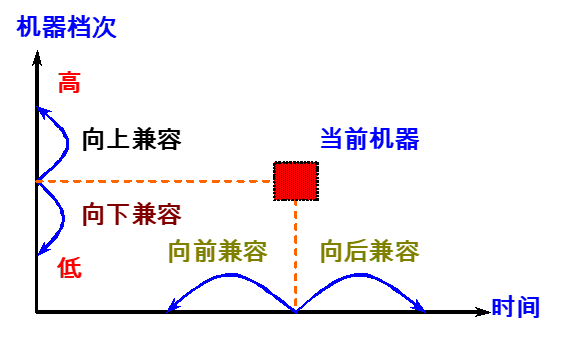
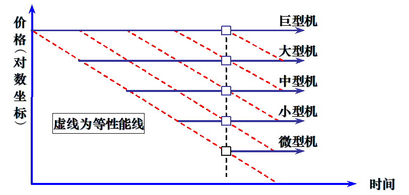
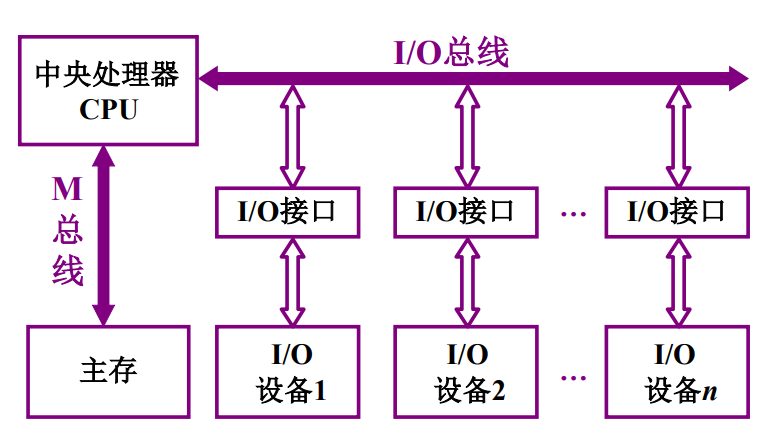
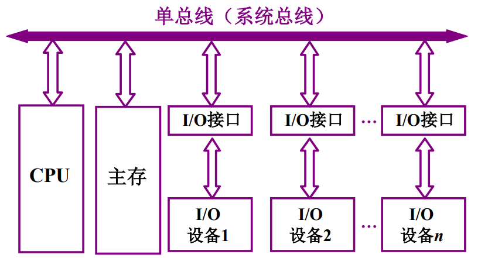
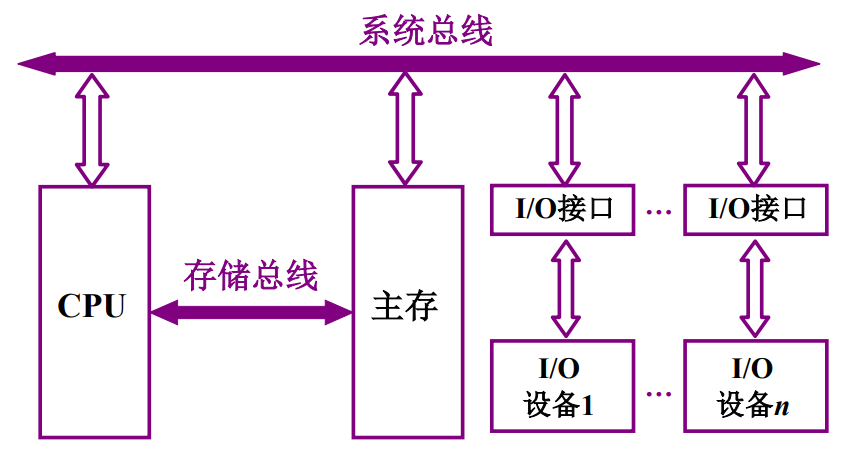
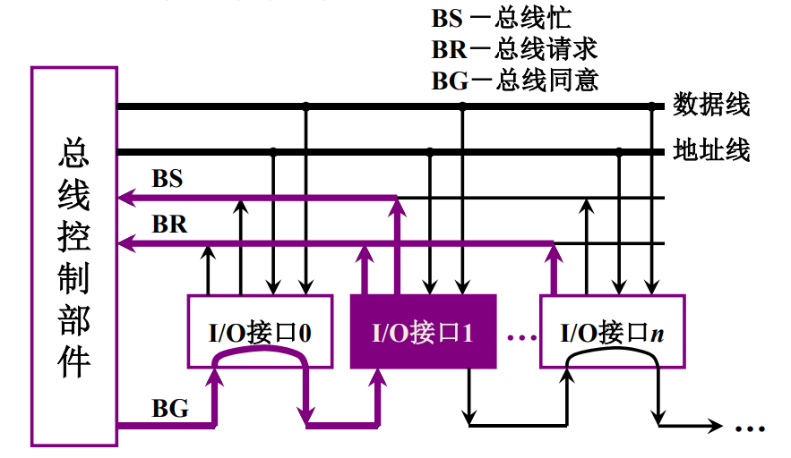
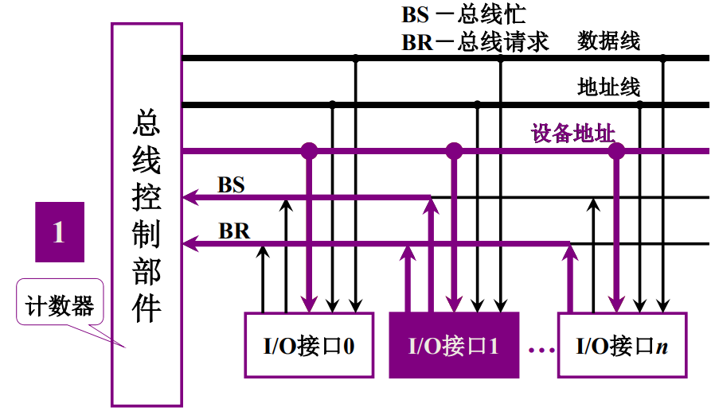
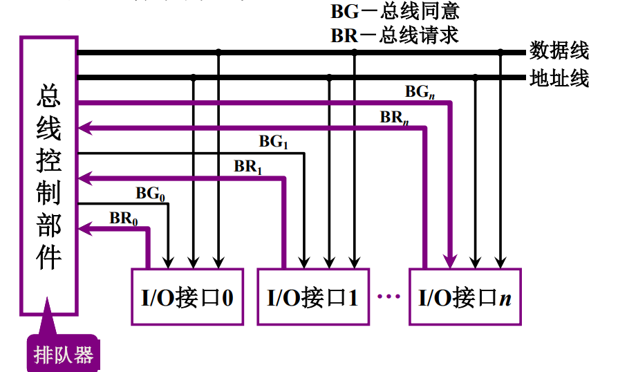

## 前言

本学期最绝望的一门课，没有之一，建议学弟学妹们不要选这门课，真的内容多又难，而且作业多，签到多，选修不做实验真的什么都不懂，建议选修cv专业课和认知神经科学原理，真的很赚。

## 一、计算机系统概论

### 1.1 计算机系统简介

1. 计算机系统：

- 硬件：计算机实体
- 软件：具有各类特殊功能的信息
  - 系统软件：管理整个计算机系统：语言处理程序、操作系统、服务型程序、数据库管理系统、网络软件。
  - 应用软件：按任务的各种应用程序。

2. 计算机解题过程：

高级语言$\xrightarrow{翻译}$目标程$\xrightarrow{运行}$结果

3. 计算机系统结构层次

- 高级语言$\rightarrow$虚拟机器$M_4$，用编译程序翻译为汇编语言程序
- 汇编语言$\rightarrow$虚拟机器$M_3$，用汇编程序翻译成机器语言程序
- 操作系统$\rightarrow$虚拟机器$M_2$，用机器语言解释操作系统
- 机器语言$\rightarrow$实际机器$M_1$，用微指令集解释机器指令
- 微指令系统$\rightarrow$微程序机器$M_0$，由硬件直接执行微指令

### 1.2 计算机基本组成

#### 1.2.1 冯诺依曼计算机特点

1. 计算机由五大部件组成
   - 存储器：存放数据和程序
   - 运算器：算术运算和逻辑运算
   - 控制器：指挥程序运行
   - 输入设备：将信息转换为机器可以识别的形式
   - 输出设备：将机器运算结果转换为人可识别的形式

2. 指令和数据以同等地位与存储器，可按照地址寻访
3. 指令和数据用二进制表示
4. 指令由操作码和地址码组成
5. **存储程序**
6. 以运算器为中心

#### 1.2.2 现代计算机

&emsp;&emsp;现代计算机一存储器为核心，运算器ALU + 控制器CU = CPU，主存 + 辅存 = 存储器，主存 + CPU = 主机，输入设备 + 输出设备 = I/O设备，主机 + I/O设备 = 硬件。

#### 1.2.3 计算机工作步骤

1. 上机前准备
   - 建立数学模型
   - 确定计算方法
   - 编制解题程序
     - 程序：运算的全部步骤
     - 指令：每一个步骤

2. 计算机解题过程
   - 存储器的基本组成
     - 存储单元：存放一串二进制代码
     - 存储字：存储单元中二进制代码的组合
     - 存储字长：存储单元中二进制代码的组合，每个存储单元会被赋予一个地址号
     - 按地址访问
     - MAR：存储器地址寄存器，反应存储单元的个数
     - MDR：存储器数据寄存器，反应存储字长
     - eg：MAR=4位，MDR=8位，则存储单元有16个，每个的存储字长为8位。
   - 运算器的基本组成

|  | ACC | MQ | X |
|:-----------:|:-----------:|:-----------:|:-----------:|
|加法|被加数 和||加数|
|减法|被减数 差||减数|
|乘法|乘积高位|乘数和乘积低数位|被乘数|
|除法|被除数和余数|商|除数|

3. 控制器的基本组成
   - PC：存放当前欲执行指令的地址，具有计数功能，（PC）+1$\rightarrow$PC
   - IR：存放当前欲执行的指令
   - CU：控制单元

### 1.3 硬件主要技术指标

1. 机器字长：CPU一次能处理数据的位数，与CPU中的寄存器位数有关（即rax，rbx寄存器位数）。
2. 运算速度
   - 主频
   - 吉普森法：$T_m = \sum_{i=1}^{n}f_it_i$
   - MIPS：每秒执行百万条指令
   - CPI：执行一条指令所需时钟周期数
   - FLOATS：每秒浮点运算次数

3. 存储容量：存放二进制信息的总位数
   - 主存容量：存储单元$\times$存储字长。
     - eg：MAR = 10，MDR = 8，容量1Kb$\times$8位；MAR = 16，MDR = 32，容量64Kb$\times$32位
     - 字节数：1K=$2^{10}$，1B=$2^3$b，1GB=$2^{30}$B
   - 辅存容量：字节数

## 二、计算机系统量化分析基础

### 2.1 计算机体系结构概念

#### 2.1.1 计算机体系结构概念演变

&emsp;&emsp;计算机体系结构是程序员所看见的计算机的属性，即概念性结构和功能特性。

&emsp;&emsp;程序员所看见的计算机属性：

1. 通用寄存器：
   - 数据表示：硬件能直接辨认和处理的数据类型
   - 寻址规则：最小寻址单元、寻址方式及其表示
   - 寄存器定义：寄存器定义、数量、使用方式
   - 指令系统：机器指令的操作类型和格式、指令间的排序和控制机构
   - 中断系统：中断的类型和中断响应硬件的功能
   - 机器工作状态的定义和切换：管态、目态
   - 存储系统：程序员可用的最大存储容量
   - 信息保护：信息保护方式和硬件支持
   - I/O结构：I/O寻址方式、数据传送方式

#### 2.1.2 计算机体系结构、组成和实现

&emsp;&emsp;体系结构的概念用于描述计算机系统设计的技术、方法和理论，包括：

- 计算机指令系统
- 计算机组成
- 计算机硬件实现

1. 计算机组成

- 指令集结构的逻辑实现
  - 数据通路的宽度
  - 专用功能部件的设置
  - 功能部件的并行性
  - 缓冲和排队技术
  - 预测技术
  - 可靠性技术
  - 控制机构组成

2. 计算机实现

- 处理器、主存的物理结构
- 器件的集成度和速度
- 信号传输
- 器件、模块、插件、底板的划分与连接
- 涉及的专用器件
- 电源、冷却
- 微组装技术
- 整机装配技术

#### 2.1.3 系列机和兼容

1. 系列机
&emsp;&emsp;系列机：具有相同体系结构，但组成和实现不同的一系列不同型号的计算机系统。现代计算机不但系统系列化，构成部件和软件也系列化，如微处理器CPU、硬盘、操作系统、高级语言等。
&emsp;&emsp;一种指令集结构可以由多种组成，一种组成也可以有多种物理实现。**系列机**就是在**一个厂家**生产的具有相同指令集结构，但具有不同组成和实现的一系列不同型号的机器。

2. 兼容
软件兼容：
   - 系列机具有相同的体系结构，软甲可以在系列计算机的各档机器上运行。
   - 同一个软件可以不加修改地运行于体系结构相同的各档计算机，而且获得的结果一样，差别只是不同的运行时间。
   - 兼容分为二进制兼容、汇编级兼容、高级语言兼容、数据级兼容等。

3. 兼容机
   - 不同厂家生产的具有相同体系结构的计算机
   - 推动了部件的规范化、计算机产品标准化的进程，降低了生产和制造成本
   - 较强竞争力

4. 兼容性
   - 向上（下）兼容：某档机器编制的程序，不加修改的就能运行于比它高（低）档的机器。
   - 向前（后）兼容：某个时期投入市场的某种型号机器编制的程序，不加修改地就能运行于在其之前（后）投入市场的机器。
   - **向前兼容更难**

1. 兼容性对体系结构的影响
   - 计算机系统及软件设计者的障碍
     - 系统软件开发难度大
     - 需要保护巨大的应用软件宝库
   - 向后兼容是才是软件兼容的根本特征，也是系列机的根本特征
     - 为了保证软件的兼容，要求指令集不改变，这无疑又妨碍计算机体系结构的发展
     - 向后兼容虽然削弱了系列机对体系结构发展的约束，但仍然是体系结发展的沉重包袱
     - 20世纪80年代具有RISC体系结构的微处理器在新结构、新技术应用等方面领先传统的CISC微处理器的主要原因之一

### 2.2 计算机体系结构发展

#### 2.2.1 计算机分代

技术和性能的“下移”。新型体系结构的设计一方面是**合理地增加计算机系统中硬件的功能比例**。另一方面则是**通过多种途径提高计算机体系结构中的并行性**。

#### 2.2.2 软件的发展

程序和数据使用的存储器容量不断增大。

1. 计算机语言与编译技术
2. 操作系统
3. 软件工具与中间件

#### 2.2.3 应用的发展

1. 嵌入式计算机：包括移动设备和掌上计算机
2. 台式计算机：对性价比要求最高
3. 服务器市场：可用性、高流量密度和可扩展性
4. 数据中心：类似于服务器要求，电能和散热系统很重要
5. 巨型机：面向浮点运算的数据中心计算机，内部网络需要更高的带宽和更低的延迟。

#### 2.2.4 相关核心技术的发展

1. 摩尔定律
2. 缩放定律：如果将MOS管的尺寸和电压减半，MOS管的切换速度将提高两倍，耗电量降至$\left.1 / \right.4$。
3. DRAM：单个DRAM模块的容量每年增减25%$\sim$40%，增速逐年下降。
4. 闪存：近几年，每年约50%$\sim$60%速度增长，大约每两年翻一番，大量用于便携式设备。
5. 磁盘：从04年开始，大约每年增长40%，约3年翻一番，SSD成本迅速下降。
6. 网络：ptsd，不写了。

#### 2.2.5 体系结构的发展

1. 分布式I/O处理能力
2. 保护的存储器空间
3. 存储器组织结构的发展
4. 并行处理技术
5. 指令集的发展

#### 2.2.6 并行处理技术的发展

1. 并行性：计算机系统在同一时刻或同一时间间隔内进行多种运算或操作。
   - 同时性：两个或两个以上的事件在同一时刻发生
   - 并发性：两个或两个以上的时间在同一时间间隔内发生
2. 从执行程序的角度，并行性从低到高分为：
   - 指令内部并行：单条指令中各种微操作之间的并行
   - 指令级并行：并行执行两条或两条以上的指令
   - 线程级并行：并行执行两条或两条以上的线程（通常是以一个进程内派生的多个线程为调度单位）
   - 任务级或过程级并行：并行执行两条或两条以上的过程或任务（程序段），以子程序或进行为调度单元
   - 作业或程序级并行：并行执行两个或两个以上的作业或程序
3. 从处理数据的角度，并行性从低到高可分为：
   - 字串位串：每次只对一个字的一位处理，是最基本的串行处理方式，不存在并行性。
   - 字串位并：同时对一个字的全部位进行处理，不同字之间是串行的，开始出现并行性。
   - 字并位串：同时对许多字的同一位（称为**位片**）进行处理。
   - 全并行：同时对许多字的全部位或部分位进行处理。
4. **计算机系统结构的Flynn分类法**，去年考了
   - 单指令流单数据流SISD
   - 单指令流多数据流SIMD
   - 多指令流单数据流MISD
   - 多指令流多数据流MIMD
5. **提高并行性的技术途径**（大胆预测一波今年考）：
   - 时间重叠：引入时间因素，让多个处理过程在时间上互相错开，轮流重叠地使用同一套硬件设备的各个部分，以加快硬件周转而赢得速度。
   - 资源重叠：引入空间因素，以数量取胜。通过重复设置硬件资源，大幅度地提高计算机系统的性能
   - 资源共享：软件方法，使得多个任务按一定时间顺序轮流使用同一套硬件设备。
6. 单机系统中并行性的发展：
   - 在发展高性能单处理机过程中，**起主导作用的是时间重叠原理**
   - 实现时间重叠的基础：部件功能专用化
7. 多机系统中并行性的发展：
   - 多机系统遵循时间重叠、资源重叠、资源共享管理
   - 发展为三种不同机型：同构型多处理机，异构型多处理机，分布式系统
   - 耦合度：反映多机系统中各机器之间物理连接的紧密程度和交互能力的强弱。

### 2.3 计算机系统设计和分析

#### 2.3.1 成本与价格

略过，买不起

#### 2.3.2 基准测试程序

不重要，略过

#### 2.3.3 量化设计的基本原则

1. 大概率事件优先原则：追求全局的最优结果
   - 对于大概率事件，赋予其优先的处理权和资源使用权，以获得全局的最优结果
2. Amdahl定律
   - 系统性能加速比，受限于该部件在系统中所占的重要性
   - 可以定量计算
   - 假设我们对机器部件进行某种改造，那么机器系统部件的加速比为
$$ 系统加速比 = \frac{系统性能_{改进前}}{系统性能_{改进后}} = \frac{总执行时间_{改进前}}{总执行时间_{执行后}} $$
   - 系统加速比告诉我们改进后的机器比改进前快多少，依赖于两个因素：
     - **可改进比例**：可改进部分在原系统 计算时间所占的比例，总是小于1的
     - **部件加速比**：可改进部分改进后的性能提高，一般是大于1的
   - 改进后，系统的总执行时间等于不可改进部分的执行时间加上可改进部分改进后的执行时间。
$$
\begin{aligned}
    \text{总执行时间}_{\text{改进后}}
	&=\left( 1-\text{可改进比例} \right) \times \text{总执行时间}_{\text{改进前}}+\frac{\text{可改进比例}\times \text{总执行时间}_{\text{改进前}}}{\text{部件加速比}}\\\\
	&=\text{总执行时间}_{\text{改进前}}\times \left[ \left( 1-\text{可改进比例} \right) +\frac{\text{可改进比例}}{\text{部件加速比}} \right]
\end{aligned}
$$
   - 系统加速比为改进前与改进后总执行时间之比，为
$$
\begin{aligned}
\text{系统加速比}&=\frac{\text{总执行时间}_{\text{改进前}}}{\text{总执行时间}_{\text{改进后}}}\\\\
&=\frac{1}{\left(1-\text{可改进比例}\right)+\frac{\text{可改进比例}}{\text{部件加速比}}}
\end{aligned}
$$
   - Amdahl定律的观点：
     - 性能增加的递减原则
     - 针对整个任务的一部分进行优化，则**最大加速比**不大于$\frac{1}{1-可改进比例}$
     - Amdahl定律衡量一个好的计算机系统：具有高性能的计算机系统是一个带宽平衡的系统，而不是看某些部件的性能

3. 程序的局部性原理
   - 程序执行时所访问存储器在时-空上是相对簇聚的
   - 簇聚包括时间局部性和空间局部性
   - 程序的时间局部性：程序即将用到的信息可能是目前正在使用的信息
   - 程序的空间局部性：程序即将用到的信息与目前正在使用的信息在空间上相邻或相近

4. CPU时间
   - CPU时间：执行一个程序所需的时间：CPU时间 = 执行程序所需的时钟周期数$\times$时钟周期时间
   - CPI：每条指令执行的平均时钟周期数：CPI = 执行程序所需的时钟周期数 / IC，取决于计算机组成和指令系统的结构
   - IC：执行指令的条数，取决于指令系统结构和编译技术
   - CPU时间 = IC $\times$ CPI $\times$ 时钟周期时间，取决于硬件实现技术和计算机组成

5. CPU性能公式
   - 假设计算机系统有n种指令，其中第i种指令的处理时间为$\text{CPI}_i$，在程序中第i种指令出现的次数为$\text{IC}_i$

$$
\begin{aligned}
    \text{T}_{\text{CPU}} &= \sum \left(\text{IC}_i\times \text{CPI}_i\right) / f\\\\
    &= \sum \left(\text{IC}_i\times \text{CPI}_i\right) \times \text{T}_{\text{CLK}}
\end{aligned}
$$
$$
\begin{aligned}
    \text{CPI} &= \sum \left(\text{IC}_i\times \text{CPI}_i\right) / \text{IC}\\\\
    &=\sum\left[\left(\text{IC}_i / \text{IC}\right) \times \text{CPI}_i\right]
\end{aligned}
$$
其中，f为主频，$\text{IC}_i / \text{IC}$反应了第i种指令在程序中所占的比例。

## 三、总线

### 3.1 总线的基本概念

1. 总线：连接各个部件的信息传输线，各个部件共享的传输介质。
2. 总线上信息传送
   - 串行
   - 并行
3. 总线结构举例
   - 面向CPU的双总线结构

   - 单总线结构

   - 以存储器为中心的双总线结构

### 3.2 总线的分类

1. 片内总线：芯片内部的总线
2. 系统总线：计算机各部件之间的信息传输总线
   - 数据总线：双向，与机器字长、存储字长有关
   - 地址总线：单向，与存储地址、I/O地址有关
   - 控制总线：出，存储器读、存储器写、总线允许、中断确认；入，中断请求、总线请求
3. 通信总线：用于**计算机系统之间**或**计算机系统与其他系统**之间的通信
   - 传输方式：串行通讯总线、并行通讯总线

### 3.3 总线的特性和性能指标

1. 总线特性：
   - 机械特性
   - 电气特性
   - 功能特性
   - 时间特性

2. 性能指标：
   - 总线宽度：数据线根数
   - 总线带宽：每秒传输的最大字节数（MBps）
   - 时钟同步/异步
   - 总线复用：地址线与数据线复用
   - 信号线数：地址线、数据线和控制线的总和
   - 总线控制方式：突发、自动、仲裁、逻辑、计数
   - 其他指标：负载能力

### 3.4 总线结构

见ppt5的26页$\sim$34页。

### 3.5 总线控制

#### 3.5.1 总线判优控制

1. 基本概念：
   - 主设备（模块）：对总线有控制权
   - 从设备（模块）：响应从主设备发来的总线命令，对总线无控制权
   - 总线判优控制
     - 集中式：链式查询、计数器定时查询、独立请求方式
     - 分布式

2. 链式查询

   - 控制总线中有三根用于总线控制（BS总线忙、BR总线请求、BG总线同意）
   - BG串行地从一个I/O接口送到下一个I/O接口。若BG到达的接口有总线请求，则BG信号不再继续下传，并建立总线忙的BS信号。
   - 优：较少的线可以按照一定优先次序实现总线控制，并且容易扩充设备
   - 缺：对电路故障敏感，且优先级低的设备可能很难获得请求。
   - **需要两根线确定总线使用权属于哪个设备**

1. 计数器定时查询

   - 相对于链式查询，多了一组设备地址线，少了一根总线同意线BG。
   - 总线控制部件接到由BR送来的总线请求信号后，在总线未被使用（BS=0）的情况下，总线控制部件中的计数器开始计数，并通过设备的地址线，向各设备发出一组地址信号。当某个请求占用总线的设备地址与计数器一致时，便获得总线使用权，此时终止计数查询。
   - 优：计数可以从任意位置开始，保证了设备使用总线的优先级相等；计数器初始值可以由程序设计，优先次序也可以改变；对电路故障不如链式查询敏感。
   - 缺：增加了控制线数量，控制较为复杂。
   - **大致用$\log_2n$根线，n为允许接纳最大设备数**

1. 独立请求方式

   - 每一台设备均有一对总线请求线$BR_i$和总线同意线$BG_i$。
   - 设备需要使用总线时，发出该设备的请求信号。
   - 总线控制部件中有一排队电路，可根据优先次序确定响应哪一台设备的请求。
   - 优：响应速度快，优先次序控制灵活
   - 缺：控制总线数量多，总线控制更复杂。
   - **需要2n根线**

#### 3.5.2 总线通信控制

1. 目的：解决通信双方协调配合问题
2. 总线传输周期：
   - 申请分配阶段
   - 寻址阶段
   - 传数阶段
   - 结束阶段
3. 总线通信的四种方式
   - 同步通信：由**统一时标**控制数据传送
   - 异步通信：采用**应答方式**，没有公共时钟标准
   - 半同步通信：同步、异步相结合
      - 同步：发送方用系统时钟前沿发信号，接收方用时钟后沿判断、识别
      - 异步：允许不同速度的模块和谐工作，增加一条**响应等待信号**
   - 分离式通信：充分挖掘系统总线每个瞬间的潜力
   - 前三种特点：一个总线传输周期（以输入数据为例）
     - 主模块发地址、命令，占用总线
     - 从模块准备数据，不占用总线，总线空闲
     - 从模块向主模块发数据，占用总线
   - 分离式通信特点：
     - 各模块有权申请占用总线
     - 采用同步方式通信，不等对方回答
     - 各模块准备数据时，不占用总线
     - 总线被占用时，无空闲
     - **充分提高了总线的有效占用**

## 四、指令系统

### 4.1 机器指令

#### 4.1.1 指令的一般格式

1. 操作码：反映机器做了什么操作
   - 长度固定，操作码集中在指令的一个字段
   - 长度可变，操作码分散在指令字的不同字段
   - **扩展操作码技术**：操作码位数随地址数减少而增加。
eg：指令一般格式为 $OP\, A_1\, A_2\,A_3$。4位操作码，OP范围是0000$\sim$1110，最多15条三地址指令；8位操作码，OP范围1111 0000$\sim$1111 1110，最多15条二地址指令；12位操作码，OP范围1111 1111 0000$\sim$1111 1111 1110，最多15条一地址；16位操作码，OP范围1111 1111 1111 0000$\sim$1111 1111 1111 1111，16条零地址，即无地址码。

2. 地址码
   1. 四地址：
      - 格式：$OP\,A_1\,A_2\,A_3\,A_4$，OP8位，其余6位，故指令字长为32位，操作码固定8位，4次访存，寻址范围$2^6=64$，若用PC代替$A_4$，则表示$A_1\, OP\, A_2\rightarrow A_3$
      - $A_1$：第一操作数地址，$A_2$：第二操作数地址，$A_3$：结果地址，$A_4$：下一条指令地址
   2. 三地址：
      - 格式：$OP\,A_1\,A_2\,A_3$，OP8位，其余8位，指令字长32位，操作码8位，4次访存，寻址范围$2^8=256$
   3. 二地址：
      - 格式：$OP\,A_1\,A_2$，OP8位，其余12位，指令字长32位，操作码8位，4次访存，寻址范围$2^{12}=4K$。若结果存于ACC，则为3次访存
   4. 一地址：
      - 格式：$OP\,A_1$，OP8位，其余24位，指令字长32位，操作码8位，2次访存，寻址范围$2^{24} = 16M$
   5. 零地址：
      - 格式：无地址码

#### 4.1.2 指令字长

1. 指令字长取决于：
   - 操作码长度
   - 操作数地址的长度
   - 操作数地址的个数
2. 指令字长，固定时，指令字长=存储字长；可变时，按字节的倍数变化
3. **当用一些硬件资源代替指令字中的地址码字段后**
   - 可以扩大指令操作数的寻址范围
   - 可以缩短指令字长
   - 可减少访存次数
4. **当指令的地址字段为寄存器时**
   - 三地址：$OP\,R_1\,R_2\,R_3$
   - 二地址：$OP\,R_1\,R_2$
   - 一地址：$OP\,R_1$
   - 可以缩短指令字长
   - **指令执行阶段不访存**

### 4.2 操作数类型和操作种类

#### 4.2.1 操作数类型

1. 操作数类型和操作数表示也是软硬件的分界之一
   - 操作数类型是面向应用、面向软件系统所处理的各种数据结构
   - 操作数表示是硬件结构能够识别、指令系统可以直接调用的结构

2. 整数：字节（8位），半字（16位），单字（32位）
3. 浮点数：单精度，双精度
4. 字符和字符串：8位ASCII码表示
5. 十进制：“压缩十进制”或“二进制编码十进制BCD”

#### 4.2.2 在存储器中存放方式

1. 大端序（字地址为高地址）、小端序（字地址为低地址）

#### 4.2.3 操作种类

1. 数据传送：MOVE，STORE，LOAD，PUSH，POP
2. 算数逻辑操作：加减乘除增一减一，求补，浮点运算，与或非，异或，位操作，位求反
3. 移位操作：算数移位，逻辑移位，循环移位
4. 转移：
   - 无条件转移：JMP
   - 条件转移：
     - JZ（Z=1），结果为零跳
     - JO（O=1），结果溢出跳
     - JC（C=1），结果有进位跳
     - SKP，跳过一条指令
   - 调用和返回
     - call、ret
   - 陷阱Trap与陷阱指令（意外事故的中断）
     - 一般不给用户直接使用，出现事故时，由CPU自动产生并执行
     - 设置供用户使用的陷阱指令：8086 的 INT TYPE，软中断
5. 输入输出
   - 入：端口地址$\rightarrow$CPU的寄存器
   - 出：CPU的寄存器$\rightarrow$端口地址

### 4.3 寻址方式

1. 寻址方式：确定本条指令的操作数地址和下一条欲执行指令的指令地址
   - 数据寻址
   - 指令寻址
2. 指令寻址
   - 顺序：（PC）+1 = PC
   - 跳跃：由跳转指令指出
3. 数据寻址
   - 指令格式：操作码+寻址特征+形式地址A
     - 形式地址：指令字中的地址
     - 有效地址：操作数的真实地址
     - **约定，指令字长=存储字长=机器字长**
   - 立即寻址：形式地址A就是操作数，立即数可正可负，为补码表示
     - **指令执行阶段不访存**
     - A的位数限制了立即数的范围
   - 直接寻址：有效地址由形式地址直接给出
     - 执行阶段访问一次存储器
     - A的位数决定了指令操作数的寻址范围
     - 问题：操作数的地址不易修改，即必须修改A
   - 隐含寻址：操作数地址隐含在操作码中
     - 如8086的MUL指令，被乘数隐含在AX（16位）或AL（8位）中；MOVS指令，源操作数地址隐含在SI中，目的操作数的地址隐含在DI中
     - **指令字中少了一个地址字段，可以缩短指令字长**
   - 间接寻址：有效地址由形式地址间接提供
     - 执行指令阶段需要两次访存
     - 可以扩大寻址范围
     - 便于编写程序
   - 寄存器寻址：有效地址为寄存器编号
     - 执行阶段不访存，值访问寄存器，执行速度快
     - 寄存器个数有限，可以缩短指令字长
   - 寄存器间接寻址：有效地址在寄存器中
     - 有效地址在寄存器中，操作数在存储器中，执行阶段访存
     - 便于编写循环程序
   - 基址寻址
     1. 采用专用寄存器作基址寄存器：EA = （BR）+ A
        - 可以扩大寻址范围
        - 利于多道程序
        - BR内容由操作系统或管理程序决定
        - 在程序的执行过程中BR内容不变，形式地址A可变
     2. 采用通用寄存器作基址寄存器
        - 由用户指定哪个通用寄存器作基址寄存器
        - 基址寄存器的内容由操作系统决定
        - 在程序的执行过程中BR内容不变，形式地址A可变
   - 变址寻址：IX为变址寄存器，通用寄存器也可以用作变址寄存器
     - 可以扩大寻址范围
     - IX内容由用户决定
     - 在程序执行过程中，IX内容可变，形式地址A不变
     - 便于处理数组问题
   - 相对寻址：EA=（PC）+A，A相当于当前指令的位移量（可正可负，补码）
     - A的位数决定了操作数的寻址范围
     - 程序浮动
     - 广泛用于转移指令
   - 堆栈寻址：
     - 硬堆栈：多个寄存器；软堆栈：指定的存储空间
     - 进栈：（SP）-1$\rightarrow$SP，出栈：（SP）+1$\rightarrow$SP。（按照字编址，按字节编址需要$\pm$2）

各种寻址方式的比较
|方式|算法|主要优点|主要缺点|
|:--:|:--:|:--:|:--:|
|立即寻址|操作数=A|无存储器访问|操作数范围有限|
|直接寻址|EA=A|简单|地址范围有限|
|间接寻址|EA=（A）|地址范围更大|需要访问多重存储器|
|寄存器寻址|EA=R|无存储器访问|地址范围有限|
|寄存器间接寻址|EA=（R）|地址范围更大|需要额外的存储器访问|
|相对/基址/变址寻址|EA=A+（R）|灵活|复杂|
|堆栈寻址|EA=栈顶|无存储器访问|应用有限|

### 4.4 指令系统结构的分类

1. 指令集结构分类方法
   - **在CPU中操作数的存储方法**
   - 指令中显式表示的操作数的个数
   - 操作数的寻址方式
   - 指令集所提供的操作类型
   - 操作数的类型和大小

#### 4.4.1 通用寄存器型指令集结构

1. 优点：
   - 在表达式求值方面，比其他类型的指令集结构都有更大的灵活性
   - 寄存器可以用来存放变量
     - 减少存储器的通信量，加快程序的执行速度（寄存器比存储器更快）
     - 可以用更少的地址位寻址寄存器，有效地改进程序的目标代码的大小。

2. 通用寄存器指令集结构分类

|ALU指令中存储器 操作数个数|ALU指令中操作数 最多个数|结构类型|机器实例|
|:--:|:--:|:--:|:--:|
|0|3|RR|MIPS,SPARC, Alpha,PowerPC,ARM|
|1|2|RM|IBM360/370,Intel 80x86|
|1|3|RM|IBM360/370|
|2|2|MM|VAX|
|3|3|MM|VAX|

3. 可以将目前大多数的通用寄存器型指令集结构分为三种类型
   - 寄存器——寄存器型（RR）
   - 寄存器——存储器型（RM）
   - 存储器——存储器型（MM）

4. 三种寄存器型指令集结构优缺点：

（m，n）表示指令的n个操作数中有m个存储器操作数

|指令集结构类型|优点|缺点|
|:--:|:--:|:--:|
|寄存器-寄存器型 （0，3）|指令字长固定 指令结构简洁 简单的代码结构 各种指令的执行周期数相近|与指令中含存储器操作数的指令系统结构相比， 指令条数多，目标代码不紧凑，程序占用空间较大|
|寄存器-存储器型 （1，2）|可在ALU指令中对存储器操作数进行引用， 不必先用load指令加载，容易对指令编码， 目标代码紧凑|有一个操作数被破坏，指令中两个操作数不对称， 在一条指令中同时对寄存器操作数和存储器操作数进行编码， 可能限制指令所能表示的寄存器个数|
|存储器-存储器型 （2，2）或（3，3）|目标代码最紧凑，不需要设置存储器来保存变量|指令字长变换很大，特别是3个操作数指令。 而且每条指令完成的工作也差别很大。对存储器的频率访问会使存储器成为瓶颈。 这种类型的指令系统现在已经不用了|

### 4.5 指令系统的设计与优化

#### 4.5.1 指令系统设计的基本原则

1. 基本要求
   - 完整性
   - 规整性
   - 正交性
   - 高效性
   - 兼容性

2. 指令集操作的分类
   - 必须有：
     - 算数和逻辑运算：整数的加减与或
     - 数据传输：取数、存数
     - 控制：分支、跳转、过程调用、返回、自陷
     - 系统：os调用、虚拟存储器管理
   - 不一定有：
     - 浮点操作
     - 十进制操作
     - 字符串操作
     - 图形操作
  
#### 4.5.2 控制指令

1. 跳转：无条件
2. 分支：有条件改变控制流
   - 跳转
   - 条件分支
   - 过程调用
   - 过程返回

3. 条件分支指令表示
   - 条件码CC：自由设置分支条件，但限制了指令执行顺序
   - 条件寄存器：简单，但占用一个寄存器
   - 比较分支：一条指令完成两条指令功能，但分支指令操作增多

4. 过程调用和返回的状态保存：
   - 调用者保存
   - 被调用者保存

### 4.6 指令系统的发展和改进

CISC$\rightarrow$RISC。

RISC设计原则：

1. 选择使用频率最高的指令，并补充最有用的指令
2. 每条指令功能尽可能简单，并在一个机器周期内部完成
3. 指令长度相同
4. 只有load和store操作指令才访问存储器，其他指令在寄存器之间进行
5. 以简单有效的方式支持高级语言

## 五、CPU设计与实现

### 5.1 CPU结构

1. CPU功能

- 控制器功能
  - 指令控制
  - 操作控制
  - 时间控制
  - 处理中断
- 运算器功能
  - 数据加工

2. CPU结构

3. CPU寄存器
   - 用户可见寄存器
     - 通用寄存器：存放操作数或作为寻址方式所需的专用寄存器
     - 数据寄存器：存放操作数
     - 地址寄存器：存放地址，可用作特殊的寻址方式：段基址、栈指针
     - 条件码寄存器：存放条件码：正负零溢出进位
   - 控制和状态寄存器
     - 控制寄存器：$PC\rightarrow MAR\rightarrow M \rightarrow MDR \rightarrow IR$。控制CPU操作，除PC外皆用户不可见
     - 状态寄存器

4. 控制单元CU和中断系统
   - CU：产生全部指令的微操作命令序列
     - 组合逻辑设计：硬连线逻辑
     - 微程序设计：存储逻辑
   - 中断系统

5. ALU

### 5.2 运算方法与ALU

#### 5.2.1 定点运算

1. 移位运算

&emsp;&emsp;移位规则：
正数，原码、补码、反码，左移右移都添0
负数，原码，左移右移都添0
负数，补码，左移添0，右移添1
负数，反码，左移右移都添1

算数移位：有符号数的移位
逻辑移位：无符号数的移位

逻辑左右移都是加0，相应位丢失
算数左移，低位补0，高位符号位不变；算数右移，次高位补1，最高位符号不变

2. 加减法运算

加法会舍入溢出位。减法连同符号位一起计算，符号位产生的进位自然丢掉。

3. 溢出判断
   - 一位符号位判断溢出
参加操作的两个数符号相同，其结果的符号与原操作数的符号不同，即为溢出。
硬件实现方法：最高有效位的进位$\oplus$符号位进位 = 1，则溢出
   - 两位符号位判断溢出
结果的双符号位相同，则未溢出；结果的双符号位不同，则溢出。最高符号位才是其真正的符号位

4. 原码乘法

n位小数，移位n次，相加操作n次。用移位的次数判断乘法是否结束

#### 5.2.2 浮点四则远算

1. 加减运算
对阶时，阶数小的向阶数大的看齐

#### 5.2.3 算数逻辑单元ALU

略过

### 5.3 多级时序系统

#### 5.3.1 指令周期

1. 指令周期：取出并执行一条指令所需要的全部时间

完成一条指令包括，取指分析的取指周期，执行的执行周期。部分指令由间指周期或者中断周期。

#### 5.3.2 微操作命令分析

完成一条指令分为4个工作周期
取指周期，间指周期，执行周期，中断周期

1. 取指周期

PC$\rightarrow$MAR$\rightarrow$地址线
1$\rightarrow$R
M（MAR）$\rightarrow$MDR
MDR$\rightarrow$IR
OP（IR）$\rightarrow$CU
（PC）+1$\rightarrow$PC

2. 间指周期

指令形式地址$\rightarrow$MAR
Ad（IR）$\rightarrow$MAR
I$\rightarrow$R
M（MAR）$\rightarrow$MDR
MDR$\rightarrow$Ad（IR）

#### 5.3.3 控制单元功能

1. 多级时序系统

   1. 机器周期：所有指令执行过程中的一个基准周期
   2. 基准时间确定：以完成最复杂指令功能的时间为准，以访问一次存储器的时间为基准。如果指令字长=存储字长，则取指周期=机器周期
   3. 时钟周期：控制计算机操作的最小时钟单位
   4. 机器周期、节拍组成多级时序系统，一个指令周期包含若干个机器周期，一个机器周期包含若干个时钟周期

### 5.4 MIPS CPU的简单实现

处理器的指令字长为32位，包含：

- 32个32位通用寄存器R0$\sim$R31，R0的值为0
- 1个32位的指令寄存器IR
- 1个32位的程序计数器PC

操作码6位。将指令执行划分为5个阶段

- 取指令阶段
- 指令译码/读寄存器阶段
- 执行/有效地址计算周期
- 存储器访问/分支完成周期
- 写回周期

## 六、流水线技术

### 6.1 流水线概述

1. 流水线特点：

- 流水过程由多个相关的子过程组成，子过程称为流水线的段，段的数目称为流水线的深度
- 每个子过程由专用的功能段实现
- 各功能段的时间应该基本相等，通常为1个时钟周期
- 流水线需要经过一定的通过时间才能稳定
- 流水线技术适合大量重复的时序过程

2. **流水线分类：**

- 按照完成的功能分类
  - 单功能流水线：只完成一种固定功能的流水线
  - 过功能流水线：各段可以进行不同连接，从而完成不同功能
- 按同一时间流水段的连接方式划分
  - 静态流水线：在同一时间内，流水线各段只能按同一种功能的连接方式工作
  - 动态流水线：在同一时间内，在某些段正在实现某种运算时，另一些段却在实现另一种运算，会使得流水线的控制变得很复杂。
- 按流水级别划分
  - 部件级流水线：吧处理机的算数逻辑部件分段，使得各种数据类型的操作能够流水
  - 处理机级流水：把解释指令的过程按照流水方式处理
  - 处理机间流水：由两个以上的处理机串行地对同一数据流进行处理，每个处理机完成一项任务
- 按数据表示进行分类
  - 标量流水处理机：仅对标量数据进行流水处理
  - 向量流水处理机：处理机具有向量数据表示，并通过向量指令对向量的各元素进行处理
- 按是否有反馈回路进行分类
  - 线性流水线：流水线各段串行连接，没有反馈回路
  - 非线性流水线：除了串行连接之外，还有反馈回路

### 6.2 MIPS的基本流水线

### 6.3 流水线中的冲突

### 6.4 向量处理机

## 七、指令级并行

### 7.1 指令级并行概念

### 7.2 指令的动态调度

### 7.3 控制相关的动态解决技术

### 7.4 多指令流出技术

