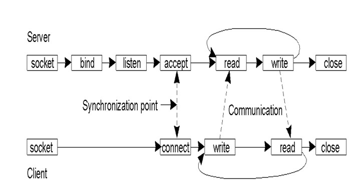
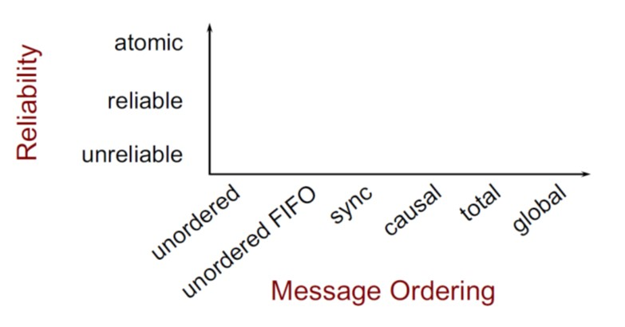

## 一、分布式系统介绍

### 1.1 分布式系统

分布式系统定义为其中联网计算机上的组件仅通过传递消息来通信和协调其动作的系统。

1. 特点：

- 并发：多进程、多线程之间并发，共享资源
- 无全局时钟：进程间通过消息传递协作
- 单节点失败问题：某些进程失败不会被其他进程知晓

### 1.2. 分布式系统挑战

1. 异质性：

- 中间件：提供程序抽象以掩盖底层(网络、硬件、操作系统、编程语言)不同的软件
- 移动代码：可以从一台计算机传输到另一台计算机并在目标计算机上运行的程序代码。 示例：Java Applet。Java虚拟机（JVM）提供了一种使代码在各种主机上可执行的方法。

2. 开放性：

- 单个计算机系统的开放性：哪些接口可以extended or implemented
- 分布式系统开放性：可以添加新资源共享服务并使其可供各种客户端程序使用的程度。

3. 安全性：

- 机密性：防止泄露给未经授权个体
- 完整性：防止更改、破坏，方法之一，校验和
- 可用性：防止干扰访问资源的手段。

4. 易扩展性：

- 物理资源开销
- 性能下降
- 防止软件执行中的超时
- 避免性能瓶颈：设计算法避免

4. 失败处理问题:

- 失败的检测：只有一部分的失败可以被检测到
- 掩盖失败：部分被检测的失败，可以被掩盖或减轻损失
- 容忍失败：Internet大部分服务容忍失败
- 从失败处恢复：从软件层面设计，当服务器崩溃后，永久性数据可被恢复或回滚
- 冗余组件：可通过冗余组件容忍失败。

5. 并发性：

多线程并发使用同一资源，考虑性能表现

6. 透明性：

- 访问透明性：本地资源和远程资源可以通过相同操作访问
- 地点透明性：无需知晓物理地址、网路地址即可访问资源
- 并发透明性：多个进程并发操作共享资源互不干扰
- 复制透明性：使用户可以使用多个资源实例来提高可靠性和性能，而无需用户或应用程序程序员了解副本。
- 故障透明性：隐藏故障，即使硬件或软件组件出现故障，用户和应用程序也可以完成其任务。
- 移动透明性：允许在系统内移动资源和客户端，而不会影响用户或程序的操作。
- 性能透明性：允许重新配置系统以随负载变化而提高性能。
- 伸缩透明性：允许系统和应用程序按比例扩展，而无需更改系统结构或应用程序算法。

7. 服务质量

- 可靠性
- 安全性
- 性能
- 易扩展性

## 二、系统模型

### 2.1 物理模型

物理模型是分布式系统底层硬件元素的表示，它从所用计算机和网络技术的特定细节中抽象出来。

三代分布式系统：

1. 早期的分布式系统

- 由于使用局域网技术而在1970年代末和1980年代初出现。
- 系统通常由局域网连接的10到100个节点组成，Internet连接性有限且支持的服务（例如，共享的本地打印机，文件服务器）。

2. 互联网规模的分布式系统
   - 由于Internet的增长而出现在1990年代。
   - 基础架构已成为全球性的。

3. 当代分布式系统
   - 移动计算的出现导致节点与位置无关
   - 需要增加功能，例如服务发现和对自发互操作的支持
   - 云计算和普适计算的出现

### 2.2 体系结构模型

分布式系统的体系结构模型简化并抽象了分布式系统各个组件的功能，并且

- 跨计算机网络组织组件。
- 它们之间的相互关系，即彼此交流。

1. 通信实体

在分布式系统中，进行通信的实体通常是进程。

例外情况：

- 在原始环境（例如传感器网络）中，操作系统不提供任何抽象，因此节点进行通信。
- 在大多数环境中，进程由线程补充，因此线程更多地是通信的端点。

2. 通信示例

- 进程间通讯：
  - 对分布式系统中进程之间的通信的低级支持，包括消息解析原语。
  - 直接访问Internet协议提供的API（套接字编程）并支持多播通信。
- 远程调用
  - 涵盖了基于通信实体之间的双向交换的一系列技术。
  - 导致调用远程操作，过程或方法
    - 请求-应答协议：更多的模式施加在基础消息解析服务上，以支持客户端-服务器计算
    - 远程过程调用：可以像在本地地址空间中一样调用远程计算机上的过程中的过程
    - 远程方法调用：调用对象可以调用远程对象中的方法
- 间接沟通
  - 群组通信
    - 将消息传递给一组的管理者
    - 系统中由组标识符表示的组的抽象
    - 收件人选择接收发送到组的消息
    - 广播（发送给所有人的消息）
    - 组播（消息发送到特定组）
  - 发布-订阅系统
    - 大量的生产者（发布者）将感兴趣的信息项（事件）分发给同样大量的消费者（订阅者）
  - 消息队列
    - 消息队列提供点对点服务，消息产生者进程可以将消息发送到指定的队列，而消费者进程可以从队列中接收消息或得到通知。

3. 服务器结构

- 客户端服务器架构
  - 客户端-服务器提供了一种直接，相对简单的方法来共享数据和其他资源
  - 但是它伸缩性很差
  - 通过将服务放置在单个地址中隐含的服务提供和管理的集中式扩展不能很好地超出承载该服务的计算机的容量及其连接的带宽
  - 为了在更多数量的计算机和网络链路之间共享计算和通信负载，需要更加广泛地分配共享资源。
- P2P
  - 由在不同计算机上运行的大量对等进程组成。
  - 所有进程都具有客户端和服务器角色。
  - 它们之间的通信模式完全取决于应用程序需求。
  - 用于访问对象的存储，处理和通信负载分布在计算机和网络链接之间。
  - 每个对象都复制到几台计算机中，以进一步分散负载，并在断开各个计算机的连接时提供弹性。
  - 与客户端-服务器体系结构相比，放置和检索单个计算机的需求更加复杂。

4. 体系结构组件

将服务垂直组织成服务层。分布式服务可以由一个或多个服务器进程提供，彼此交互并与客户端进程进行交互，以维护服务资源在系统范围内的一致视图。

例子
网络时间服务是通过在Internet上的主机上运行的服务器进程基于网络时间协议（NTP）在Internet上实现的，这些服务器进程将向任何请求它的客户端提供当前时间。

5. 垂直分布

客户端-服务器体系结构的扩展。将传统服务器功能分布在多个服务器上。

### 2.3 基础模型

同步分布式系统和异步分布式系统的特征（交互模型）

## 三、物理时间

1. 最简单的同步技术

进行RPC以从服务器获取时间，将本地时钟设置为服务器时间，不计算网络或处理延迟。

2. Cristian 算法

补偿网络延迟（假设对称），客户端在$T_0$发送请求，服务器回复当前时钟值$T_{server}$，客户在$T_1$收到响应，即$RTT = T_1-T_0$，客户端将时钟设置为：$T_{client} = T_{server}+\frac{T_1-T_0}{2}$
精度，± RTT/2，如果考虑传输过程错误的时延，则精度为$\pm \left(\frac{T_1-T_0}{2} - T_{\min}\right)$，$T_{\min}$为消息最短传输时间

问题：
- 服务器可能会失败
- 受到恶意干扰

3. Berkeley 算法

目的：尽可能使一组计算机的时钟同步（也称为内部同步）

假设没有机器具有准确的时间源（即，没有区分客户端和服务器）
从参与的计算机中获取平均值，将所有时钟同步到平均值

一台机器被选为（或指定）为主机； 其他人是slave：
主机定期轮询所有slave，询问他们的时间，通过计算网络延迟，可以使用Cristian的算法从其他计算机获取更准确的时钟值，收集结果后，计算平均值，包括主机的时间。向每个从站发送需要调整其时钟的偏移量，通过发送“偏移”而不是“时间戳”来避免网络延迟问题。

算法中有一些规定可以忽略时滞过大的时钟的读数，计算容错平均值。如果主机发生故障，任何从机都可以接管主机

4. NTP协议

端口123，UDP

- 即使出现消息延迟，也可以使Internet上的客户端准确地同步到UTC
  - 使用统计技术来过滤数据并提高结果质量
- 提供可靠的服务
  - 避免长时间的连接中断
  - 冗余路径
  - 冗余服务器
- 使客户端能够频繁同步
  - 通过使用偏移量来调整时钟（对于对称模式）
- 提供抗干扰保护
  - 验证数据源

组播（用于快速LAN，精度低）
  服务器定期将其时间多播到其子网中的客户端

远程过程调用（中等精度）
  服务器以其实际时间戳响应客户端请求
  就像克里斯蒂安的算法一样

对称模式（高精度）
  用于在时间服务器之间进行同步（对等）

使用UDP不可靠地传递所有消息

计算方法：对称模式下：

时延计算方法$d_i = \left(T_i - T_{i-3}\right) - \left(T_{i-1} - T_{i-2}\right)$。
时钟A设置时间为$T_i + o_i = T_{i-1}+ \left. d_i / \right. 2$

提升精度方法：
- 单一来源的数据过滤
  - 保留多个最新对<oi，di>
  - 过滤器色散：选择与最小dj对应的oj

- 对等选择：与较低层服务器同步
  - 较低的层数，较低的同步散布

- 服务器的层是动态变化的，具体取决于与其同步的服务器

## 四、逻辑时钟

### 4.1 事件发生关系

1. happened-before

- 如果a和b发生在同一进程中，a在b之前，则$a\rightarrow b$
- 如果a和b发生在不同的过程中，a是“发送”，b是相应的“接收”，则$a\rightarrow b$
- 传递的：如果$a\rightarrow b$和$b\rightarrow c$，则$a\rightarrow c$

2. concurrent

其他类型为concurrent

### 4.2 逻辑时钟

逻辑时钟是单调递增的软件计数器，它不必与物理时钟有关，必须通过加而不是减来校正时钟

为事件分配逻辑时间值的规则
如果$a\rightarrow b$，则$clock\left(a\right) < clock\left(b\right)$

1. Lamport 算法

每个进程$P_i$具有逻辑时钟$L_i$。 时钟同步算法：

- $L_i$初始化为0；
- $L_i$更新：
  - LC1：$P_i$中发生的每一个新事件，$L_i$都会增加1
  - LC2：$P_i$发送消息m时，它将$t = L_i$附加到m
  - LC3：当$P_j$收到（m，t）时，它会设置$L_j：= \max \left\{L_j, t \right\}$，然后将LC1应用于事件receive（m）的$L_j$递增

2. 时钟向量算法

每个进程Pi保持一个时钟Vi，该时钟Vi是N个整数的向量

- 初始化：对于$1\le i\le N$和$1 \le k\le N$，$V_i \left[k \right]:= 0$
- 更新$V_i$：
  - VC1：$P_i$中有新事件时，它将设置$V_i \left[i\right]:= V_i \left[i\right] +1$
  - VC2：$P_i$发出消息m时，它将$t = V_i$附加到m
  - VC3：当$P_j$收到$\left(m, t\right)$时，对于$1\le k\le N$，它设置$V_j \left[k\right]:= \max \left\{V_j \left[k\right], t \left[k\right]\right\}$，然后将VC1应用于事件的递增$V_j \left[j\right]$ 接收$\left(m, t\right)$

注意：$V_i \left[j\right]$是一个时间戳，指示$P_i$知道到目前为止$P_j$中发生的所有事件。

根据向量时钟区分 happened-before 和 concurrent
定义

- $V = V’$：当$i = 1, \cdots, N$时，$V \left[i\right] = V’\left[i\right]$
- $V≤\le V’$：当$i = 1, \cdots, N$时，$V \left[i\right]\le V’\left[i\right]$
- $V < V’$：如果$V\le V’$，并且$V\ne V’$
- $V\left(e\right)$：事件e的时间戳向量

对于任何两个事件a和b，
- $a\rightarrow b$如果$V\left(a\right) < V\left(b\right), a\ne b$
- $a || b$如果既不满足$V\left(a\right) \le V\left(b\right)$也不满足$V\left(a\right) \ge V\left(b\right)$

3. 因果顺序组播算法

每个组成员保留一个长度为n（n个组成员）的时间戳向量，所有分量都初始化为0。
当Pi多播消息m时，它将递增其时间向量Vi的第i个分量，并将Vi附加到m。
当带有$V_j$的$P_j$从$P_i$接收$\left(m, V_i\right)$时：

- 如果（对于所有k，$V_j\left[k\right] \ge V_i \left[k\right]，k\ne i$），则
  - $V_j [i]：= V_i [i]$; // $V_i [i]总是大于V_j [i]$
  - $V_j [j]：＝ V_j [j] +1$

4. 全序组播

对于m1 ||m2，所有接收者都必须以相同的顺序接收m1和m2（即m2之前的所有m1或m1之前的所有m2）。

## 五、互斥算法 & 选举算法

### 5.1 互斥算法

#### 5.1.1 集中式算法

模拟单处理器系统，一个进程当选为协调员。

步骤：

1. 索取资源
2. 等待回应
3. 获得许可
4. 访问资源
5. 释放资源

如果另一个进程要求资源：

- 协调员不会回复直到被请求资源被释放
- 维护队列
服务请求按FIFO顺序

好处

- 公平：所有请求均按顺序处理
- 易于实施，理解，验证
- 流程不需要了解小组成员，只需了解协调员

问题

- 流程无法区分被协调者阻塞还是失败–单点故障
- 集中式服务器可能成为瓶颈

#### 5.1.2 令牌环算法

假定已知的一组过程，可以对组进行某些排序（唯一的进程ID），在软件中构建逻辑环，进程与其邻居进行通信。

初始化

- 进程0为资源R创建令牌
令牌在环上循环

- 从Pi到P（i + 1）mod N
进程获取令牌时
- 检查是否需要持有令牌
- 如果不是，请向邻居发送令牌
- 是，请访问资源
- 持有令牌直到完成

一次只有一个进程具有令牌

- 保证互斥
顺序明确（但不一定先到先得）
- 饥饿不会发生
- 有时不如先到先得的算法有效

问题

- 令牌丢失（例如，进程终止），它将不得不重新生成。检测丢失可能是一个问题（令牌丢失还是有人正在使用？）
- 流程损失：如果您无法与邻居交谈怎么办？

#### 5.1.3 Ricart & Agrawala 算法

使用可靠的多播和逻辑时钟的分布式算法，进程要获得资源所有权：

- 撰写包含以下内容的消息：
  - 标识符（机器ID，进程ID）
  - 资源名称
  - 时间戳（按总顺序排列的Lamport）
- 向组中的所有进程发送请求
- 等到所有人都允许
- 输入关键部分/使用资源

进程收到请求时：

- 如果接收者不感兴趣：
  - 发送确定给发件人
- 如果接收器在临界锁中
  - 不回复; 将请求添加到队列
- 如果接收方也刚发送了一个请求：
  - 比较时间戳：已接收和已发送的消息，选择最早的
  - 如果接收方是失败者，请发送OK
  - 如果接收方是获胜者，请不要回复，排队
- 完成关键部分后
  - 向所有排队的请求发送确定

问题：
N点故障
大量的通讯流量
证明可以使用完全分布式的算法

#### 5.1.4 分布式互斥算法

每个进程维护请求队列，包含互斥请求，要求关键部分

- 进程Pi将请求（i，Ti）发送到所有节点
- 将请求放置在自己的队列中
- 当进程Pj收到一个请求，它返回带有时间戳的ack

输入关键部分（访问资源）：

- Pi从其他进程接收到的消息（确认或释放），且时间戳大于Ti
- Pi的请求在其队列中具有最早的时间戳

与Ricart-Agrawala的区别：

- 每个人都做出回应（acks）…总是-没有阻碍
- 流程根据其请求是否是其队列中的最早者来决定是否进行

释放关键部分

- 从自己的队列中删除请求
- 发送带有时间戳的发布消息

进程收到释放消息时

- 从队列中删除对该进程的请求
- 这可能会导致其自己的条目在队列中具有最早的时间戳记，从而使其能够访问关键部分

### 5.2 选举算法

1. 需要一个过程来担任协调员

2. 进程没有区别特征

3. 每个进程都有一个唯一的ID来标识自己

#### 5.2.1 霸道选举算法

•选择ID最大的进程作为协调者
•当进程P检测到协调器失效时：

- 将选举消息发送到具有更高ID的所有进程。
  - 如果没有人回应，则P获胜并接管。
  - 如果有任何响应，则表示P的工作已完成。

- 可选：让所有具有较低ID的节点都知道正在进行选举。

如果进程收到选举消息

- 发回确定信息
- 举行选举（除非已经举行选举）

- 进程通过向所有进程发送一条消息告诉他们是新的协调者来宣布胜利
- 如果死进程恢复，则举行选举以找到协调器。

#### 5.2.2 环选举算法

流程安排

- 如果有任何过程检测到协调器故障
  - 构造带有进程ID的选举消息并发送到下一个进程
  - 如果后继者失败，请跳过
  - 重复直到找到正在运行的进程
- 收到选举信息
  - 进程转发消息，将其进程ID添加到主体
- 最终，消息返回给发起者
  - 进程在列表中看到其ID
  - 分发（或多播）协调器消息，通知协调器。通常选举编号最小的进程

#### 5.2.3 Chang & Roberts Ring 算法

优化环

- 消息始终包含一个进程ID
- 避免多次巡回选举
- 如果某一进程发送消息，则将其状态标记为参与者

收到选举消息后：

- 如果PID（消息）> PID（进程）
  - 转发消息–较高的ID总是会胜过较低的ID
- 如果PID（消息）< PID（进程）
  - 用PID（消息）替换消息中的PID
  - 转发新消息–我们的ID号更高； 用它
- 如果PID（消息）< PID（进程）AND 进程是参与者
  - 丢弃邮件-我们已经在分发ID
- 如果PID（消息）== PID（过程）
  - 该过程现在是领导者-消息已传播：宣布获胜者

## 六、socket套接字通信

### 6.1 面向连接的协议 Connection-oriented Protocols

1. 建立联系
2. 谈判协议
3. 交换数据
4. 终止连接

### 6.2 无需连接的协议 connectionless protocols

- 没有通话设置
- 发送/接收数据（每个数据包都已寻址）
- 无终止

### 6.3 socket

目标：

- 进程之间的通信不应该取决于它们是否在同一台计算机上
- 将所有数据交换（访问）统一为文件访问
  - 应用程序可以选择特定的通信方式
- 虚拟电路，数据报，基于消息的有序交付
  - 支持不同的协议和命名约定（不仅适用于TCP / IP或UDP / IP）

PCB协议控制模块，PCB的每个条目包含：

- 本地地址
- 本地端口
- 目的地址
- 目的端口

### 6.4 RPC 远程过程调用

在其他机器上调用程序的机制，机器A上的进程可以调用机器B上的过程。A被暂停，B继续执行。当B返回时，控制权移交给A。

目标：进行远程过程调用，看起来与对程序员的本地调用相同。

RPC编译器会自动生成存根过程，以向用户发出RPC，就好像它是本地调用一样。存根过程做什么：

- 编码解码参数和返回值
- 处理不同机器之间的不同数据格式
- 检测和处理客户端/服务器进程和网络的故障

RPC工作流程：

对于服务接口中的每个方法,访问服务的客户端包含了一个存根过程( stub procedure)。该存根过程的行为对客户端来说就像一个本地过程，但不执行调用。存根过程把过程标识符和参数编码成一个请求消息。该请求消息通过它的通信模块发送给服务器。当应答消息返回时，它将对结果进行解码。对于服务接口中的每个方法，服务器端包含分发器程序、服务器存根过程和服务过程。该分发器程序根据请求消息中的过程标识符选择一个服务器存根过程。该服务器存根过程对请求消息中的参数解码，然后调用相应的服务过程,并把返回值编码成应答消息服务过程是服务接口中过程的具体实现。客户和服务器的存根过程及分发器程序可以通过接口编译器从服务的接口定义中自动生成。

1. 客户端调用存根过程，将参数压栈。Client calls stub (push parameters onto stack)
2. 客户端的存根过程将过程标识符和参数编码成一个请求消息，并调用操作系统**中断**，请求发送消息。Clnt_stub marshals parameters to message & makes an OS call (client blocked)
3. 客户端通过网络，将消息发送给服务器。Network message sent to server
4. 服务器分发器程序将请求消息传递给服务器存根过程。Deliver message to server stub & unblock server
5. 服务器存根过程对请求消息中的参数解码，然后调用相应的服务过程。Svr-stub unmarshals parameters & calls service routine (local call)
6. 服务过程将返回结果传递给服务器存根过程。Return to the stub from service routine
7. 服务器存根过程封装消息并调用操作系统请求发送消息。Svr_stub marshals return-value & requests OS to send out message
8. 数据在网络 上传输。Transfer message over network
9. 客户端存根过程接收消息，**恢复进程**。Deliver message to client (unblock client)
10. 客户端存根过程将返回值返回客户端程序。Clnt_stub unmarshals return-value & returns to client program…

## 七、网际路由

### 7.1 CIDR

无类别域间路由协议

CIDR：将网络地址（A，B或C类）细分为任意长度，以有效利用IP地址空间（此细分对整个Internet都是可见的）。

用于给用户分配IP地址以及在互联网上有效地路由IP数据包的对IP地址进行归类的方法。在Internet上创建附加地址的方法，这些地址提供给服务提供商（ISP），再由ISP分配给客户。CIDR将路由集中起来，使一个IP地址代表主要骨干提供商服务的几千个IP地址，从而减轻Internet路由器的负担。

CIDR路由表中的每个条目都包含一个基地址和一个子网掩码（与子网中的路由相同）。
对于路由IP数据包，其目标IP地址为布尔值与子网掩码进行“与”运算，以查看其是否与条目的基本地址相匹配（如果找到多个匹配项，则使用最长的匹配项）。
数据包通过匹配条目的传出链接发送出去。
并非所有路由器都执行CIDR。 （如果所有路由器都采用CIDR，则地址的网络部分可以是任意长度！）

### 7.2 NAT

为了缓解IP地址的短缺，NAT技术仅使用少量的外部IP地址与外部进行通信，并从外部隐藏本地IP地址（因此这些本地IP地址可以在其他地方重用）：
所有到外部的Internet通信都必须经过NAT路由器，其中内部IP地址（源IP地址）被外部IP地址代替。
IP数据包中的源端口号字段由指向NAT路由器的转换表中条目的索引代替。 此项包含内部IP地址和原始源端口号。
当外部IP数据包到达NAT路由器时，将提取其目标端口号并将其用作转换表的索引，在此转换表中将提取原始IP地址和端口号并将其放回到数据包中。

数据包通过NAT穿越时转换地址。
使用端口号标识内部IP用户。
这是解决问题的肮脏方法，仅适用于TCP / UDP通信。

### 7.3 DHCP

专用IP地址的分配由动态主机配置协议完成，动态协议是在路由器上运行的服务：
短期租用IP地址（尤其是对于移动用户），主机可能会定期刷新地址

DHCP服务器可以服务于多个LAN（子网）。
每个LAN上都需要一个DHCP中继代理，以使该LAN上的主机能够通过广播消息到达DHCP服务器。
启动设备（主机）时，它将广播DHCP发现数据包（以请求/发现IP地址）。
DHCP发现数据包被同一LAN上的DHCP代理截获并转发到DHCP服务器。

### 7.4 ARP

地址解析协议，将已知的IP地址转换为MAC地址。

ARP提供了从IP地址到物理地址的映射。 假设A知道B的IP地址，并且想知道B的物理地址：

- 广播ARP查询报文，包含B的IP地址
- 局域网上的所有计算机都接收ARP查询
- B收到ARP数据包，并用其（B）的物理层地址回复A
- 缓存（保存）IP到物理地址对，直到信息变旧（超时）
  - 软状态：除非刷新，否则信息超时（消失）
ARP Shell命令：arp

### 7.5 OSPF

开放的最短路径优先协议

一个AS通常被划分为带编号的区域（一个子网或一组连续的子网）。
每个AS都有一个主干，称为区域0。每个区域中至少有一个路由器连接到主干路由器。
一些骨干路由器（称为AS边界路由器）连接到其他AS，以进行AS间路由。

OSPF将AS中的路由器抽象为连接的图，并为每个边缘分配权重（距离，延迟等）。
每个路由器定期向其相邻路由器泛洪Link-State-Update消息，因此每个路由器都知道该区域内的拓扑。

区域内路由：每个路由器使用链接状态数据库，并运行到目标路由器的最短路径。

区域间路由：源路由器$\rightarrow$骨干网$\rightarrow$目标区域$\rightarrow$目标路由器
跨AS路由，源路由器$\rightarrow$骨干网$\rightarrow$AS边界路由器$\rightarrow$目的地AS边界路由器（通过BGP）$\rightarrow$dest-router

### 7.6 BGP

边界网关协议
跨AS的流量通过BGP（边界网关协议）路由：
外部网关协议更关注路由策略，例如没有通过某些AS的传输流量，没有为某些AS的中继等。

BGP是一种距离向量协议。 路由表中的每个条目均包含：dest，下一跳到目的地，距离（跳数）。 它总是选择到目的地的距离最短的下一跳邻居来转发数据包，称为下一跳路由。
每个BGP路由器都与其邻居交换路由信息（到所有目的地的距离和下一跳）。 从邻居收集信息后，BGP路由器可以更新（建立）自己的路由表。

## 八、命名服务

### 8.1 DNS 域名系统

在许多名称服务器的层次结构中实现的分布式数据库
DNS服务：
主机名解析
邮件主机位置（例如，找到hwdu@hitsz.edu.cn的邮件服务器）
反向分辨率
知名服务（例如telnet，FTP，HTTP等）
名称的添加/删除是由权威管理员手动编辑名称数据库来完成的。

DNS：存储资源记录（RR）的分布式数据库

1. Type=A. name is hostname, value is IP address
2. Type=CNAME. name is an alias name for some “real name”, value is the “real name”
3. Type=NS. name is domain (e.g. foo.com), value is IP address of authoritative name server for this domain. 值是该域的权威名称服务器的IP地址
4. Type=MX. value is hostname of mailserver associated with name

例：

1. 在域中添加新主机：在NS DB中添加记录
    jupiter IN A 144.214.120.2
2. 创建子域“ ds”：在NS DB中添加一条记录（以及主机名“ ds-sun0”的条目）
    IN NS ds-sun0.ds.cs.cityu.edu.hk
3. 为子域“ ds”设置邮件服务器：添加一条记录
    ds.cs.cityu.edu.hk IN MX 1 mars.cs.cityu.edu.hk
the “ds” sub-domain uses the same mail server as “cs.cityu” domain
4. 更改域的www服务器：添加一条记录
    www.cs.cityu.edu.hk IN CNAME mars.cs.cityu.edu.hk
    OR
    www IN A 144.214.120.97

## 九、群组通信

### 9.1 通信类型

1. 一对一
   1. 单播
        点对点
   2. anycast
        1对最近的独立节点
2. 一对多
   1. 组播
      1. 1对多
      2. 群组通信
   2. 广播
        一对全部

### 9.2 解决问题

1. 群组开放 or 封闭：封闭仅可群成员发送消息
2. 独立节点 or 分层级的
   - 独立节点：每个节点都可和整个群组通信
   - 分层级：需要设置代理者：将消息传递给子组的代理者
3. 群组成员关系，群组创建
   - 分布式 or 中心化
4. 离开群组、加入群组：必须是同步的
5. 容错性

考虑失败因素：

1. 崩溃失败
   - 进程停止通信
2. 遗漏失败（通常是由于网络）
3. 发送遗漏：进程无法发送消息
4. 接收遗漏：进程无法接收消息
5. 拜占庭式的失败：一些消息有误
6. 分区失败
   - 网络可能会被分割，将组划分为两个或更多个无法访问的子组

### 9.3 组播

1. 软件实现的组播

通过组协调器进行多个单播

- 协调员认识小组成员
- 协调员遍历小组成员
- 可能支持协调员的层次结构

### 9.4 组播可靠性

1. 原子性

发送到局域网内的消息会到达所有局域网的成员
如果无法到达任何成员，则没有成员将对其进行处理

问题

- 网络不可靠
- 每条消息都应得到确认
- 确认可能会丢失
- 邮件发件人可能死亡

解决：

1. 重试 尽管有网络故障和系统停机时间
   - 发件人和收件人保持持久的日志
   - 每封邮件都有一个唯一的ID，因此我们可以丢弃重复的邮件
   - 发件人
     - 发送消息给所有小组成员
     - 记录发送消息
     - 等待每个小组成员的确认
     - 记录确认
     - 如果等待确认超时，请重新发送给组成员
   - 接收者
     - 将收到的非重复消息记录到持久日志中
     - 发送确认消息

假如无效的发送者或接收者将被重新启动，则在中断的地方重新启动

2. 重新定义组
   - 如果某些成员未能收到该消息：
   - 从组中删除失败的成员
   - 然后允许现有成员处理消息
   - 但是仍然需要考虑发送者的死亡
   - 尚存的小组成员可能需要接任以确保当前所有小组成员都收到消息
   - 这是虚拟同步中使用的方法

2. 可靠组播：

- 所有非故障组成员都将收到此消息
  - 假设发件人和收件人将仍然活着
  - 网络可能有故障
    - 尝试重新发送未送达的邮件...但最终放弃了
  - 如果某些小组成员没有收到消息也可以
- 确认消息
  - 向每个小组成员发送消息
  - 等待每个小组成员的确认
  - 转发给非响应成员
  - 受到反馈内爆的影响

### 9.5 优化确认消息ACK

1. 最简单的方法是在发送下一条消息之前等待ACK
   - 但这会导致往返延迟
2. 最佳化
   1. 流水线发送ACK
      - 发送多个消息–异步接收ACK
      - 设置超时–重新发送缺少ACK的消息
   2. 累积确认
      - 等待一会儿再发送ACK
      - 如果收到其他邮件，则对所有邮件发送一个ACK
   3. 稍待确认
      - 发送ACK和返回消息
   4. 消极确认
      - 在每条消息上使用序列号
      - 接收者请求重发错过的消息
      - 效率更高，但需要发件人无限期地缓冲消息

TCP执行其中的前三个，但是现在我们必须为每个收件人执行此操作

### 9.6 消息顺序

1. 基于全局时间的顺序

所有消息均按发送的确切顺序传递，假设两个事件永远不会在同一时间发生！

难以（不可能）实现，不可行

2. 全序组播

所有接收器的订购顺序一致，所有消息均以相同的顺序发送给所有组成员，它们在交付队列中按相同顺序排序。

执行：

- 附加唯一的完全排序的消息ID
- 接收器仅在接收到所有具有较小ID的消息时才向应用程序传递消息

3. 偏序

消息按Lamport或Vector时间戳排序。如果消息m’因果关系取决于消息m，则所有进程都必须在m’之前传递m。

实现方法：

Pa接收来自Pb的消息,每个进程都保留一个优先级向量
（类似于向量时间戳记）
向量在多播发送和接收事件上更新。每个条目=因果关系事件之前来自相应组成员的最新消息数

4. 同步顺序 Sync ordering

消息可以按任何顺序到达
特殊消息类型
同步原语
在接受任何其他（同步后）消息之前，请确保已传递所有待处理的消息

5. 单源FIFO（SSF）排序 Single Source FIFO (SSF) ordering

来自同一来源的消息将按照其发送顺序进行传递。
消息m必须在消息m’之前传递 当且仅当 m是从同一主机在m'之前发送的

6. 无序组播

消息可以以不同的顺序传递给不同的成员。无需保证按序到达。

7. 各种组播顺序关系

### 9.7 IP组播

组播协议：

1. IGMP：Internet组管理协议
   - 专为路由器与直接连接的网络上的主机进行通信而设计

2. PIM：协议独立多播独立合并协议
   - 组播路由协议，用于在路由器之间传递数据包
   - 拓扑发现由其他协议处理
   - 两种形式：
     1. 密集模式（PIM-DM）密集模式
     2. 稀疏模式（PIM-SM）稀疏模式

PIM-DM

将多播数据包中继到所有连接的路由器，使用生成树和反向路径转发（RPF）避免循环。如果链接上没有感兴趣的接收者，则反馈并切断。

路由器发送修剪消息，路由器定期发送消息以刷新修剪状态。泛洪是由发送者的路由器发起的。

反向路径转发（RPF）：避免路由循环（逆向路径转发）

数据包仅在通过发送者最短路径的链接接收到的情况下才进行复制和转发，通过检查路由器到源地址的转发表找到最短路径。

Flooding: Dense Mode Multicast 洪泛：密集形式多播

优势：

- 简单的
- 如果大多数位置都需要该数据包，则很好

坏处：

- 浪费在网络上，浪费在路由器上的多余状态和数据包重复

