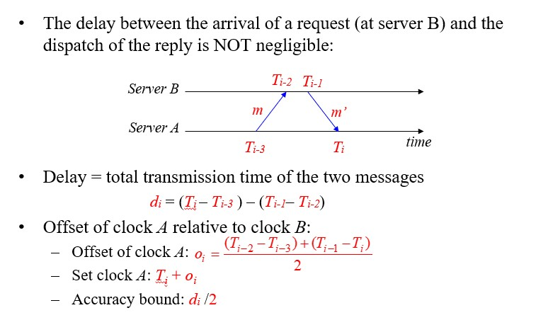

## 一、分布式系统介绍

### 1.1 分布式系统

分布式系统定义为其中联网计算机上的组件仅通过传递消息来通信和协调其动作的系统。

1. 特点：

- 并发：多进程、多线程之间并发，共享资源
- 无全局时钟：进程间通过消息传递协作
- 单节点失败问题：某些进程失败不会被其他进程知晓

### 1.2. 分布式系统挑战

1. 异质性：

- 中间件：提供程序抽象以掩盖底层(网络、硬件、操作系统、编程语言)不同的软件
- 移动代码：可以从一台计算机传输到另一台计算机并在目标计算机上运行的程序代码。 示例：Java Applet。Java虚拟机（JVM）提供了一种使代码在各种主机上可执行的方法。

2. 开放性：

- 单个计算机系统的开放性：哪些接口可以extended or implemented
- 分布式系统开放性：可以添加新资源共享服务并使其可供各种客户端程序使用的程度。

3. 安全性：

- 机密性：防止泄露给未经授权个体
- 完整性：防止更改、破坏，方法之一，校验和
- 可用性：防止干扰访问资源的手段。

4. 易扩展性：

- 物理资源开销
- 性能下降
- 防止软件执行中的超时
- 避免性能瓶颈：设计算法避免

4. 失败处理问题:

- 失败的检测：只有一部分的失败可以被检测到
- 掩盖失败：部分被检测的失败，可以被掩盖或减轻损失
- 容忍失败：Internet大部分服务容忍失败
- 从失败处恢复：从软件层面设计，当服务器崩溃后，永久性数据可被恢复或回滚
- 冗余组件：可通过冗余组件容忍失败。

5. 并发性：

多线程并发使用同一资源，考虑性能表现

6. 透明性：

- 访问透明性：本地资源和远程资源可以通过相同操作访问
- 地点透明性：无需知晓物理地址、网路地址即可访问资源
- 并发透明性：多个进程并发操作共享资源互不干扰
- 复制透明性：使用户可以使用多个资源实例来提高可靠性和性能，而无需用户或应用程序程序员了解副本。
- 故障透明性：隐藏故障，即使硬件或软件组件出现故障，用户和应用程序也可以完成其任务。
- 移动透明性：允许在系统内移动资源和客户端，而不会影响用户或程序的操作。
- 性能透明性：允许重新配置系统以随负载变化而提高性能。
- 伸缩透明性：允许系统和应用程序按比例扩展，而无需更改系统结构或应用程序算法。

7. 服务质量

- 可靠性
- 安全性
- 性能
- 易扩展性

## 二、系统模型

### 2.1 物理模型

物理模型是分布式系统底层硬件元素的表示，它从所用计算机和网络技术的特定细节中抽象出来。

三代分布式系统：

1. 早期的分布式系统

- 由于使用局域网技术而在1970年代末和1980年代初出现。
- 系统通常由局域网连接的10到100个节点组成，Internet连接性有限且支持的服务（例如，共享的本地打印机，文件服务器）。

2. 互联网规模的分布式系统
   - 由于Internet的增长而出现在1990年代。
   - 基础架构已成为全球性的。

3. 当代分布式系统
   - 移动计算的出现导致节点与位置无关
   - 需要增加功能，例如服务发现和对自发互操作的支持
   - 云计算和普适计算的出现

### 2.2 体系结构模型

分布式系统的体系结构模型简化并抽象了分布式系统各个组件的功能，并且

- 跨计算机网络组织组件。
- 它们之间的相互关系，即彼此交流。

1. 通信实体

在分布式系统中，进行通信的实体通常是进程。

例外情况：

- 在原始环境（例如传感器网络）中，操作系统不提供任何抽象，因此节点进行通信。
- 在大多数环境中，进程由线程补充，因此线程更多地是通信的端点。

2. 通信示例

- 进程间通讯：
  - 对分布式系统中进程之间的通信的低级支持，包括消息解析原语。
  - 直接访问Internet协议提供的API（套接字编程）并支持多播通信。
- 远程调用
  - 涵盖了基于通信实体之间的双向交换的一系列技术。
  - 导致调用远程操作，过程或方法
    - 请求-应答协议：更多的模式施加在基础消息解析服务上，以支持客户端-服务器计算
    - 远程过程调用：可以像在本地地址空间中一样调用远程计算机上的过程中的过程
    - 远程方法调用：调用对象可以调用远程对象中的方法
- 间接沟通
  - 群组通信
    - 将消息传递给一组的管理者
    - 系统中由组标识符表示的组的抽象
    - 收件人选择接收发送到组的消息
    - 广播（发送给所有人的消息）
    - 组播（消息发送到特定组）
  - 发布-订阅系统
    - 大量的生产者（发布者）将感兴趣的信息项（事件）分发给同样大量的消费者（订阅者）
  - 消息队列
    - 消息队列提供点对点服务，消息产生者进程可以将消息发送到指定的队列，而消费者进程可以从队列中接收消息或得到通知。

3. 服务器结构

- 客户端服务器架构
  - 客户端-服务器提供了一种直接，相对简单的方法来共享数据和其他资源
  - 但是它伸缩性很差
  - 通过将服务放置在单个地址中隐含的服务提供和管理的集中式扩展不能很好地超出承载该服务的计算机的容量及其连接的带宽
  - 为了在更多数量的计算机和网络链路之间共享计算和通信负载，需要更加广泛地分配共享资源。
- P2P
  - 由在不同计算机上运行的大量对等进程组成。
  - 所有进程都具有客户端和服务器角色。
  - 它们之间的通信模式完全取决于应用程序需求。
  - 用于访问对象的存储，处理和通信负载分布在计算机和网络链接之间。
  - 每个对象都复制到几台计算机中，以进一步分散负载，并在断开各个计算机的连接时提供弹性。
  - 与客户端-服务器体系结构相比，放置和检索单个计算机的需求更加复杂。

4. 体系结构组件

将服务垂直组织成服务层。分布式服务可以由一个或多个服务器进程提供，彼此交互并与客户端进程进行交互，以维护服务资源在系统范围内的一致视图。

例子
网络时间服务是通过在Internet上的主机上运行的服务器进程基于网络时间协议（NTP）在Internet上实现的，这些服务器进程将向任何请求它的客户端提供当前时间。

5. 垂直分布

客户端-服务器体系结构的扩展。将传统服务器功能分布在多个服务器上。

### 2.3 基础模型

同步分布式系统和异步分布式系统的特征（交互模型）

## 三、物理时间

1. 最简单的同步技术

进行RPC以从服务器获取时间，将本地时钟设置为服务器时间，不计算网络或处理延迟。

2. Cristian 算法

补偿网络延迟（假设对称），客户端在$T_0$发送请求，服务器回复当前时钟值$T_{server}$，客户在$T_1$收到响应，即$RTT = T_1-T_0$，客户端将时钟设置为：$T_{client} = T_{server}+\frac{T_1-T_0}{2}$
精度，± RTT/2，如果考虑传输过程错误的时延，则精度为$\pm \left(\frac{T_1-T_0}{2} - T_{\min}\right)$，$T_{\min}$为消息最短传输时间

问题：
- 服务器可能会失败
- 受到恶意干扰

3. Berkeley 算法

目的：尽可能使一组计算机的时钟同步（也称为内部同步）

假设没有机器具有准确的时间源（即，没有区分客户端和服务器）
从参与的计算机中获取平均值，将所有时钟同步到平均值

一台机器被选为（或指定）为主机； 其他人是slave：
主机定期轮询所有slave，询问他们的时间，通过计算网络延迟，可以使用Cristian的算法从其他计算机获取更准确的时钟值，收集结果后，计算平均值，包括主机的时间。向每个从站发送需要调整其时钟的偏移量，通过发送“偏移”而不是“时间戳”来避免网络延迟问题。

算法中有一些规定可以忽略时滞过大的时钟的读数，计算容错平均值。如果主机发生故障，任何从机都可以接管主机

4. NTP协议

端口123，UDP

- 即使出现消息延迟，也可以使Internet上的客户端准确地同步到UTC
  - 使用统计技术来过滤数据并提高结果质量
- 提供可靠的服务
  - 避免长时间的连接中断
  - 冗余路径
  - 冗余服务器
- 使客户端能够频繁同步
  - 通过使用偏移量来调整时钟（对于对称模式）
- 提供抗干扰保护
  - 验证数据源

组播（用于快速LAN，精度低）
  服务器定期将其时间多播到其子网中的客户端

远程过程调用（中等精度）
  服务器以其实际时间戳响应客户端请求
  就像克里斯蒂安的算法一样

对称模式（高精度）
  用于在时间服务器之间进行同步（对等）

使用UDP不可靠地传递所有消息

计算方法：对称模式下：

时延计算方法$d_i = \left(T_i - T_{i-3}\right) - \left(T_{i-1} - T_{i-2}\right)$。
时钟A设置时间为$T_i + o_i = T_{i-1}+ \left. d_i / \right. 2$

