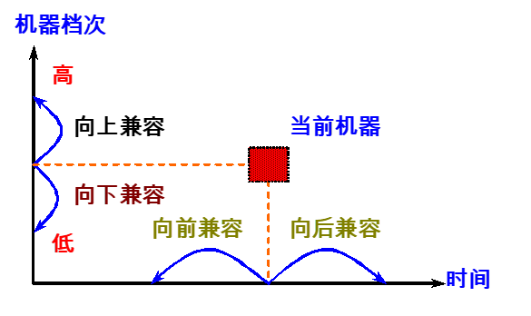
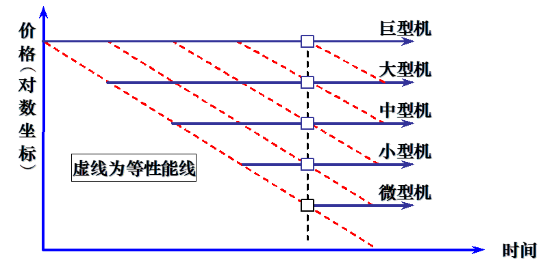

## 前言

本学期最绝望的一门课，没有之一，建议学弟学妹们不要选这门课，真的内容多又难，而且作业多，签到多，选修不做实验真的什么都不懂，建议选修cv专业课和认知神经科学原理，真的很赚。

## 一、计算机系统概论

### 1.1 计算机系统简介

1. 计算机系统：

- 硬件：计算机实体
- 软件：具有各类特殊功能的信息
  - 系统软件：管理整个计算机系统：语言处理程序、操作系统、服务型程序、数据库管理系统、网络软件。
  - 应用软件：按任务的各种应用程序。

2. 计算机解题过程：

高级语言$\xrightarrow{翻译}$目标程$\xrightarrow{运行}$结果

3. 计算机系统结构层次

- 高级语言$\rightarrow$虚拟机器$M_4$，用编译程序翻译为汇编语言程序
- 汇编语言$\rightarrow$虚拟机器$M_3$，用汇编程序翻译成机器语言程序
- 操作系统$\rightarrow$虚拟机器$M_2$，用机器语言解释操作系统
- 机器语言$\rightarrow$实际机器$M_1$，用微指令集解释机器指令
- 微指令系统$\rightarrow$微程序机器$M_0$，由硬件直接执行微指令

### 1.2 计算机基本组成

#### 1.2.1 冯诺依曼计算机特点

1. 计算机由五大部件组成
   - 存储器：存放数据和程序
   - 运算器：算术运算和逻辑运算
   - 控制器：指挥程序运行
   - 输入设备：将信息转换为机器可以识别的形式
   - 输出设备：将机器运算结果转换为人可识别的形式

2. 指令和数据以同等地位与存储器，可按照地址寻访
3. 指令和数据用二进制表示
4. 指令由操作码和地址码组成
5. **存储程序**
6. 以运算器为中心

#### 1.2.2 现代计算机

&emsp;&emsp;现代计算机一存储器为核心，运算器ALU + 控制器CU = CPU，主存 + 辅存 = 存储器，主存 + CPU = 主机，输入设备 + 输出设备 = I/O设备，主机 + I/O设备 = 硬件。

#### 1.2.3 计算机工作步骤

1. 上机前准备
   - 建立数学模型
   - 确定计算方法
   - 编制解题程序
     - 程序：运算的全部步骤
     - 指令：每一个步骤

2. 计算机解题过程
   - 存储器的基本组成
     - 存储单元：存放一串二进制代码
     - 存储字：存储单元中二进制代码的组合
     - 存储字长：存储单元中二进制代码的组合，每个存储单元会被赋予一个地址号
     - 按地址访问
     - MAR：存储器地址寄存器，反应存储单元的个数
     - MDR：存储器数据寄存器，反应存储字长
     - eg：MAR=4位，MDR=8位，则存储单元有16个，每个的存储字长为8位。
   - 运算器的基本组成

|  | ACC | MQ | X |
|:-----------:|:-----------:|:-----------:|:-----------:|
|加法|被加数 和||加数|
|减法|被减数 差||减数|
|乘法|乘积高位|乘数和乘积低数位|被乘数|
|除法|被除数和余数|商|除数|

3. 控制器的基本组成
   - PC：存放当前欲执行指令的地址，具有计数功能，（PC）+1$\rightarrow$PC
   - IR：存放当前欲执行的指令
   - CU：控制单元

### 1.3 硬件主要技术指标

1. 机器字长：CPU一次能处理数据的位数，与CPU中的寄存器位数有关（即rax，rbx寄存器位数）。
2. 运算速度
   - 主频
   - 吉普森法：$T_m = \sum_{i=1}^{n}f_it_i$
   - MIPS：每秒执行百万条指令
   - CPI：执行一条指令所需时钟周期数
   - FLOATS：每秒浮点运算次数

3. 存储容量：存放二进制信息的总位数
   - 主存容量：存储单元$\times$存储字长。
     - eg：MAR = 10，MDR = 8，容量1Kb$\times$8位；MAR = 16，MDR = 32，容量64Kb$\times$32位
     - 字节数：1K=$2^{10}$，1B=$2^3$b，1GB=$2^{30}$B
   - 辅存容量：字节数

## 二、计算机系统量化分析基础

### 2.1 计算机体系结构概念

#### 2.1.1 计算机体系结构概念演变

&emsp;&emsp;计算机体系结构是程序员所看见的计算机的属性，即概念性结构和功能特性。

&emsp;&emsp;程序员所看见的计算机属性：

1. 通用寄存器：
   - 数据表示：硬件能直接辨认和处理的数据类型
   - 寻址规则：最小寻址单元、寻址方式及其表示
   - 寄存器定义：寄存器定义、数量、使用方式
   - 指令系统：机器指令的操作类型和格式、指令间的排序和控制机构
   - 中断系统：中断的类型和中断响应硬件的功能
   - 机器工作状态的定义和切换：管态、目态
   - 存储系统：程序员可用的最大存储容量
   - 信息保护：信息保护方式和硬件支持
   - I/O结构：I/O寻址方式、数据传送方式

#### 2.1.2 计算机体系结构、组成和实现

&emsp;&emsp;体系结构的概念用于描述计算机系统设计的技术、方法和理论，包括：

- 计算机指令系统
- 计算机组成
- 计算机硬件实现

1. 计算机组成

- 指令集结构的逻辑实现
  - 数据通路的宽度
  - 专用功能部件的设置
  - 功能部件的并行性
  - 缓冲和排队技术
  - 预测技术
  - 可靠性技术
  - 控制机构组成

2. 计算机实现

- 处理器、主存的物理结构
- 器件的集成度和速度
- 信号传输
- 器件、模块、插件、底板的划分与连接
- 涉及的专用器件
- 电源、冷却
- 微组装技术
- 整机装配技术

#### 2.1.3 系列机和兼容

1. 系列机
&emsp;&emsp;系列机：具有相同体系结构，但组成和实现不同的一系列不同型号的计算机系统。现代计算机不但系统系列化，构成部件和软件也系列化，如微处理器CPU、硬盘、操作系统、高级语言等。
&emsp;&emsp;一种指令集结构可以由多种组成，一种组成也可以有多种物理实现。**系列机**就是在**一个厂家**生产的具有相同指令集结构，但具有不同组成和实现的一系列不同型号的机器。

2. 兼容
软件兼容：
   - 系列机具有相同的体系结构，软甲可以在系列计算机的各档机器上运行。
   - 同一个软件可以不加修改地运行于体系结构相同的各档计算机，而且获得的结果一样，差别只是不同的运行时间。
   - 兼容分为二进制兼容、汇编级兼容、高级语言兼容、数据级兼容等。

3. 兼容机
   - 不同厂家生产的具有相同体系结构的计算机
   - 推动了部件的规范化、计算机产品标准化的进程，降低了生产和制造成本
   - 较强竞争力

4. 兼容性
   - 向上（下）兼容：某档机器编制的程序，不加修改的就能运行于比它高（低）档的机器。
   - 向前（后）兼容：某个时期投入市场的某种型号机器编制的程序，不加修改地就能运行于在其之前（后）投入市场的机器。
   - **向前兼容更难**

5. 兼容性对体系结构的影响
   - 计算机系统及软件设计者的障碍
     - 系统软件开发难度大
     - 需要保护巨大的应用软件宝库
   - 向后兼容是才是软件兼容的根本特征，也是系列机的根本特征
     - 为了保证软件的兼容，要求指令集不改变，这无疑又妨碍计算机体系结构的发展
     - 向后兼容虽然削弱了系列机对体系结构发展的约束，但仍然是体系结发展的沉重包袱
     - 20世纪80年代具有RISC体系结构的微处理器在新结构、新技术应用等方面领先传统的CISC微处理器的主要原因之一

### 2.2 计算机体系结构发展

#### 2.2.1 计算机分代

技术和性能的“下移”。新型体系结构的设计一方面是**合理地增加计算机系统中硬件的功能比例**。另一方面则是**通过多种途径提高计算机体系结构中的并行性**。

#### 2.2.2 软件的发展

程序和数据使用的存储器容量不断增大。

1. 计算机语言与编译技术
2. 操作系统
3. 软件工具与中间件

### 2.3 计算机系统设计和分析

